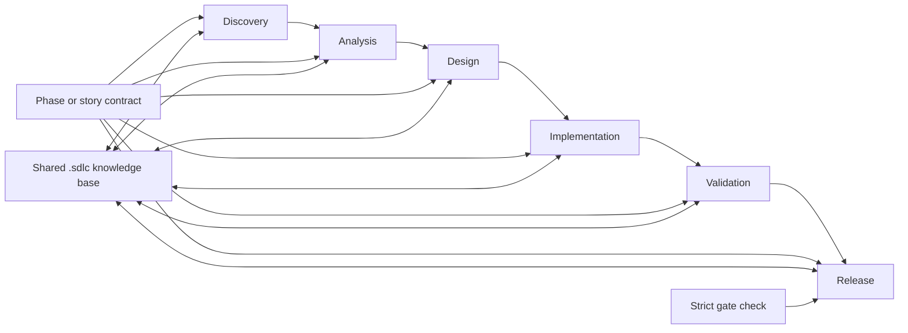
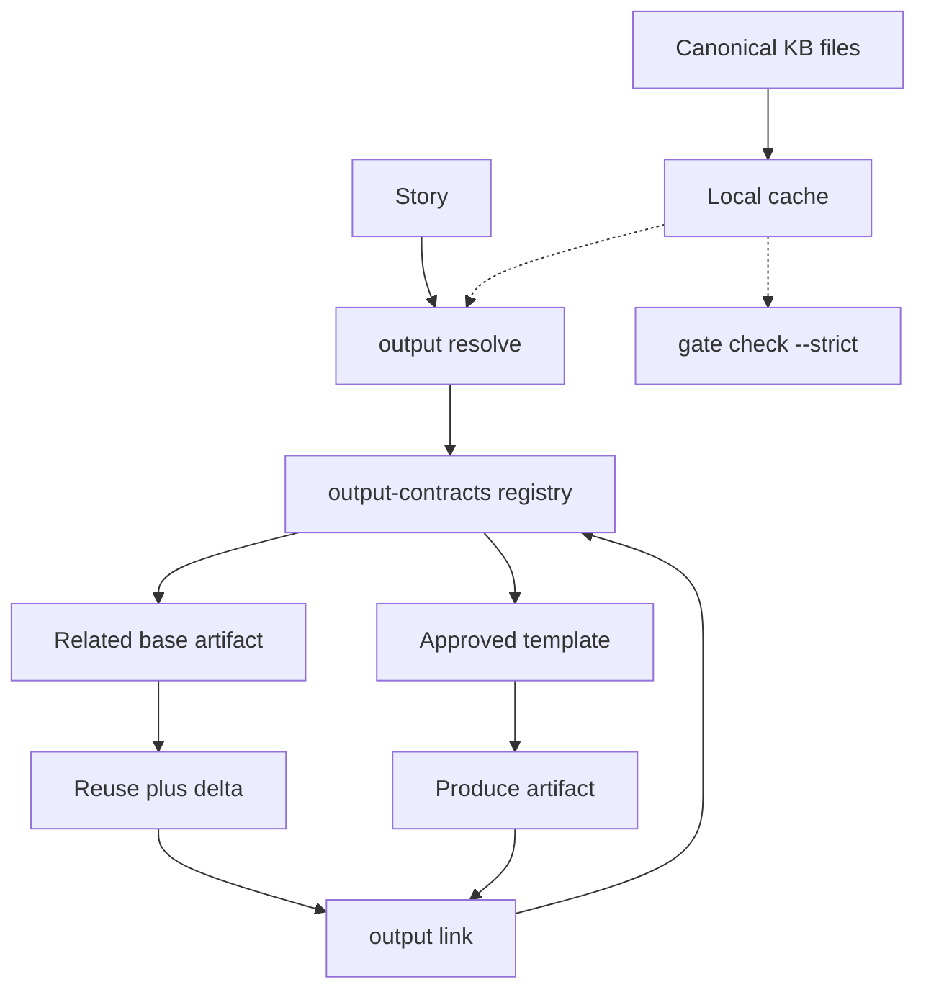
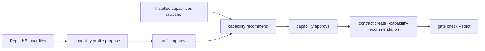

# Agentic SDLC Codex Plugin

Agentic SDLC is a Codex plugin that turns a classic software development life cycle into a contract-driven, agent-legible operating system.

The plugin gives Codex a reusable SDLC skill and a cross-platform Node CLI. The CLI creates a shared `.sdlc/` knowledge base inside the target project, so teams and agents can work in parallel through Git branches and pull requests.

## What It Implements

- Phase contracts for Discovery, Analysis, Design, Implementation, Validation, and Release.
- Existing-project onboarding with an inferred baseline that must be confirmed before it becomes canonical.
- A Git-first knowledge base for requirements, stories, decisions, assumptions, risks, tests, traces, and releases.
- Story-scoped workspaces so multiple agents can work in parallel without overwriting each other.
- Work breakdown agreements for project-local epics, stories, tasks, and approved decomposition choices.
- Contextual capability discovery for project/story profiles, skill/MCP/tool/model recommendations, install approvals, and technical decision matrices.
- Contract capability policies for agreed skills, MCPs, tools, bindings, permissions, and approval boundaries.
- Approved dependency graphs that control orchestration, stale downstream work, and strict gates.
- Append-only trace logs for decisions, tests, implementation events, gate reviews, and release notes.
- Parallel orchestration commands for multi-chat work, story claims, handoffs, locks, and sync/push attribution.
- Output consistency registry for approved artifact templates, story-artifact links, and reuse/delta decisions.
- Local regenerable cache for faster KB lookup, dependency graphs, artifact fingerprints, and output resolution.
- Language-agnostic request routing: Codex normalizes user intent to canonical JSON, then the CLI deterministically decides the SDLC route from project state and policy.
- Formal approval governance that separates implementation permission from approved SDLC artifacts.
- Gate checks that validate contract completeness, story readiness, and traceability.
- A regenerable search index over `.sdlc/` content.

## Process At A Glance





## Install In Codex

Import this repository as a Codex plugin. The plugin root is the repository root and contains `.codex-plugin/plugin.json`.

For local dogfooding when the Codex app does not expose a plugin import command, link the skill directly so future Codex sessions load the repo copy instead of a stale copy:

```bash
ln -s "$(pwd)/skills/agentic-sdlc" "$HOME/.codex/skills/agentic-sdlc"
```

After import, invoke the skill with:

```text
Use $agentic-sdlc to initialize this project.
```

## CLI Usage

The CLI has no runtime dependencies beyond Node.js.

```bash
node bin/agentic-sdlc.mjs init --project-name "My Product"
node bin/agentic-sdlc.mjs onboard existing-project --project-name "Legacy Product" --document README.md
node bin/agentic-sdlc.mjs baseline approve --id BASELINE-INITIAL --actor-type human --approval-source explicit-user --summary "Confirmed current baseline"
node bin/agentic-sdlc.mjs contract create --phase discovery
node bin/agentic-sdlc.mjs story create --id ST-001 --title "Implement a business workflow"
node bin/agentic-sdlc.mjs work item create --type epic --id EP-001 --title "Business workflow"
node bin/agentic-sdlc.mjs breakdown propose --id BD-REQ-001 --requirement REQ-001 --item story:ST-001
node bin/agentic-sdlc.mjs breakdown approve --id BD-REQ-001 --actor-type human --approval-source explicit-user --summary "Approved breakdown"
node bin/agentic-sdlc.mjs dependency propose --id DEP-001 --edge ST-002:ST-001:requires_artifact:validation:artifact_linked
node bin/agentic-sdlc.mjs dependency approve --id DEP-001 --actor-type human --approval-source explicit-user --summary "Approved dependency graph"
node bin/agentic-sdlc.mjs capability profile propose --id CAP-PROFILE-ST-001 --story ST-001 --phase analysis --context-file .sdlc/requirements/REQ-001.md
node bin/agentic-sdlc.mjs capability profile approve --id CAP-PROFILE-ST-001 --actor-type human --approval-source explicit-user --summary "Approved capability profile"
node bin/agentic-sdlc.mjs capability recommend --id CAP-REC-ST-001 --profile CAP-PROFILE-ST-001 --available-capabilities-file .sdlc/decisions/available-capabilities.json
node bin/agentic-sdlc.mjs capability approve --id CAP-REC-ST-001 --actor-type human --approval-source explicit-user --summary "Approved capability recommendation"
node bin/agentic-sdlc.mjs story claim --id ST-001 --agent codex --branch feature/ST-001
node bin/agentic-sdlc.mjs output template propose --type functional-analysis --summary "Standard functional analysis"
node bin/agentic-sdlc.mjs output template approve --id functional-analysis-v1 --actor-type human --approval-source explicit-user --summary "Approved output template"
node bin/agentic-sdlc.mjs output resolve --story ST-001 --type functional-analysis
node bin/agentic-sdlc.mjs trace append --story ST-001 --type decision --summary "Keep provider-specific logic behind an adapter"
node bin/agentic-sdlc.mjs sync record --story ST-001 --event push --summary "Pushed feature/ST-001"
node bin/agentic-sdlc.mjs gate check --story ST-001 --out .sdlc/reports/ST-001-gate-report.json
node bin/agentic-sdlc.mjs orchestrate status
node bin/agentic-sdlc.mjs cache rebuild
node bin/agentic-sdlc.mjs index rebuild
node bin/agentic-sdlc.mjs kb search "business workflow"
```

## Intent Routing

Use `route decide` when the user request could mean intake, story decomposition, contract creation, implementation, validation, or release. Codex first converts the conversation into the canonical schema in [schemas/route-intent.schema.json](schemas/route-intent.schema.json). The CLI then checks `.sdlc/` state, confidence thresholds, required story/contract/output evidence, and returns the next route without writing canonical artifacts.

```bash
node bin/agentic-sdlc.mjs route decide --json --intent-json '{
  "requested_action": "implement_story",
  "confidence": 0.92,
  "referenced_entities": [{"type": "story", "id": "ST-001"}],
  "provided_artifacts": [],
  "missing_context": [],
  "proposed_phase": "implementation",
  "artifact_type": null,
  "skip_phases": []
}'
```

Raw text passed with `--text` is treated only as untrusted context. The CLI never keyword-matches natural language; low confidence, missing context, phase skips, new templates, duplicate outputs, and implementation starts are routed to confirmation or clarification.

For technical analysis, the route layer also checks whether an approved capability profile exists. If it does not, the returned next commands point to `capability profile propose` before contract creation, so architecture decisions can use project-specific evidence and approved skill/MCP/tool choices.

## Existing Project Onboarding

For an existing repository, use onboarding instead of pretending the SDLC knows the past history:

```bash
node bin/agentic-sdlc.mjs onboard existing-project \
  --project-name "Existing Product" \
  --document README.md \
  --source docs \
  --question "Which inferred facts are canonical?"
```

This initializes `.sdlc/` when needed and writes `.sdlc/baseline/BASELINE-INITIAL.json` plus a readable current-state report. The baseline is `proposed` by default: detected stack, key files, documents, assumptions, and open questions are evidence, not confirmed truth. Approve it only after the user confirms what is canonical.

## Approval Governance

Approvals are formal SDLC events, not a side effect of telling an agent to implement or push. Human approvals must include an explicit source and a summary or evidence:

```bash
node bin/agentic-sdlc.mjs contract approve \
  --id contract-ST-001-analysis \
  --actor-type human \
  --approval-source explicit-user \
  --summary "Approved analysis contract and output structure"
```

Use `--approval-source bootstrap` only for migration or provisional records. Bootstrap approvals are marked provisional and do not satisfy strict gates by default.

## Collaboration Model

The plugin intentionally keeps the project knowledge base in `.sdlc/`, not inside the plugin installation. That makes the knowledge base shareable with other developers and agents.

Recommended workflow:

1. Run `orchestrate status` or `orchestrate plan` to see available lanes.
2. Claim one story per worker chat with `story claim`.
3. Work on the claimed branch and append decisions/evidence through `trace append`.
4. Use `story handoff` when passing work from analysis to implementation or validation, then `story handoff close` when the receiving lane accepts it.
5. Use `sync record --event push` after pushing or merging so other chats know what changed.
6. Run `gate check --story <id> --strict` before review or merge.
7. Release claims and locks when work is done.

Before producing a durable artifact, run `output resolve --story <id> --type <artifact-type>`. If another story already covered the same requirement, the default is to reuse the approved base artifact and create only a delta. New templates, duplicate new outputs, or structure changes require user approval and an auditable registry decision. Story-specific contracts should include `--output-ref artifact-type:template-id:mode`; strict gates require those refs to be satisfied by output links.

Derived cache and indexes under `.sdlc/cache/` and `.sdlc/indexes/` can be regenerated and must not be treated as the source of truth. `output resolve` verifies cached recommendations against canonical KB files and rejects tampered cache results.

## Parallel Orchestration

Multiple Codex chats can work safely when each chat owns a different story claim:

```bash
node bin/agentic-sdlc.mjs orchestrate plan --json
node bin/agentic-sdlc.mjs story claim --id ST-001 --agent analysis-chat --branch feature/ST-001 --thread-id codex-thread-a
node bin/agentic-sdlc.mjs story claim --id ST-002 --agent implementation-chat --branch feature/ST-002 --thread-id codex-thread-b
```

A parent chat can coordinate several stories by reading `orchestrate status --json`, assigning available lanes, and requiring each worker chat to write attributed trace, handoff, sync, and gate evidence into `.sdlc/`.

For shared phase artifacts, use phase locks:

```bash
node bin/agentic-sdlc.mjs phase lock --phase analysis --reason "Updating shared functional analysis"
node bin/agentic-sdlc.mjs phase release --id LOCK-analysis-20260701123000 --reason "Analysis artifact handed off"
```

The CLI rejects a second active lock for the same phase/scope and uses local lock files to serialize claim, phase-lock, and output-registry mutations inside one workspace.

## Contextual Contract Generation

Contract templates are generic, but generated contracts are project-specific. The agent should inspect `.sdlc/`, read user-provided files, and ask targeted questions before creating or revising a contract.

```bash
node bin/agentic-sdlc.mjs contract create \
  --phase analysis \
  --context-file .sdlc/requirements/REQ-001.md \
  --context-summary "Analyze the MVP around the approved business workflow." \
  --qa "Who approves this phase?|Product owner" \
  --question "Which external provider is authoritative for MVP?" \
  --constraint "Provider-specific logic must stay behind an adapter"
```

The resulting contract stores project identity, context source references, answered/open questions, assumptions, and constraints under `contextualization`.

Contracts also carry an `execution_policy`. By default, generated contracts tell spawned Codex agents to inherit the model and reasoning level from the main Codex thread. Override them only when a phase needs a different execution profile:

```bash
node bin/agentic-sdlc.mjs contract create \
  --phase implementation \
  --model codex-model-id \
  --reasoning high \
  --execution-note "Use higher reasoning for risky architecture changes"
```

Model identifiers are stored as free-form Codex model IDs so the plugin does not need hardcoded model catalogs. Reasoning levels are configurable in `templates/sdlc-config.json`.

Contracts can also carry a `capability_policy` and `capability_bindings`. Use these to agree which skills, MCPs, tools, concrete targets, permissions, and approval-required actions are allowed for the step. Required MCP/tool capabilities must either have a binding or remain as explicit open questions before strict gates pass.

## Capability Discovery

Capability discovery is the technical architect layer. Codex or another LLM can inspect the repo, `.sdlc/`, user files, and available skills/MCPs/tools, then submit canonical JSON. The CLI stores only validated project evidence under `.sdlc/capability-discovery/`; it does not infer technologies from user-language keywords.



Use `--approve-install` only when the user or CI has explicitly approved installing missing capabilities. Without that approval, an install-required recommendation can be recorded but cannot be applied to a contract.

```bash
node bin/agentic-sdlc.mjs contract create \
  --phase analysis \
  --story ST-001 \
  --context-summary "Technical analysis for the approved workflow." \
  --capability-recommendation CAP-REC-ST-001
```

## How Agents Interact

The SDLC is designed as a handoff chain. Each phase agent reads the previous phase artifacts, works under a contract, writes evidence to the project KB, and leaves the next phase with structured inputs.

Detailed examples are available in:

- [Agent Interactions](docs/agent-interactions.md)
- [Knowledge Base Structure](docs/kb-structure.md)

## Repository Layout

```text
.codex-plugin/plugin.json      Codex plugin manifest
skills/agentic-sdlc/         Codex skill and references
bin/agentic-sdlc.mjs         Cross-platform CLI
templates/sdlc-config.json     Configurable SDLC phase contracts and policies
templates/kb-readme.md         Generated project KB guide
schemas/                       JSON schemas for SDLC artifacts
docs/architecture.md           Implementation architecture
docs/agent-interactions.md     Phase-by-phase agent examples
docs/kb-structure.md           Detailed project KB structure
```
