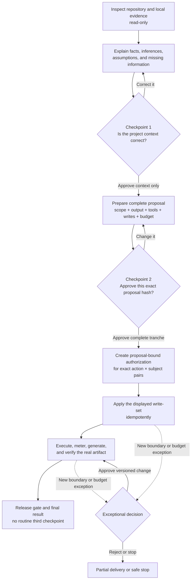
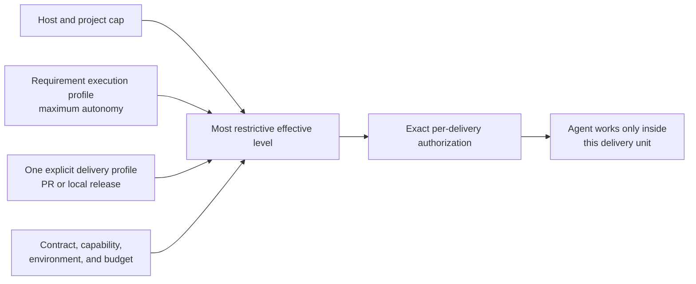
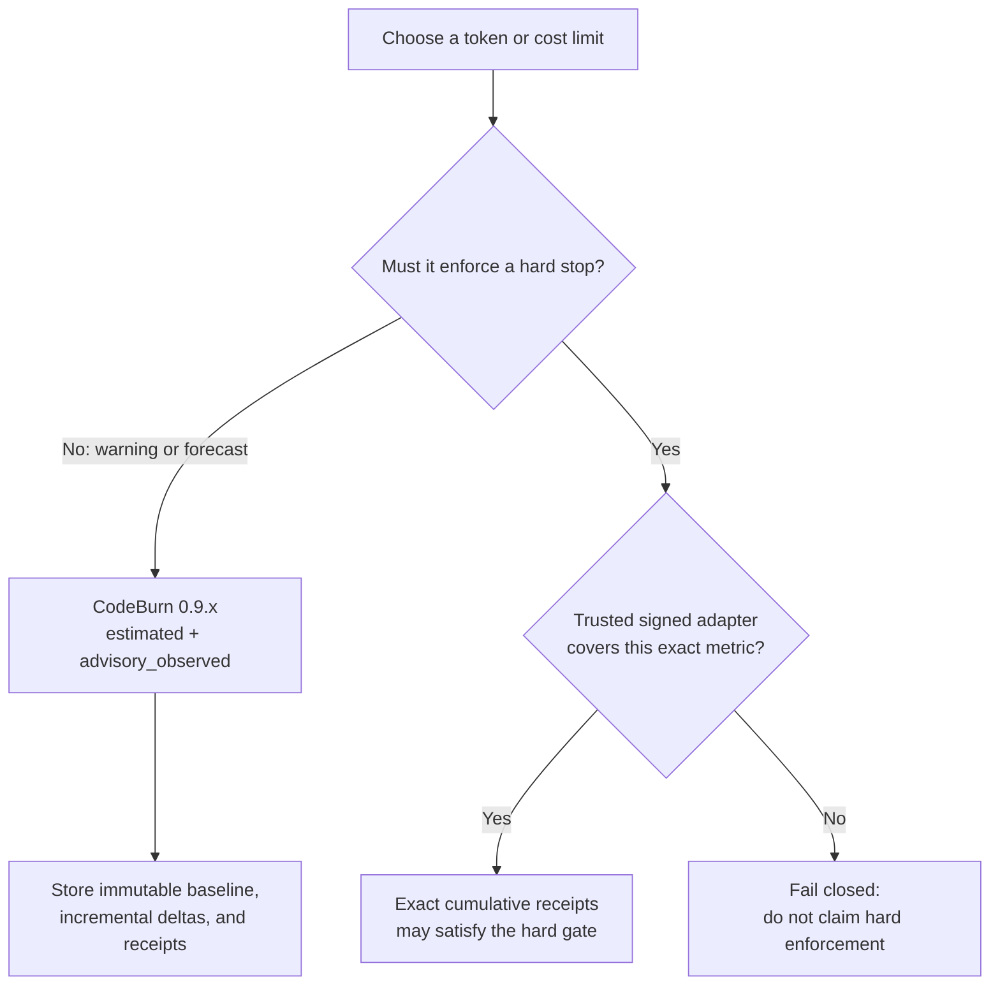

# Agentic SDLC Codex Plugin

Agentic SDLC 0.10.0 gives Codex a guided way to understand an existing software project, deliver verified work, and explain its recorded lineage visually. The normal experience is intentionally simple: Codex explains what it inferred, proposes the work in plain language, creates the requested real file, verifies it, and returns an auditable result.

Project state stays in the target repository under `.sdlc/`. The plugin installation contains reusable skills, templates, schemas, the cross-platform Node.js CLI, and the build-free Change Observatory UI.

## Documentation Map

- [Documentation home](docs/README.md) — choose the right guide without knowing the internal record names.
- [How It Works](docs/how-it-works.md) — the complete two-checkpoint journey, state transitions, authorization, verification, and recovery.
- [Autonomy, Limits, and Metering](docs/limits-and-metering.md) — concrete time, step, token, cost, reserve, warning, and stop-policy examples.
- [Token Efficiency](docs/token-efficiency.md) — compact derived JSON, the RTK command gateway, lifecycle observations, and budget-safe savings telemetry.
- [Assessment Interactions](docs/agent-interactions.md) — the precise contract used for every user question.
- [Portable Installation](docs/portable-install.md) — installation, update, diagnosis, and recovery on supported platforms.
- [Change Observatory](docs/change-observatory.md) — launch the local visual lineage app and understand its evidence and security model.

## Quick Start

Install from the `aantenore` source repository. Keep this checkout separate from the generated personal-plugin directory:

```bash
git clone https://github.com/aantenore/agentic-sdlc-codex-plugin.git
cd agentic-sdlc-codex-plugin
python3 scripts/install-personal-marketplace.py
codex plugin add agentic-sdlc-codex-plugin@personal
codex plugin list --json
```

If RTK 0.43 or newer is already installed and you want its guidance available to
Codex globally, opt in while staging:

```bash
python3 scripts/install-personal-marketplace.py --with-rtk
```

`--with-rtk` configures the current user's global Codex instructions. It does
not install or upgrade the RTK binary, and omitting the flag leaves global
instructions unchanged. `--rtk-executable` selects a binary only for that
bootstrap step; the automatic gateway still resolves `rtk` from `PATH` unless
the project configures and explicitly trusts a custom provider command. See
[Portable Installation](docs/portable-install.md) for the user-global scope,
runtime trust boundary, and update behavior.

Open the project you want to assess in a **new Codex task**, then ask naturally:

```text
Contextualize this project and prepare an initial technical assessment.
```

The dedicated `Project Assessment` skill is visible in Codex and is also selected implicitly from equivalent requests. Normal use is conversational: the low-level CLI commands are available for automation and recovery, but the user does not need to orchestrate them manually.

To inspect an existing `.sdlc` history visually, ask in the same natural style:

```text
Open the Change Observatory and explain this project's recorded delivery lineage.
```

The installed `Change Observatory` skill resolves the plugin-local launcher directly, so a Codex plugin installation does not depend on a global shell command.

## Change Observatory

Change Observatory is a local, read-only application bundled in the plugin. It answers “What was asked?”, “What changed?”, and “Why was it decided?”, then gives every recorded story a proof-bound Asked / Decided / Contract / Done / Verified dossier. Technical and non-technical readers can inspect the causal iteration, global contracts, decisions, changes, tests, gates, and raw canonical evidence without the app inventing missing history.

From an npm/git/tarball package installation that exposes the bin entry:

```bash
agentic-sdlc observe --root /path/to/project
```

For automation or a machine without a browser opener:

```bash
agentic-sdlc observe --root /path/to/project --port 0 --no-open --json
```

The server binds only to `127.0.0.1`, selects an ephemeral port by default, protects evidence APIs with a per-run token carried in the URL fragment, and makes no project writes. Plain-language explanations retain their `codex-generated`, `deterministic`, or `human-authored` label and contain only stored summaries, rationale, alternatives, inputs, outputs, and evidence—never private chain-of-thought. See [Change Observatory](docs/change-observatory.md) for the full model.

## How It Works

A normal local assessment has **two user checkpoints**, not one approval for every internal record. The first confirms facts about the project; the second approves one immutable, complete execution tranche.



### What The Two Checkpoints Mean

| Checkpoint | What Codex asks | What your answer authorizes | What it does **not** authorize | Example answer |
| --- | --- | --- | --- | --- |
| **1 — Project context** | Is the displayed understanding factually correct? | The exact baseline content hash | Starting work, creating the deliverable, tools, writes, budget, production, or external access | `I approve this project context.` or `Correction: we use Kubernetes, not ECS.` |
| **2 — Complete proposal** | May Codex execute the displayed scope, requirement ceiling, output, tools, write-set, limits, stop policy, and—when present—this one delivery profile? | Only the exact proposal hash, exact action × subject pairs, and selected level for the named delivery | Another PR/local release, protected merge, deploy, undisplayed actions, broader paths, secrets, production, destructive work, or silent budget extensions | `I approve this complete proposal and checkpointed level for PR-184.` or `Change the hard limit to 45 minutes and show the proposal again.` |

Every question must say **what is being asked, why it is needed now, what the answer authorizes, what it excludes, and valid answer examples**. A bare “Proceed?” is not sufficient.

Checkpoint 2 displays, in plain language:

- outcome, audience, scope, exclusions, depth, evidence sources, and checks;
- stable `requirement:v2` revision/profile and story IDs, including the autonomy ceiling and whether each record will be created or reused;
- report sections, real output format, destination, delivery mode, generator, and verifier;
- installed tools plus exact read, write, external-access, and production boundaries;
- contract draft, route intent, subject hashes, exact write-set, and idempotent recovery plan;
- aggregate limits for the main agent and subagents, warning thresholds, completion reserve, stop policy, and extension boundary;
- assumptions, limitations, and every action that would require a new decision.

When the tranche will produce a pull request or a local release, checkpoint 2 also names that exact delivery unit and asks for its autonomy level. The requirement carries only the maximum permitted level; it never silently authorizes a later pull request. A second pull request, even for the same requirement, receives a new delivery profile and a new explicit choice. Each profile is one delivery lane with exactly one story and its one approved contract; aggregate several changes through an agreed aggregation story/contract instead of hiding unrelated work in one profile.

The default budget has exact active-time targets of 2,700/3,600 seconds, exact step targets of 40/60, and an advisory estimated token threshold of 200,000 with no token hard limit. Cost remains unavailable and non-binding until a trustworthy metering adapter, immutable pricing reference, and currency are configured. See [Autonomy, Limits, and Metering](docs/limits-and-metering.md) before changing these defaults.

Internally, `assessment proposal approve` records host/CI authority and creates proposal-bound authorization. `assessment proposal apply` materializes only the approved write-set and safely resumes partial attempts. Every automated use gets a validity-at-use receipt. Completion requires aggregate budget accounting, layered artifact verification, and a release gate.

Normalized actions are configured in `assessment_workflow.requested_actions`. Question explanations live in `open_question_guidance`, including category keywords, rationale, bilingual examples, proposal effects, and safe fallbacks. New aliases or guidance therefore do not require hardcoded CLI branches.

An additional decision is exceptional: it is required for a new installation, external or production access, secrets, destructive work, an out-of-scope write, a material proposal change, or an unapproved budget extension.

## Autonomy Is Negotiated Per Requirement And Selected Per Delivery

**Autonomy** answers “what may the agent do without asking again?” **Limits** answer “how much may it consume while doing it?” A `requirement:v2` links an approved requirement execution profile that sets an autonomy ceiling. Every delivery unit then makes a separate, explicit selection for exactly one `pull_request` or `local_release`.

The available levels are `supervised`, `checkpointed`, and `bounded-autonomous`. A downstream record may narrow the selected level but can never widen it:

> effective autonomy = minimum of host, project, requirement, delivery, contract, capability, environment, and budget boundaries



`bounded-autonomous` therefore means broad freedom only inside the displayed, hash-bound delivery unit. It is not permanent authority and it is never learned from the number of successful prior runs. For example:

```text
For PR-184 choose bounded-autonomous. You may implement, test, commit, push, and update
that PR on the displayed repository and branches. Do not merge the protected branch,
deploy remotely, use secrets, or write outside the approved paths. This choice expires
when PR-184 is terminal and does not apply to another PR.
```

A local release is a first-class delivery unit. Its profile must name the local root, allowed actions and write paths, smoke tests, and a required rollback procedure. Local does not mean unrestricted: machine-global changes, writes outside the workspace, destructive actions, external access, remote deployment, and production access remain explicit exception boundaries.

Delivery binding is one-way and hash-safe: reserve the planned profile ID in the requirement-bound story contract, approve that contract, then create the matching delivery profile against the immutable requirement, story, and contract hashes. The ID is not a profile hash or approval. Task start receives the profile and rejects drift; the approved contract is not rewritten to point back to it.

Each requested control has a concrete effect:

| Control | Simple example | Effect |
| --- | --- | --- |
| Action and subject | `output.link = docs/assessment.pdf` | Authorizes that action on that exact artifact, not every output |
| Paths | `write: docs/ and .sdlc/` | Writes elsewhere remain outside the tranche |
| External boundary | `no production, secrets, or external APIs` | Crossing one of those boundaries requires a new decision |
| Active time | `soft 45 min, hard 60 min` | Warn or stop based on measured active work, excluding user wait time |
| Steps | `soft 40, hard 60` | Aggregates main-agent and subagent execution steps |
| Tokens or cost | `200k tokens soft` or `EUR 5 hard` | Enforceability depends on the assurance of the measurement source |
| Completion reserve | `15%` | Protects capacity for verification and final delivery |
| Stop policy | `request extension, otherwise partial delivery` | Defines behavior instead of silently exceeding the approved budget |

In `audit_only` authority mode the CLI cannot independently prove the human actor, so effective autonomy is capped at `checkpointed`, including for a local-only release. `bounded-autonomous` requires an external host/CI to sign the exact delivery-profile approval subject with Ed25519, `authority_policy.mode: host_verified`, the matching public key in `authority_policy.trusted_host_keys`, and `--host-receipt-file` on approval. The CLI verifies that authority; it does not mint it itself. Merge to `main` or another protected branch and every production or remote deployment remain separate explicit decisions unless the exact action and target were displayed and authoritatively approved.

After task start, every state-changing delivery operation follows **authorize → execute exact operation → complete with immutable evidence**. Canonical PR actions include `repository.write`, `test.run`, `git.commit`, `git.push`, `pull_request.update`, and `pull_request.merge`; local actions are `build.local`, `test.run`, and `release.local`. At a checkpoint under `host_verified`, the external receipt must sign `autonomy.delivery.action.<canonical-action>` and the exact runtime/action-details subject; `audit_only` records explicit approval without claiming verified authority. The action receipt does not execute a Git/provider operation. The host or tool performs the exact recorded action, then completion binds its evidence and the locally observable boundary. Passing `pull_request.merge` or `release.local` completion creates the terminal close receipt automatically; other terminal outcomes use an explicitly approved manual close.

Local smoke tests are stored as shell-free JSON argv arrays, for example `--smoke-test '["npm","run","smoke:local"]'`, and are executed at release completion in a supported read-only, no-network sandbox. A push can be authorized only when every commit from the live remote base SHA to the exact head has one passing `git.commit` completion receipt, and every configured fetch/push URL of the selected remote resolves to the approved repository. For remote push and merge, authorization records a live pre-state and completion queries the exact Git remote or GitHub PR for the post-state. Those authenticated live observations are hash-bound, but they are not provider-signed offline attestations; preserve durable host/CI/provider evidence and do not overstate that boundary.

A custom limit is meaningful only if a configured source can measure it. A hard limit fails closed when its required exact, trusted coverage is unavailable.

## CodeBurn Versus Exact Metering

CodeBurn is useful for local visibility and estimates; it is not provider-signed billing evidence and cannot by itself guarantee a real-time hard stop.



| Source | Best use | Assurance | Can satisfy an exact hard limit? |
| --- | --- | --- | --- |
| **CodeBurn** | Local token/call/cost visibility, warnings, estimates, and reconciliation | `estimated` / `advisory_observed` | **No**. A mapped hard metric records the evidence but stops with `metering_violation` |
| **Trusted runtime/provider adapter** | Financial or operational enforcement | Signed, identity-bound, cumulative exact receipts | **Yes**, only for the explicitly trusted metrics and approved pricing reference |

To use CodeBurn, install it separately, enable its adapter in project configuration, approve the proposal, then capture the baseline **before** `apply`:

```bash
node bin/agentic-sdlc.mjs budget meter start \
  --root /path/to/project \
  --proposal ASSESSMENT-001 \
  --adapter codeburn \
  --provider codex \
  --project TravelOps \
  --from 2026-07-15 \
  --to 2026-07-15
```

During execution or before completion, record the incremental usage since that baseline:

```bash
node bin/agentic-sdlc.mjs budget meter record \
  --root /path/to/project \
  --proposal ASSESSMENT-001 \
  --adapter codeburn \
  --baseline METER-ASSESSMENT-001-CODEBURN
```

`--provider` selects the local session-log producer, `--project` narrows the CodeBurn aggregation, `--from/--to` fix an inclusive and reproducible date window, and `--baseline` identifies the immutable starting point. The same query is reused for every delta so filter drift, counter resets, currency changes, and tampering fail closed. The adapter command is replaceable as an executable plus prefix-argument vector, preserving `shell: false` for Windows npm installations and hermetic CI. Full setup and examples are in [Autonomy, Limits, and Metering](docs/limits-and-metering.md) and [CodeBurn Metering](docs/codeburn-metering.md).

## RTK Context Optimization

RTK is integrated through a shell-free gateway rather than as a budget meter.
Inspect availability, run a supported noisy command, or capture an explicit
manual diagnostic with:

```bash
node bin/agentic-sdlc.mjs optimization status --root /path/to/project --proposal ASSESSMENT-001 --json
node bin/agentic-sdlc.mjs optimization run --root /path/to/project --proposal ASSESSMENT-001 --command-json '["npm","test"]'
node bin/agentic-sdlc.mjs optimization capture --root /path/to/project --proposal ASSESSMENT-001 --phase manual --json
```

Use `optimization run --exact` when unfiltered, complete output is required.
It bypasses RTK but never widens the allowlist or disables the anti-helper
boundary: native `rg` runs with config loading disabled, while native Git
diff/log/show runs with external diff and text-conversion drivers disabled. The
gateway accepts only fixed test commands, execution-safe read-only Git commands,
and `rg` searches without external preprocessors. Mutations and unknown commands are rejected. For an
active assessment, `--proposal` is mandatory and the command starts only when
that proposal's cost gate allows new work. The assessment
lifecycle automatically captures comparable observations at apply, budget
checkpoints, and completion, so manual capture is for diagnostics—not for
manufacturing lifecycle evidence.

RTK's project-cumulative counters may include concurrent activity in the same
checkout. The proposal delta is therefore reported separately and remains an
estimate of command output avoided, not provider usage or billing truth. RTK
always contributes zero budget credit: `usage_adjustment_applied` is `0`, the
budget evaluator continues to aggregate only usage receipts, and soft limits,
completion reserve, hard limits, and metering violations remain sovereign.
Validated observation references may appear in the completion manifest and its
release-gate evidence without changing `budget_decision`.

The standard `rtk` executable is resolved once from `PATH`, canonicalized, and
executed by that absolute path. A first PATH candidate located in the project
root (including a symlink whose real target is there), a custom provider
executable, or prefix argv is not run by doctor, status, lifecycle hooks, or the
gateway unless that exact invocation includes
`--trust-custom-rtk-command` after review.

## Canonical Output Formats

Requested formats are stored as canonical delivery metadata; a Markdown file renamed to another extension is rejected.

| Canonical format | Accepted aliases | Extension | Media type | Generator/verifier |
| --- | --- | --- | --- | --- |
| `markdown` | `md`, `markdown` | `.md` | `text/markdown` | Native checks |
| `docx` | `word`, `doc`, `docx` | `.docx` | `application/vnd.openxmlformats-officedocument.wordprocessingml.document` | `documents` |
| `xlsx` | `excel`, `spreadsheet`, `workbook`, `xlsx` | `.xlsx` | `application/vnd.openxmlformats-officedocument.spreadsheetml.sheet` | `spreadsheets` |
| `pdf` | `pdf` | `.pdf` | `application/pdf` | `pdf` |
| `pptx` | `powerpoint`, `slides`, `pptx` | `.pptx` | `application/vnd.openxmlformats-officedocument.presentationml.presentation` | `presentations` |
| `html` | `html` | `.html` | `text/html` | Native generation plus rendered validation |
| `json` | `json` | `.json` | `application/json` | Native parse validation |
| `csv` | `csv` | `.csv` | `text/csv` | `spreadsheets` |

Assessment delivery is either `artifact` or `artifact-plus-chat-summary`; the latter is the default.

## Generation And Layered Verification Receipts

Every non-native artifact has an `artifact_generator_receipt` for the exact delivered hash. Verification then reports `container_verified`, `content_verified`, and `render_verified` separately, plus optional independent verification. A structurally valid container is never described as semantically or visually verified.

DOCX, XLSX, PDF, PPTX, and HTML outputs also require render or visual-check evidence. The evidence must be a real project file outside `.sdlc/cache/` and `.sdlc/indexes/`, and it must be passed when the artifact is linked:

```bash
node bin/agentic-sdlc.mjs output link \
  --story ST-INITIAL-ASSESSMENT \
  --type technical-analysis \
  --artifact docs/technical-assessment.pdf \
  --template technical-analysis-v1 \
  --mode new \
  --requirement REQ-INITIAL-ASSESSMENT \
  --authorization <authorization-id-from-assessment-proposal-approve> \
  --receipt-file .sdlc/receipts/generation/GEN-ST-INITIAL-ASSESSMENT.json \
  --evidence .sdlc/tests/ST-INITIAL-ASSESSMENT-render.png
```

`--authorization` is the exact proposal-bound ID returned by checkpoint 2; linking consumes its dedicated `output.link` action/subject pair and persists a usage receipt. `--receipt-file` identifies the real generator; `--evidence` is separate content/render proof. Inspect the persisted output link and layered receipt with:

```bash
node bin/agentic-sdlc.mjs output status \
  --story ST-INITIAL-ASSESSMENT \
  --type technical-analysis \
  --json
```

The final chat response reports the assessment verdict, major risks, recommendations, artifact path, verification performed, limitations, and open decisions.

## Install

Use a source checkout that is separate from the generated personal-plugin directory:

```bash
cd /path/to/agentic-sdlc-codex-plugin
python3 scripts/install-personal-marketplace.py
codex plugin add agentic-sdlc-codex-plugin@personal
codex plugin list --json
```

Pass `--with-rtk` only when you intentionally want the installer to refresh the
current user's global Codex instructions for an already installed RTK binary.

On systems where Python 3 is exposed as `python` or `py -3`, use that launcher for the same script. Start a new Codex task after installation so the app reloads plugin skills and agent cards.

The installer stages the package allowlist into `~/plugins/agentic-sdlc-codex-plugin` and updates the plugin entry in `~/.agents/plugins/marketplace.json`. It refuses unsafe destinations instead of traversing or replacing a symlink, Windows junction/reparse point, Git checkout, source checkout, or unmanaged directory.

## Update

Update the source checkout, rerun the staging installer, and add the plugin again. The current Codex CLI has no dedicated plugin-update subcommand; re-adding refreshes the installed cache, including when the version is unchanged.

```bash
cd /path/to/agentic-sdlc-codex-plugin
python3 scripts/install-personal-marketplace.py
codex plugin add agentic-sdlc-codex-plugin@personal
codex plugin list --json
```

If global RTK guidance was previously enabled, retain the opt-in during update:

```bash
python3 scripts/install-personal-marketplace.py --with-rtk
```

Do not edit the generated tree under `~/plugins` directly. Start a new Codex task after the refresh.

## Uninstall

Remove the installed plugin and cache with the supported Codex command:

```bash
codex plugin remove agentic-sdlc-codex-plugin@personal
codex plugin list --json
```

This intentionally leaves the source checkout, generated staging directory, and personal marketplace entry in place. For permanent local cleanup, remove only `~/plugins/agentic-sdlc-codex-plugin` and only the matching JSON entry from `~/.agents/plugins/marketplace.json`; preserve every unrelated plugin entry. Do not remove the shared `personal` marketplace source just to uninstall this plugin.

Plugin removal also leaves RTK's independent global Codex instructions in
place. If no other project should use them, remove and verify them explicitly:

```bash
rtk init -g --codex --uninstall
rtk init -g --codex --show
```

## Diagnose An Install

Run the built-in doctor from the source checkout. The npm script and direct CLI form execute the same checks; use `--root` to include an initialized target project's KB and output registry:

```bash
npm run doctor
npm run doctor -- --root /path/to/target-project --json
node bin/agentic-sdlc.mjs doctor --root /path/to/target-project --json
codex plugin list --available --json
npm run check
npm pack --dry-run --json
```

Doctor checks the Node runtime, version consistency, first assessment prompt, core and assessment skills, assessment agent card, preset, and project records when `.sdlc/` exists. A failed check returns a non-zero exit code.

For maintainer validation when the Codex system validators are available:

```bash
uv run --with pyyaml python /path/to/plugin-creator/scripts/validate_plugin.py .
uv run --with pyyaml python /path/to/skill-creator/scripts/quick_validate.py skills/agentic-sdlc
uv run --with pyyaml python /path/to/skill-creator/scripts/quick_validate.py skills/agentic-sdlc-assessment
```

If the plugin is absent or shows an older version, rerun the installer and `codex plugin add`, confirm the result with `codex plugin list --json`, then open a new Codex task. See [Portable Codex Install](docs/portable-install.md) for the full troubleshooting matrix.

## Safety Boundaries

- Repository application evidence is read-only unless the approved proposal names a write; proposed `.sdlc/` workflow records may be persisted before checkpoint 2.
- Normal writes are limited to the agreed artifact and canonical `.sdlc/` records.
- New installs, external systems, secrets, production access, destructive actions, and unrelated writes require an explicit decision.
- Every assessment uses an explicit story before its contract or output is persisted.
- Every `requirement:v2` has an approved execution profile that is a ceiling, not an executable grant.
- Every pull request and local release has its own explicit delivery execution profile; a prior PR choice is never reused.
- A local release records its target root, smoke tests, rollback, write paths, and allowed actions.
- Protected-branch merge, remote deployment, and production access remain explicit exception decisions.
- A free-text scope or `actor-type human` flag is not authority. Checkpoint 2 binds a host/CI receipt and content authorization to the proposal hash; every covered use stores a validity-at-use receipt.
- The approved budget aggregates main-agent and subagent usage, preserves a completion reserve, and changes only through a versioned amendment.
- Cache and indexes are derived data and never count as canonical evidence.

## Advanced CLI

The CLI remains available for automation and advanced project workflows:

```bash
node bin/agentic-sdlc.mjs --help
node bin/agentic-sdlc.mjs observe --root /path/to/project --no-open --json
node bin/agentic-sdlc.mjs doctor --root /path/to/project --json
node bin/agentic-sdlc.mjs optimization status --root /path/to/project --proposal ASSESSMENT-001 --json
node bin/agentic-sdlc.mjs optimization run --root /path/to/project --command-json '["npm","test"]'
node bin/agentic-sdlc.mjs optimization capture --root /path/to/project --proposal ASSESSMENT-001 --phase manual --json
node bin/agentic-sdlc.mjs status --root /path/to/project
node bin/agentic-sdlc.mjs approval requests --root /path/to/project --json
node bin/agentic-sdlc.mjs assessment proposal status --root /path/to/project --id ASSESSMENT-001 --json
node bin/agentic-sdlc.mjs budget meter start --root /path/to/project --proposal ASSESSMENT-001 --adapter codeburn --from 2026-07-14 --to 2026-07-14
node bin/agentic-sdlc.mjs budget meter record --root /path/to/project --proposal ASSESSMENT-001 --adapter codeburn --baseline METER-ASSESSMENT-001-CODEBURN
node bin/agentic-sdlc.mjs budget status --root /path/to/project --proposal ASSESSMENT-001 --json
node bin/agentic-sdlc.mjs gate check --root /path/to/project --scope release-manifest --release-manifest RELEASE-ASSESSMENT-001 --strict --json
node bin/agentic-sdlc.mjs migration active --root /path/to/project --release-manifest RELEASE-ASSESSMENT-001
node bin/agentic-sdlc.mjs migration active --root /path/to/project --release-manifest RELEASE-ASSESSMENT-001 --apply
node bin/agentic-sdlc.mjs migration identity --root /path/to/project --identity-map-json '{"source":{"email":"old@example.invalid"},"target":{"email":"new@example.test","name":"Current User"}}'
node bin/agentic-sdlc.mjs migration identity --root /path/to/project --identity-map-json '{"source":{"email":"old@example.invalid"},"target":{"email":"new@example.test","name":"Current User"}}' --apply --plan-hash <preview-plan-hash>
node bin/agentic-sdlc.mjs migration identity --root /path/to/project --recover --recovery-nonce <nonce-from-lock> --plan-hash <hash-from-lock>
```

Natural-language interpretation stays in Codex. The CLI accepts canonical structured intent and performs deterministic state, format, authorization, and evidence checks.

CodeBurn 0.9.x is an optional, separately installed prerequisite for `budget meter`; the plugin never installs it. Capture the baseline after proposal approval and before `apply`. `record` reuses the exact persisted provider/project/date query and advances an incremental monotonic cursor. CodeBurn evidence is always `estimated`/`advisory_observed`, never signed or exact; a mapped hard metric is recorded but stops the workflow with `metering_violation`. For multi-day work, pass an explicit stable `--from/--to` window at `start`.

RTK 0.43+ is also optional and separately installed. `optimization run` routes
only allowlisted command profiles without a shell; `--exact` bypasses filtering
without allowing arbitrary command vectors. Ripgrep preprocessors, Git external
diff/textconv drivers, and Git signature-verification helpers remain disabled.
Its savings telemetry is advisory, project-scoped, and always receives zero
budget credit. See [Token Efficiency](docs/token-efficiency.md).

`migration active` is deliberately dry-run first. It validates the immutable records referenced by one exact release manifest, upgrades only missing configuration defaults when `--apply` is present, and never rewrites an approved record. Evidence referenced only by older valid releases remains where it is and is listed in an `archive-record:v1`; this logical archive changes gate scope, not filesystem location. Use the separate `archive closed --apply` workflow only when old closed reports or trace compactions must physically move.

`migration identity` is a separate, exceptional lineage repair for correcting an identity already embedded in `.sdlc`. It is also dry-run first. Before planning any rewrite it schema- and hash-validates legacy plus canonical authorization v1/v2 records, their action-subject bindings, revocations, usage receipts, prior migration receipts, and byte-exact canonical file references. It then computes the transitive subject, scope, authorization, revocation, receipt, and file-reference changes, and refuses unsupported non-JSON records, stale supported file references, opaque receipts, or any signed/attested envelope affected directly or through a dependent hash. Signed evidence must be reissued with its original authority; the migration never invents a replacement signature. The preview emits a deterministic `plan_hash`; `--apply` requires that exact hash and refuses any canonical snapshot drift. Apply uses an exclusive no-auto-reclaim lock, prepares the complete post-state—including rebuilt cache and indexes—in a same-filesystem shadow tree, verifies it, records intent in a hash-checked monotonic journal, and activates it with a directory swap. A caught failure restores the byte-exact prior tree. An interrupted process requires authenticated `--recover` with the nonce and plan hash from the verified lock; recovery rolls back before the durable commit point and only finalizes after it. Other CLI commands remain blocked while that lock exists, and concurrent recovery is claimed separately. The immutable receipt records the reviewed plan hash, source and target digests, and before/after lineage hashes without storing the source email in clear text. Directory `fsync` is used where supported, but resilience to host or power loss still depends on the filesystem and platform.

## Repository Layout

```text
.codex-plugin/plugin.json                    Plugin metadata and starter prompts
assets/                                      Plugin artwork
bin/agentic-sdlc.mjs                         Cross-platform Node.js CLI
docs/agent-interactions.md                   Two-checkpoint assessment interaction
docs/portable-install.md                     Install and recovery guide
schemas/                                     Canonical data contracts
lib/                                         Pure proposal, authorization, budget, and workflow primitives
skills/agentic-sdlc/                         Core project workflow skill
skills/agentic-sdlc-assessment/              Guided assessment skill
skills/agentic-sdlc-assessment/agents/       Assessment agent card
skills/change-observatory/                    Installed visual-lineage launcher skill
templates/                                   Reusable artifact templates
ui/change-observatory/                        Bundled build-free lineage application
```

More detail: [Assessment Interactions](docs/agent-interactions.md), [Change Observatory](docs/change-observatory.md), and [Portable Codex Install](docs/portable-install.md).
