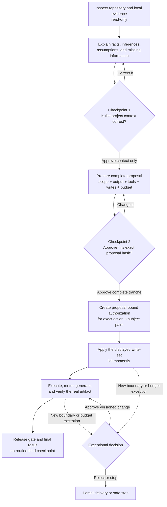
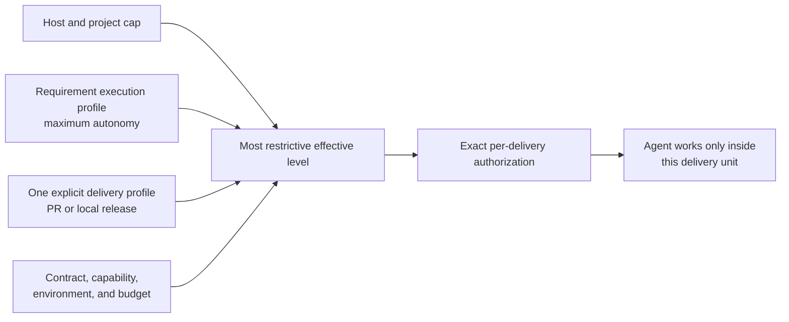
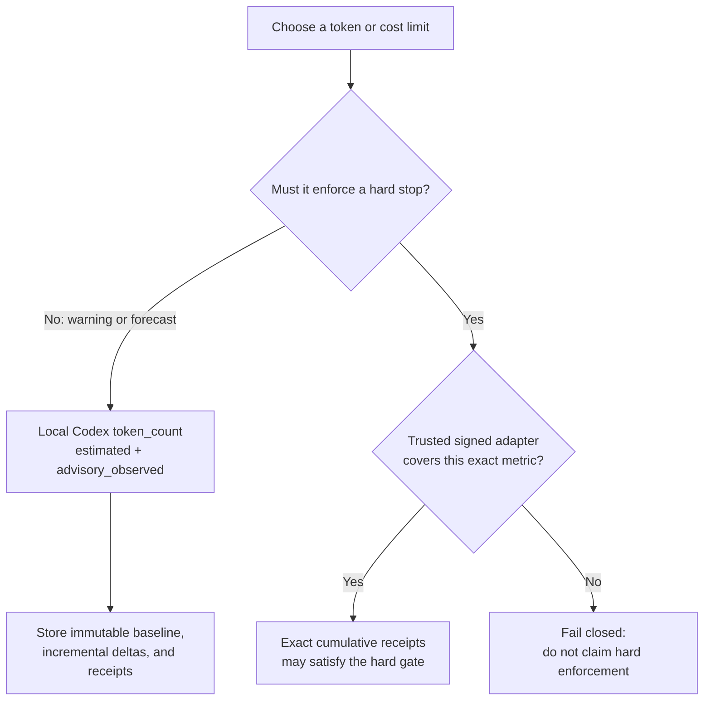

# Agentic SDLC Codex Plugin

## In plain English

**The problem:** when a coding agent works on a software project, it can be hard to tell what it understood, what it was allowed to change, why it made each decision, or whether the result really works.

**What Agentic SDLC changes:** it turns that work into a reviewable journey. The goal and boundaries are agreed before execution, important decisions and evidence stay with the project, delivered files are checked, and a local visual app explains the history. A product owner can understand the outcome without reading code, while an engineer can still inspect the underlying evidence.

**Example:** a product owner asks Codex to assess an existing service and produce an architecture report. The plugin records the request, Codex's understanding, the approved boundaries, the report, and the checks that were actually run. Change Observatory then presents that history as a readable local timeline.

| Feature | Practical benefit |
| --- | --- |
| Project understanding before work | People can correct facts and assumptions before they influence the result. |
| Visible work boundary | The goal, files, tools, limits, and exclusions are clear before execution. |
| Evidence-backed completion | The delivered file is linked to the checks actually run, not just an agent's claim that it is done. |
| Change Observatory | A local visual timeline shows what was asked, decided, changed, and verified. |
| Project memory that travels with the code | Another person or agent can resume later without relying on a disappearing chat. |

## Technical summary

Agentic SDLC 0.13.3 gives Codex a guided way to understand an existing software project, deliver verified work, and explain its recorded lineage visually. The normal experience is intentionally simple: Codex explains what it inferred, proposes the work in plain language, creates the requested real file, verifies it, and returns an auditable result.

Project state stays in the target repository under `.sdlc/`. The plugin installation contains reusable skills, templates, schemas, the cross-platform Node.js CLI, and the build-free Change Observatory UI.

You talk to Codex in normal language. Codex turns that request into structured input; the deterministic CLI checks the agreed requirement, work brief, permissions, and evidence. A new user does not need to run the low-level lifecycle commands manually.

## Documentation Map

- [Getting Started](docs/getting-started.md) — choose an assessment, a new pull request, an existing pull request, or a local-only result and see exactly what you will approve.
- [Documentation home](docs/README.md) — choose the right guide without knowing the internal record names.
- [How It Works](docs/how-it-works.md) — advanced detail about checkpoints, state transitions, authorization, verification, and recovery.
- [Autonomy, Limits, and Metering](docs/limits-and-metering.md) — concrete time, step, token, cost, reserve, warning, and stop-policy examples.
- [Configuration Safety](docs/configuration-safety.md) — why project behavior is pinned, how to preview an upgrade, and how to recover from drift without hidden policy changes.
- [Token Efficiency](docs/token-efficiency.md) — compact derived JSON, the RTK command gateway, lifecycle observations, and budget-safe savings telemetry.
- [Native Codex Session Metering](docs/codex-session-metering.md) — authentication-free local token/call observations, exact task binding, and limit semantics.
- [Assessment Interactions](docs/agent-interactions.md) — the precise contract used for every user question.
- [Portable Installation](docs/portable-install.md) — installation, update, diagnosis, and recovery on supported platforms.
- [Self-service CLI](docs/self-service-cli.md) — focused help, one-step status, safe presentation presets, shell completion, and machine output.
- [Change Observatory](docs/change-observatory.md) — launch the local visual lineage app and understand its evidence and security model.
- [Configurable Workflows](docs/configurable-workflows.md) — select a governed process, customize labels safely, and keep running history pinned and append-only.

## Quick Start

Install from the `aantenore` source repository. Keep this checkout separate from the generated personal-plugin directory:

```bash
git clone https://github.com/aantenore/agentic-sdlc-codex-plugin.git
cd agentic-sdlc-codex-plugin
python3 scripts/install-personal-marketplace-v2.py check
python3 scripts/install-personal-marketplace-v2.py plan --json
python3 scripts/install-personal-marketplace-v2.py apply --plan-hash <plan_hash-from-plan> --json
# Required: run candidate_registration.command.argv with its exact environment,
# then candidate_registration.verification.argv with its exact environment.
# Default target example only; do not use it for a custom returned target:
env HOME="$HOME" CODEX_HOME="$HOME/.codex" codex plugin add agentic-sdlc-codex-plugin@personal --json
env HOME="$HOME" CODEX_HOME="$HOME/.codex" codex plugin list --json
python3 scripts/install-personal-marketplace-v2.py validate --transaction-id <transaction_id-from-apply> --receipt-hash <receipt_hash-from-apply>
python3 scripts/install-personal-marketplace-v2.py confirm --transaction-id <transaction_id-from-apply> --receipt-hash <receipt_hash-from-apply>
python3 scripts/autoconfigure-token-efficiency.py apply --json
```

Installer V2 is the canonical local installation path. `apply` retains the
byte-exact previous plugin and marketplace state and binds the exact Codex
executable, state directory, installed entry, and cache identity seen before
the update. If Codex uses non-default locations, pass `--codex-executable`
and/or `--codex-home` to `apply`. Before validation, execute
`technical_details.candidate_registration.command.argv` with exactly its
`environment`, then execute `verification.argv` with exactly its
`environment`. The two `env ... codex` lines above illustrate only the default
target; never substitute them when the returned executable, `HOME`, or
`CODEX_HOME` differs. The returned `confirm` and `restore` commands reuse that
target and reject a different one. After registration and validation, use
`confirm` to keep the update or the returned `restore` command to roll it back.
Confirmation verifies the candidate Codex list and cache before deleting
recovery data.
Restore is not reported as complete until the prior staging copy has also been
returned to the exact installed-or-absent Codex state captured by `apply`
through the official Codex command, and its list, cache fingerprint, and
provenance match. If that Codex step fails, the receipt remains open and
the JSON result returns `staging_restored`, `codex_reconciled`,
`partial_failure`, and an exact retry command. Codex is resolved from `PATH`
during `apply`, and retries reuse that receipt-bound executable and state
directory. Use `--codex-executable` or `--codex-home` on `apply` when those
locations are intentionally non-default.

After confirmation, run the returned
`post_confirm_autoconfigure_command`. The same command is shown above for a
source checkout. It verifies the bundled Caveman skill and native Codex-session
meter, then byte-verifies and configures RTK when RTK 0.43+ is already
available. It never installs or configures CodeBurn, never authenticates, and
never accesses the network. If RTK is absent, the plugin remains operational
through its native command fallback.

Autoconfiguration is intentionally post-confirm because RTK's Codex guidance is
user-global and therefore outside the reversible plugin-copy transaction. See
[Portable Installation](docs/portable-install.md) for the user-global scope,
runtime trust boundary, and update behavior.

### Start a new Codex task

Open the target project in a **new Codex task** and choose the request that matches the outcome you want:

| Goal | Starter request |
| --- | --- |
| Understand the project and receive an assessment | `Contextualize this project and prepare an initial technical assessment.` |
| Agree a new requirement and deliver it as a new PR | `Turn this new requirement into an agreed work brief, implement it, verify it, and open a new pull request.` |
| Continue one PR that already exists | `Continue this existing pull request, verify the requested changes, and update the PR without creating a new one.` |
| Build and verify only on this machine | `Build and verify this result only on my local machine. Do not push, open a pull request, deploy, or use production.` |
| Read the recorded project history visually | `Open the Change Observatory and explain this project's recorded delivery lineage.` |

Add the actual requirement, PR URL, desired local destination, exclusions, or acceptance criteria after the starter. Codex preserves information you already supplied and asks only for material gaps.

For implementation work, the order is deliberately linear:

1. preview and normalize the request without starting work;
2. agree the requirement and success criteria;
3. decompose it only when needed;
4. agree the output and plain-language work brief;
5. make a fresh autonomy choice for this one PR or local release;
6. start the exact story-bound workflow before the task, then start the task once;
7. implement and test, completing each phase before entering the next;
8. after validation, seal the intermediate strict gate and enter `release`;
9. complete the named PR or local release, record release evidence, release the completed story claim, then seal the final lifecycle gate.

Before showing the autonomy choices, Codex explains whether the most independent option can really be used. If this installation cannot digitally verify who approved the delivery, option 3 is reduced to **autonomy with checkpoints**; this is disclosed before you choose.

### One complete first project

Use one journey from start to finish instead of treating the lifecycle commands
as unrelated features. For example, ask Codex:

```text
Inspect this repository, then implement a configurable trip-policy module as a
local-only release. It must reject trips above a configurable cost limit, include
tests, and avoid network, production, and machine-global changes.
```

Codex should lead the same `ST-TRIP-POLICY-001` story through these visible
stages:

1. **Discovery** — inspect the repository read-only and explain facts,
   inferences, constraints, and missing information.
2. **Requirement** — agree the observable policy behavior, tests, exclusions,
   and maximum delivery independence.
3. **Contract** — agree the configurable source and test paths, local
   destination, smoke test, rollback, tools, and write boundary.
4. **Story and workflow** — create the story and bind a
   `software-project` v3 workflow to it, preserving the ordered
   discovery-to-release journey. Start that workflow before `task start` and
   before the first completed story step. A custom `phase_order` requires an
   approved story-bound definition with the exact same order.
5. **Implementation and test** — change only approved paths, run the agreed
   tests, record the latest successful evidence, complete each phase step, and
   only then enter the next workflow phase.
6. **Validation gate** — after completing validation, run the ordinary strict
   story gate to seal its intermediate receipt.
7. **Enter release** — use that receipt to move the current story-bound
   workflow to `release`.
8. **Release** — only after entering `release`, complete the named local release,
   append passing release evidence, complete the release step, smoke-test that exact result,
   and retain the declared rollback procedure. Push, PR creation, deployment,
   and production remain excluded.
9. **Final lifecycle certification** — only after the release evidence,
   terminal delivery close, and release of the completed story claim, run:

   ```bash
   agentic-sdlc gate check --strict --story ST-TRIP-POLICY-001 --lifecycle-complete
   ```

The final command is intentionally stronger than the distinct intermediate strict check.
It passes only when every configured story phase, current requirement and
contract, required output, latest test evidence, exact terminal delivery, and
release evidence agree with the current workflow's verified terminal event and
checkpoint. Codex then reports the delivered location, checks, exclusions,
residual risks, and final receipt. The reader does not need to run the preceding
low-level commands manually; [Getting Started](docs/getting-started.md#walk-through-one-complete-first-project)
shows what to expect at each decision.

### Know where work happens

| Boundary | What it means |
| --- | --- |
| Codex conversation | Codex understands the request, explains the plan, and asks for decisions. |
| Deterministic CLI | The CLI validates structured state, permissions, limits, and evidence; it does not interpret the conversation. |
| Local execution and data | Project reads, approved local writes, tests, `.sdlc/` records, and a local release stay on the named machine and paths. |
| Repository publication | Push and PR create/update use the network and only the displayed repository and branches. |
| Deployment and production | A PR or local release never implies a remote deployment, production access, or secret use. Those need a separate exact decision. |

A **new PR** must show the repository, base branch, new head branch, allowed files, tests, push, and PR creation. An **existing PR** must show the exact PR and its current repository, base, head, and SHA; the workflow updates that PR and does not create another one. A **local-only result** excludes push, PR actions, remote deployment, and production and includes a smoke test plus rollback.

If the workflow pauses, ask Codex: `Why is Agentic SDLC blocked? Explain the next safe action without changing anything.` The read-only `agentic-sdlc status` command gives the same one-next-step orientation for operators. See [Getting Started](docs/getting-started.md#when-the-workflow-pauses) for recovery.

The dedicated `Project Assessment` and `Change Observatory` skills are visible in Codex and can also be selected implicitly from equivalent requests. The Observatory skill resolves the plugin-local launcher directly, so a Codex plugin installation does not depend on a global shell command.

If you are new to the plugin, continue with [Getting Started](docs/getting-started.md). The sections below are reference material for operators and maintainers.

## Self-service CLI

The CLI explains the outcome, practical impact, any decision needed, what remains protected, and one next step before showing optional technical details. Focused help and completion work even outside an initialized project:

```bash
PLUGIN_CLI="$HOME/plugins/agentic-sdlc-codex-plugin/bin/agentic-sdlc.mjs"
node "$PLUGIN_CLI" help
node "$PLUGIN_CLI" help autonomy delivery approve --locale it
node "$PLUGIN_CLI" completion zsh
node "$PLUGIN_CLI" preset list
node "$PLUGIN_CLI" status --cli-preset human-it
node "$PLUGIN_CLI" status --cli-preset machine
```

The plugin installation does not create a global `agentic-sdlc` executable.
An npm package installation may expose that bin through its package-manager
shim; the plugin-local form above is always explicit.

`--cli-preset` changes presentation only. It cannot authorize an action, change a command or destination, widen writable paths, or supply approval flags. Explicit CLI options take precedence. The existing assessment/output `--preset` option is unchanged. See [Self-service CLI](docs/self-service-cli.md) for deterministic export and shell setup examples.

## Change Observatory

Change Observatory is a local, read-only application bundled in the plugin. It answers “What was asked?”, “What changed?”, and “Why was it decided?”, then gives every recorded story a proof-bound Asked / Decided / Contract / Done / Verified dossier. Technical and non-technical readers can inspect the causal iteration, global contracts, decisions, changes, tests, gates, and raw canonical evidence without the app inventing missing history.

From an npm/git/tarball package installation that exposes the bin entry:

```bash
agentic-sdlc observe --root /path/to/project
```

For automation or a machine without a browser opener:

```bash
agentic-sdlc observe --root /path/to/project --port 0 --no-open --json
```

To compare an explicit set of local projects, pass a relative portfolio file;
no sibling-directory discovery or fallback is performed:

```bash
agentic-sdlc observe --root /path/to/workspace --portfolio-manifest portfolio.json
```

For a compact read-only status that exits without opening a server or creating
an access token:

```bash
agentic-sdlc portfolio status --root /path/to/workspace --manifest portfolio.json --json
```

The portfolio starts with bounded summary cards and loads a project's detailed
lineage only after it is selected. Its versioned summary reports bounded active
workflows, blockers, risks, budgets, dependencies, and releases; an eight-entry
LRU disposes full project caches as the reader moves across larger manifests.
See [Change Observatory](docs/change-observatory.md#open-an-explicit-project-portfolio)
for the manifest format and path protections.

The server binds only to `127.0.0.1`, selects an ephemeral port by default, protects evidence APIs with a per-run token carried in the URL fragment, and makes no project writes. Plain-language explanations retain their `codex-generated`, `deterministic`, or `human-authored` label and contain only stored summaries, rationale, alternatives, inputs, outputs, and evidence—never private chain-of-thought. See [Change Observatory](docs/change-observatory.md) for the full model.

Operationally, the plugin now makes failures easier to investigate without
sending project data anywhere. Every governed CLI operation and Observatory
request has a `corr-<uuid>` correlation ID, and errors return a stable code plus that ID
without returning a stack trace, raw internal detail, token, or secret-bearing
path. A safe project-relative path may still be shown when it tells the operator
what to correct. The Observatory exposes
separate “the process is answering” and “the project can be read” checks,
in-memory metrics with a fixed set of labels, advisory SLOs, and a redacted
support bundle. External metric and log sinks are disabled.

New trace events are redacted before they are saved and are linked by hashes to
a local checkpoint. This detects edits, reordering, truncation, and checkpoint
drift during later validation. It is deliberately **tamper-evident local
integrity**, not a signature, proof of origin, or “tamper-proof” storage: someone
who can replace both the trace and its checkpoint can create a different
internally consistent history. Evidence fingerprints are calculated from the
redacted representation, so a digest does not preserve a hidden fingerprint of
the original secret.

Random-looking text is not treated as a secret by itself. Redaction happens
when a value has a known credential format, appears in credential context, is
explicitly configured as sensitive, or matches a configured secret/PII rule.
That keeps authorization action IDs such as `AUT-ACT-...`, SHA digests, UUIDs,
correlation IDs, source paths, and other legitimate audit references readable.
Identifier allow rules describe legitimate IDs; they never override a known
credential detector or an explicit project privacy rule.

## How It Works

A normal local assessment has **two user checkpoints**, not one approval for every internal record. The first confirms facts about the project; the second approves one immutable, complete execution tranche.


```mermaid
flowchart TD
  A["Inspect repository and local evidence<br/>read-only"] --> B["Explain facts, inferences,<br/>assumptions, and missing information"]
  B --> C{"Checkpoint 1<br/>Is the project context correct?"}
  C -- "Correct it" --> B
  C -- "Approve context only" --> D["Prepare complete proposal<br/>scope + output + tools + writes + budget"]
  D --> E{"Checkpoint 2<br/>Approve this exact proposal hash?"}
  E -- "Change it" --> D
  E -- "Approve complete tranche" --> F["Create proposal-bound authorization<br/>for exact action × subject pairs"]
  F --> G["Apply the displayed write-set<br/>idempotently"]
  G --> H["Execute, meter, generate,<br/>and verify the real artifact"]
  H --> I["Release gate and final result<br/>no routine third checkpoint"]
  G -.->|"New boundary or budget exception"| X{"Exceptional decision"}
  H -.->|"New boundary or budget exception"| X
  X -- "Approve versioned change" --> H
  X -- "Reject or stop" --> Y["Partial delivery or safe stop"]
```

### What The Two Checkpoints Mean

| Checkpoint | What Codex asks | What your answer authorizes | What it does **not** authorize | Example answer |
| --- | --- | --- | --- | --- |
| **1 — Project context** | Is the displayed understanding factually correct? | The exact baseline content hash | Starting work, creating the deliverable, tools, writes, budget, production, or external access | `I approve this project context.` or `Correction: we use Kubernetes, not ECS.` |
| **2 — Complete proposal** | May Codex execute the displayed scope, requirement ceiling, output, tools, write-set, limits, stop policy, and—when present—this one delivery profile? | Only the exact proposal hash, exact action × subject pairs, and selected level for the named delivery | Another PR/local release, protected merge, deploy, undisplayed actions, broader paths, secrets, production, destructive work, or silent budget extensions | `I approve this complete proposal and checkpointed level for PR-184.` or `Change the hard limit to 45 minutes and show the proposal again.` |

Every question must say **what is being asked, why it is needed now, what the answer authorizes, what it excludes, and valid answer examples**. A bare “Proceed?” is not sufficient.

Checkpoint 2 displays, in plain language:

- outcome, audience, scope, exclusions, depth, evidence sources, and checks;
- stable `requirement:v2` revision/profile and story IDs, including the autonomy ceiling and whether each record will be created or reused;
- report sections, real output format, destination, delivery mode, generator, and verifier;
- installed tools plus exact read, write, external-access, and production boundaries;
- contract draft, route intent, subject hashes, exact write-set, and idempotent recovery plan;
- aggregate limits for the main agent and subagents, warning thresholds, completion reserve, stop policy, and extension boundary;
- assumptions, limitations, and every action that would require a new decision.

When the tranche will produce a pull request or a local release, checkpoint 2 also names that exact delivery unit and asks for its autonomy level. The requirement carries only the maximum permitted level; it never silently authorizes a later pull request. A second pull request, even for the same requirement, receives a new delivery profile and a new explicit choice. Each profile is one delivery lane with exactly one story and its one approved contract; aggregate several changes through an agreed aggregation story/contract instead of hiding unrelated work in one profile.

The default budget has exact active-time targets of 2,700/3,600 seconds, exact step targets of 40/60, and an advisory estimated token threshold of 200,000 with no token hard limit. Cost remains unavailable and non-binding until a trustworthy metering adapter, immutable pricing reference, and currency are configured. See [Autonomy, Limits, and Metering](docs/limits-and-metering.md) before changing these defaults.

Internally, `assessment proposal approve` records host/CI authority and creates proposal-bound authorization. `assessment proposal apply` materializes only the approved write-set and safely resumes partial attempts. Every automated use gets a validity-at-use receipt. Completion requires aggregate budget accounting, layered artifact verification, and a release gate.

Normalized actions are configured in `assessment_workflow.requested_actions`. Question explanations live in `open_question_guidance`, including category keywords, rationale, bilingual examples, proposal effects, and safe fallbacks. New aliases or guidance therefore do not require hardcoded CLI branches.

An additional decision is exceptional: it is required for a new installation, external or production access, secrets, destructive work, an out-of-scope write, a material proposal change, or an unapproved budget extension.

## Autonomy Is Negotiated Per Requirement And Selected Per Delivery

**Autonomy** answers “what may the agent do without asking again?” **Limits** answer “how much may it consume while doing it?” A `requirement:v2` links an approved requirement execution profile that sets an autonomy ceiling. Every delivery unit then makes a separate, explicit selection for exactly one `pull_request` or `local_release`.

In plain terms:

1. While agreeing a requirement, you decide only the maximum freedom that future work may request. This does not authorize a pull request.
2. For every pull request or local release, the plugin asks for a separate autonomy choice. That choice applies only to that delivery and is never reused.
3. The CLI then tells you what is actually possible now. If it says **autonomy with checkpoints**, the agent may work between the named checkpoints but must stop before actions such as push, merge, or release when those actions require approval.
4. The default installation records who approved the work, but that record has no independently verifiable digital signature. For that reason, a request for full autonomy becomes autonomy with checkpoints. Full autonomy inside the agreed limits is available only when the system running the plugin verifies a signed approval for that exact delivery.

The names below are the technical labels stored in JSON and used by automation:

| What a person sees | Stored technical label | Meaning |
| --- | --- | --- |
| Supervised work | `supervised` | Ask before the governed phases and actions |
| Autonomy with checkpoints | `checkpointed` | Work independently inside the agreed boundary, stopping at the listed checkpoints |
| Full autonomy inside the agreed limits | `bounded-autonomous` | Continue inside one exact delivery boundary without routine prompts; never applies to another PR |
| Approval recorded for audit | `audit_only` | Attribution is stored, but identity was not independently verified |
| Signed approval verified | `host_verified` | A trusted host or CI signature matches this exact approval subject |

The available levels are `supervised`, `checkpointed`, and `bounded-autonomous`. A downstream record may narrow the selected level but can never widen it:

> effective autonomy = minimum of host, project, requirement, delivery, contract, capability, environment, and budget boundaries


```mermaid
flowchart LR
  H["Host and project cap"] --> E["Most restrictive effective level"]
  R["Requirement execution profile<br/>maximum autonomy"] --> E
  D["One explicit delivery profile<br/>PR or local release"] --> E
  C["Contract, capability,<br/>environment, and budget"] --> E
  E --> X["Exact per-delivery authorization"]
  X --> W["Agent works only inside<br/>this delivery unit"]
```

`bounded-autonomous` therefore means broad freedom only inside the displayed, hash-bound delivery unit. It is not permanent authority and it is never learned from the number of successful prior runs. For example:

```text
For PR-184 choose bounded-autonomous. You may implement, test, commit, push, and update
that PR on the displayed repository and branches. Do not merge the protected branch,
deploy remotely, use secrets, or write outside the approved paths. This choice expires
when PR-184 is merged, closed, or cancelled and does not apply to another PR.
```

A local release is a first-class delivery unit. Its profile must name the local root, allowed actions and write paths, smoke tests, their governed working directory, and a required rollback procedure. The smoke directory must be inside an allowed write path; it defaults to the only allowed write path and must be explicit when several are present. Local does not mean unrestricted: machine-global changes, writes outside the workspace, destructive actions, external access, remote deployment, and production access remain explicit exception boundaries.

Every new local release automatically includes the checkpointed `rollback.verify` action. It binds the exact local root, write paths, rollback procedure, and immutable rehearsal evidence. The CLI only observes and hashes that subject; it accepts no rollback command and executes no restore operation. Authorize `rollback.verify` with `--evidence`, then complete it with the same unchanged evidence. A passing receipt must predate `release.local` authorization, is referenced by the final release receipt, and is revalidated by the lifecycle gate. For a declared data migration it also binds the exact passing `data.rollback` receipt. Missing, tampered, or out-of-order evidence fails closed.

Reversible local data changes use the typed actions `data.migrate` and `data.rollback`; the pair is mandatory. The profile binds one existing regular data file, one or more exact logical scopes, immutable dry-run/preview evidence outside the mutable write paths, an exact backup file, and the rollback procedure. Both actions are always checkpoints. The CLI never accepts or runs a migration shell command: it authorizes the immutable subject, an external tool performs the exact operation, and the local-filesystem observer hashes the target and backup before and after completion. A rollback must prove a real target change back to the backup; a no-op cannot become verified evidence. Both `release.local` authorization and completion require the exact rollback receipt, its bound `rollback.verify`, and a later passing migration, so an incomplete sequence cannot close the delivery terminally. The lifecycle gate revalidates the same chain.

Delivery binding is one-way and hash-safe: reserve the planned profile ID in the requirement-bound story contract, approve that contract, then create the matching delivery profile against the immutable requirement, story, and contract hashes. The ID is not a profile hash or approval. Task start receives the profile and rejects drift; the approved contract is not rewritten to point back to it.

Each requested control has a concrete effect:

| Control | Simple example | Effect |
| --- | --- | --- |
| Action and subject | `output.link = docs/assessment.pdf` | Authorizes that action on that exact artifact, not every output |
| Paths | `write: docs/ and .sdlc/` | Writes elsewhere remain outside the tranche |
| External boundary | `no production, secrets, or external APIs` | Crossing one of those boundaries requires a new decision |
| Active time | `soft 45 min, hard 60 min` | Warn or stop based on measured active work, excluding user wait time |
| Steps | `soft 40, hard 60` | Aggregates main-agent and subagent execution steps |
| Tokens or cost | `200k tokens soft` or `EUR 5 hard` | Enforceability depends on the assurance of the measurement source |
| Completion reserve | `15%` | Protects capacity for verification and final delivery |
| Stop policy | `request extension, otherwise partial delivery` | Defines behavior instead of silently exceeding the approved budget |

In `audit_only` authority mode the CLI cannot independently prove the human actor, so effective autonomy is capped at `checkpointed`, including for a local-only release. `bounded-autonomous` requires an external host/CI to sign the exact delivery-profile approval subject with Ed25519, `authority_policy.mode: host_verified`, the matching public key in `authority_policy.trusted_host_keys`, and `--host-receipt-file` on approval. The CLI verifies that authority; it does not mint it itself. Merge to `main` or another protected branch and every production or remote deployment remain separate explicit decisions unless the exact action and target were displayed and authoritatively approved.

After task start, every state-changing delivery operation follows **authorize → execute exact operation → complete with immutable evidence**. Canonical PR actions include `repository.write`, `test.run`, `git.commit`, `git.push`, `pull_request.update`, and `pull_request.merge`; local actions are `build.local`, `test.run`, the mandatory non-executing `rollback.verify`, optional paired `data.migrate`/`data.rollback`, and `release.local`. At a checkpoint under `host_verified`, the external receipt must sign `autonomy.delivery.action.<canonical-action>` and the exact runtime/action-details subject; `audit_only` records explicit approval without claiming verified authority. The action receipt does not execute a Git/provider operation. The host or tool performs the exact recorded action, then completion binds its evidence and the locally observable boundary. Passing `pull_request.merge` or `release.local` completion creates the terminal close receipt automatically; other terminal outcomes use an explicitly approved manual close.

New delivery choices use `delivery-execution-profile:v2`. The profile records which registered observer verifies Git pushes, pull-request state, or the local filesystem boundary. That choice is part of the profile hash and cannot silently change between authorization and completion. The observer only checks the before/after state; it never pushes, merges, or releases. Historical v1 profiles keep their original bytes and hashes and use only the documented in-memory compatibility mapping.

Local smoke tests are stored as shell-free JSON argv arrays, for example `--smoke-test '["npm","run","smoke:local"]'`, and are executed from the exact governed `--smoke-cwd` at release completion in a supported read-only sandbox that denies external network access. macOS also denies loopback; Linux `bwrap` exposes only namespace-local loopback. A portable smoke command must therefore not bind a listener or connect to a service: API releases should exercise an exported handler in-process, while other releases can validate manifests, built files, or CLI output. Direct shells, indirect dispatchers, inline interpreter code, and ambiguous loader options are rejected. An explicit interpreted entrypoint must resolve inside an allowed artifact path; package managers may run only `test` or one reviewed `run <script>` from a real `package.json` in that exact directory, preventing fallback to the source project. Before any smoke command starts, a durable write-ahead attempt consumes the exact authorization; the v3 receipt binds the plugin build, sandbox, resolved launcher/runtime, explicit payload paths, environment, and pre-smoke artifact manifest. Completion records the unchanged post-smoke manifest, and later strict gates reject artifact drift or a missing attempt/integrity chain. The sandbox can read files available to the host account and is not a confidentiality or transitive-code-attestation boundary: the binding covers the explicit launcher, entrypoint, and artifact bytes, so reviewed project code must not import or execute ungoverned host paths. A failed or interrupted attempt cannot silently reuse the authorization. Successful local completion currently requires `/usr/bin/sandbox-exec` on macOS or `/usr/bin/bwrap` on Linux; other hosts and Linux systems without `bwrap` fail closed before a `released` receipt is written. A push can be authorized only when every commit from the live remote base SHA to the exact head has one passing `git.commit` completion receipt, and every configured fetch/push URL of the selected remote resolves to the approved repository. For remote push and merge, authorization records a live pre-state and completion queries the exact Git remote or GitHub PR for the post-state. Those authenticated live observations are hash-bound, but they are not provider-signed offline attestations; preserve durable host/CI/provider evidence and do not overstate that boundary.

A custom limit is meaningful only if a configured source can measure it. A hard limit fails closed when its required exact, trusted coverage is unavailable.

## Native Codex Metering Versus Exact Metering

The bundled `codex-session` adapter reads only the exact task's local
`token_count` events. It is direct and authentication-free, but not
provider-signed billing evidence and cannot by itself guarantee a hard stop.


```mermaid
flowchart TD
  A["Choose a token or cost limit"] --> B{"Must it enforce a hard stop?"}
  B -- "No: warning or forecast" --> C["Local Codex token_count<br/>estimated + advisory_observed"]
  C --> D["Store immutable baseline,<br/>incremental deltas, and receipts"]
  B -- "Yes" --> E{"Trusted signed adapter<br/>covers this exact metric?"}
  E -- "Yes" --> F["Exact cumulative receipts<br/>may satisfy the hard gate"]
  E -- "No" --> G["Fail closed:<br/>do not claim hard enforcement"]
```

| Source | Best use | Assurance | Can satisfy an exact hard limit? |
| --- | --- | --- | --- |
| **Native Codex session meter** | Exact-task token/call visibility and soft-limit warnings; cost unavailable | `estimated` / `advisory_observed` | **No**. A mapped hard metric records the evidence but stops with `metering_violation` |
| **Trusted runtime/provider adapter** | Financial or operational enforcement | Signed, identity-bound, cumulative exact receipts | **Yes**, only for the explicitly trusted metrics and approved pricing reference |

After proposal approval, capture the exact task baseline **before** `apply`.
`CODEX_THREAD_ID` is supplied by the Codex host; outside the host, pass
`--thread-id` explicitly:

```bash
node bin/agentic-sdlc.mjs budget meter start \
  --root /path/to/project \
  --proposal ASSESSMENT-001
```

During execution or before completion, record the incremental usage since that baseline:

```bash
node bin/agentic-sdlc.mjs budget meter record \
  --root /path/to/project \
  --proposal ASSESSMENT-001
```

The adapter binds the task ID, session identity, project `cwd`, counters, and
source event into immutable snapshots and monotonic deltas. It stores no prompt
or response body, executes no shell, and calls no web or authenticated API.
RTK and Caveman savings affect the next real measured total; the plugin never
deducts synthetic savings from usage. CodeBurn remains a disabled, opt-in
legacy adapter for existing projects. Full details are in
[Native Codex Session Metering](docs/codex-session-metering.md) and
[Autonomy, Limits, and Metering](docs/limits-and-metering.md).

## RTK Context Optimization

RTK is integrated through a shell-free gateway rather than as a budget meter.
The bundled Caveman response skill is the second optimization layer. RTK
reduces command output entering model context; Caveman reduces non-critical
user-facing prose while retaining exact technical content. Approvals, security
warnings, commands, contracts, and durable artifacts retain normal clarity.
Inspect availability, run a supported noisy command, or capture an explicit
manual diagnostic with:

```bash
node bin/agentic-sdlc.mjs optimization status --root /path/to/project --proposal ASSESSMENT-001 --json
node bin/agentic-sdlc.mjs optimization run --root /path/to/project --proposal ASSESSMENT-001 --command-json '["npm","test"]'
node bin/agentic-sdlc.mjs optimization capture --root /path/to/project --proposal ASSESSMENT-001 --phase manual --json
```

Use `optimization run --exact` when unfiltered, complete output is required.
It bypasses RTK but never widens the allowlist or disables the anti-helper
boundary: native `rg` runs with config loading disabled, while native Git
diff/log/show runs with external diff and text-conversion drivers disabled. The
gateway accepts only fixed test commands, execution-safe read-only Git commands,
and `rg` searches without external preprocessors. Mutations and unknown commands are rejected. For an
active assessment, `--proposal` is mandatory and the command starts only when
that proposal's cost gate allows new work. The assessment
lifecycle automatically captures comparable observations at apply, budget
checkpoints, and completion, so manual capture is for diagnostics—not for
manufacturing lifecycle evidence.

RTK's project-cumulative counters may include concurrent activity in the same
checkout. The proposal delta is therefore reported separately and remains an
estimate of command output avoided, not provider usage or billing truth. RTK
always contributes zero budget credit: `usage_adjustment_applied` is `0`, the
budget evaluator continues to aggregate only usage receipts, and soft limits,
completion reserve, hard limits, and metering violations remain sovereign.
Validated observation references may appear in the completion manifest and its
release-gate evidence without changing `budget_decision`.

The standard `rtk` executable is resolved once from `PATH`, canonicalized, and
executed by that absolute path. A first PATH candidate located in the project
root (including a symlink whose real target is there), a custom provider
executable, or prefix argv is not run by doctor, status, lifecycle hooks, or the
gateway unless that exact invocation includes
`--trust-custom-rtk-command` after review.

## Canonical Output Formats

Requested formats are stored as canonical delivery metadata; a Markdown file renamed to another extension is rejected.

| Canonical format | Accepted aliases | Extension | Media type | Generator/verifier |
| --- | --- | --- | --- | --- |
| `markdown` | `md`, `markdown` | `.md` | `text/markdown` | Native checks |
| `docx` | `word`, `doc`, `docx` | `.docx` | `application/vnd.openxmlformats-officedocument.wordprocessingml.document` | `documents` |
| `xlsx` | `excel`, `spreadsheet`, `workbook`, `xlsx` | `.xlsx` | `application/vnd.openxmlformats-officedocument.spreadsheetml.sheet` | `spreadsheets` |
| `pdf` | `pdf` | `.pdf` | `application/pdf` | `pdf` |
| `pptx` | `powerpoint`, `slides`, `pptx` | `.pptx` | `application/vnd.openxmlformats-officedocument.presentationml.presentation` | `presentations` |
| `html` | `html` | `.html` | `text/html` | Native generation plus rendered validation |
| `json` | `json` | `.json` | `application/json` | Native parse validation |
| `csv` | `csv` | `.csv` | `text/csv` | `spreadsheets` |

Assessment delivery is either `artifact` or `artifact-plus-chat-summary`; the latter is the default.

## Generation And Layered Verification Receipts

Every non-native artifact has an `artifact_generator_receipt` for the exact delivered hash. Verification then reports `container_verified`, `content_verified`, and `render_verified` separately, plus optional independent verification. A structurally valid container is never described as semantically or visually verified.

DOCX, XLSX, PDF, PPTX, and HTML outputs also require render or visual-check evidence. The evidence must be a real project file outside `.sdlc/cache/` and `.sdlc/indexes/`, and it must be passed when the artifact is linked:

```bash
node bin/agentic-sdlc.mjs output link \
  --story ST-INITIAL-ASSESSMENT \
  --type technical-analysis \
  --artifact docs/technical-assessment.pdf \
  --template technical-analysis-v1 \
  --mode new \
  --requirement REQ-INITIAL-ASSESSMENT \
  --authorization <authorization-id-from-assessment-proposal-approve> \
  --receipt-file .sdlc/receipts/generation/GEN-ST-INITIAL-ASSESSMENT.json \
  --evidence .sdlc/tests/ST-INITIAL-ASSESSMENT-render.png
```

`--authorization` is the exact proposal-bound ID returned by checkpoint 2; linking consumes its dedicated `output.link` action/subject pair and persists a usage receipt. `--receipt-file` identifies the real generator; `--evidence` is separate content/render proof. Inspect the persisted output link and layered receipt with:

```bash
node bin/agentic-sdlc.mjs output status \
  --story ST-INITIAL-ASSESSMENT \
  --type technical-analysis \
  --json
```

The final chat response reports the assessment verdict, major risks, recommendations, artifact path, verification performed, limitations, and open decisions.

## Install

Use a source checkout that is separate from the generated personal-plugin directory:

```bash
cd /path/to/agentic-sdlc-codex-plugin
python3 scripts/install-personal-marketplace-v2.py check
python3 scripts/install-personal-marketplace-v2.py plan --json
python3 scripts/install-personal-marketplace-v2.py apply --plan-hash <plan_hash-from-plan> --json
# Execute the exact candidate_registration argv/environment returned by apply.
# Default target example only:
env HOME="$HOME" CODEX_HOME="$HOME/.codex" codex plugin add agentic-sdlc-codex-plugin@personal --json
env HOME="$HOME" CODEX_HOME="$HOME/.codex" codex plugin list --json
python3 scripts/install-personal-marketplace-v2.py validate --transaction-id <transaction_id-from-apply> --receipt-hash <receipt_hash-from-apply>
python3 scripts/install-personal-marketplace-v2.py confirm --transaction-id <transaction_id-from-apply> --receipt-hash <receipt_hash-from-apply>
python3 scripts/autoconfigure-token-efficiency.py apply --json
```

Installer V2 is canonical. Use its returned `restore` command instead of
`confirm` if validation or plugin registration fails. After confirmation, the
token-efficiency autoconfiguration verifies the bundled Caveman/native-meter
components and configures an existing verified RTK binary. It does not use or
install CodeBurn.

On systems where Python 3 is exposed as `python` or `py -3`, use that launcher for the same script. Start a new Codex task after installation so the app reloads plugin skills and agent cards.

`check` and `plan` are read-only. `apply` accepts only the exact current plan
hash, rechecks it under a lock, stages and byte-verifies the package, then
updates `~/plugins/agentic-sdlc-codex-plugin` and the matching entry in
`~/.agents/plugins/marketplace.json` while retaining byte-exact recovery data.
`validate` proves that state is still unchanged; `confirm` removes the retained
copy only after the official candidate list/cache matches, while `restore`
puts the prior local bytes back and uses the official Codex add/remove command
required by the installed-or-absent state captured during `apply`. A failed or
missing Codex command leaves a retryable partial state instead of claiming a
completed rollback. The installer refuses unsafe destinations instead of
traversing or replacing a symlink, Windows junction/reparse point, Git
checkout, source checkout, unmanaged directory, or linked Codex cache
ancestor. Running the script without a mode is the same as `plan`; it never
installs implicitly.

## Update

Update the source checkout, rerun the staging installer, and add the plugin again. The current Codex CLI has no dedicated plugin-update subcommand; re-adding refreshes the installed cache, including when the version is unchanged.

```bash
cd /path/to/agentic-sdlc-codex-plugin
python3 scripts/install-personal-marketplace-v2.py plan --json
python3 scripts/install-personal-marketplace-v2.py apply --plan-hash <plan_hash-from-plan> --json
# Execute the exact candidate_registration argv/environment returned by apply.
# Default target example only:
env HOME="$HOME" CODEX_HOME="$HOME/.codex" codex plugin add agentic-sdlc-codex-plugin@personal --json
env HOME="$HOME" CODEX_HOME="$HOME/.codex" codex plugin list --json
python3 scripts/install-personal-marketplace-v2.py validate --transaction-id <transaction_id-from-apply> --receipt-hash <receipt_hash-from-apply>
python3 scripts/install-personal-marketplace-v2.py confirm --transaction-id <transaction_id-from-apply> --receipt-hash <receipt_hash-from-apply>
python3 scripts/autoconfigure-token-efficiency.py apply --json
```

The last step is the same post-confirm autoconfiguration used for a fresh
install. It re-verifies the newly staged Caveman/native-meter files and the
currently selected RTK executable before refreshing global RTK guidance.

Do not edit the generated tree under `~/plugins` directly. Start a new Codex task after the refresh.

## Uninstall

Remove the installed plugin and cache with the supported Codex command:

```bash
codex plugin remove agentic-sdlc-codex-plugin@personal
codex plugin list --json
```

This intentionally leaves the source checkout, generated staging directory, and personal marketplace entry in place. For permanent local cleanup, remove only `~/plugins/agentic-sdlc-codex-plugin` and only the matching JSON entry from `~/.agents/plugins/marketplace.json`; preserve every unrelated plugin entry. Do not remove the shared `personal` marketplace source just to uninstall this plugin.

Plugin removal also leaves RTK's independent global Codex instructions in
place. If no other project should use them, remove and verify them explicitly:

```bash
rtk init -g --codex --uninstall
rtk init -g --codex --show
```

## Diagnose An Install

Run the built-in doctor from the source checkout. The npm script and direct CLI form execute the same checks; use `--root` to include an initialized target project's KB and output registry:

```bash
npm run doctor
npm run doctor -- --root /path/to/target-project --json
node bin/agentic-sdlc.mjs doctor --root /path/to/target-project --json
codex plugin list --available --json
npm run check
npm pack --dry-run --json
```

Doctor checks the Node runtime, version consistency, first assessment prompt, core and assessment skills, assessment agent card, preset, and project records when `.sdlc/` exists. A failed check returns a non-zero exit code.

For maintainer validation when the Codex system validators are available:

```bash
uv run --with pyyaml python /path/to/plugin-creator/scripts/validate_plugin.py .
uv run --with pyyaml python /path/to/skill-creator/scripts/quick_validate.py skills/agentic-sdlc
uv run --with pyyaml python /path/to/skill-creator/scripts/quick_validate.py skills/agentic-sdlc-assessment
```

If the plugin is absent or shows an older version, rerun the installer and `codex plugin add`, confirm the result with `codex plugin list --json`, then open a new Codex task. See [Portable Codex Install](docs/portable-install.md) for the full troubleshooting matrix.

## Safety Boundaries

- Repository application evidence is read-only unless the approved proposal names a write; proposed `.sdlc/` workflow records may be persisted before checkpoint 2.
- Normal writes are limited to the agreed artifact and canonical `.sdlc/` records.
- New installs, external systems, secrets, production access, destructive actions, and unrelated writes require an explicit decision.
- Every assessment uses an explicit story before its contract or output is persisted.
- Every `requirement:v2` has an approved execution profile that is a ceiling, not an executable grant.
- Every pull request and local release has its own explicit delivery execution profile; a prior PR choice is never reused.
- A local release records its target root, smoke tests, governed smoke working directory, rollback, write paths, and allowed actions.
- Protected-branch merge, remote deployment, and production access remain explicit exception decisions.
- A free-text scope or `actor-type human` flag is not authority. Checkpoint 2 binds a host/CI receipt and content authorization to the proposal hash; every covered use stores a validity-at-use receipt.
- The approved budget aggregates main-agent and subagent usage, preserves a completion reserve, and changes only through a versioned amendment.
- Cache and indexes are derived data and never count as canonical evidence.

## Advanced CLI

The CLI remains available for automation and advanced project workflows:

```bash
node bin/agentic-sdlc.mjs --help
node bin/agentic-sdlc.mjs observe --root /path/to/project --no-open --json
node bin/agentic-sdlc.mjs doctor --root /path/to/project --json
node bin/agentic-sdlc.mjs optimization status --root /path/to/project --proposal ASSESSMENT-001 --json
node bin/agentic-sdlc.mjs optimization run --root /path/to/project --command-json '["npm","test"]'
node bin/agentic-sdlc.mjs optimization capture --root /path/to/project --proposal ASSESSMENT-001 --phase manual --json
node bin/agentic-sdlc.mjs status --root /path/to/project
node bin/agentic-sdlc.mjs approval requests --root /path/to/project --json
node bin/agentic-sdlc.mjs assessment proposal status --root /path/to/project --id ASSESSMENT-001 --json
node bin/agentic-sdlc.mjs budget meter start --root /path/to/project --proposal ASSESSMENT-001
node bin/agentic-sdlc.mjs budget meter record --root /path/to/project --proposal ASSESSMENT-001
node bin/agentic-sdlc.mjs budget status --root /path/to/project --proposal ASSESSMENT-001 --json
node bin/agentic-sdlc.mjs gate check --root /path/to/project --scope release-manifest --release-manifest RELEASE-ASSESSMENT-001 --strict --json
node bin/agentic-sdlc.mjs migration active --root /path/to/project --release-manifest RELEASE-ASSESSMENT-001
node bin/agentic-sdlc.mjs migration active --root /path/to/project --release-manifest RELEASE-ASSESSMENT-001 --apply
node bin/agentic-sdlc.mjs migration identity --root /path/to/project --identity-map-json '{"source":{"email":"old@example.invalid"},"target":{"email":"new@example.test","name":"Current User"}}'
node bin/agentic-sdlc.mjs migration identity --root /path/to/project --identity-map-json '{"source":{"email":"old@example.invalid"},"target":{"email":"new@example.test","name":"Current User"}}' --apply --plan-hash <preview-plan-hash>
node bin/agentic-sdlc.mjs migration identity --root /path/to/project --recover --recovery-nonce <nonce-from-lock> --plan-hash <hash-from-lock>
```

Natural-language interpretation stays in Codex. The CLI accepts canonical structured intent and performs deterministic state, format, authorization, and evidence checks.

The default budget meter is bundled. It reads cumulative `token_count` events
from the exact local Codex task, selected by `CODEX_THREAD_ID`, and advances an
incremental monotonic cursor. It is always
`estimated`/`advisory_observed`, never signed or exact; cost remains
unavailable. CodeBurn is optional legacy compatibility, disabled by default,
and never part of autoconfiguration.

RTK 0.43+ is also optional and separately installed. `optimization run` routes
only allowlisted command profiles without a shell; `--exact` bypasses filtering
without allowing arbitrary command vectors. Ripgrep preprocessors, Git external
diff/textconv drivers, and Git signature-verification helpers remain disabled.
Its savings telemetry is advisory, project-scoped, and always receives zero
budget credit. See [Token Efficiency](docs/token-efficiency.md).

`migration active` is deliberately dry-run first. It validates the immutable records referenced by one exact release manifest, upgrades only missing configuration defaults when `--apply` is present, and never rewrites an approved record. Evidence referenced only by older valid releases remains where it is and is listed in an `archive-record:v1`; this logical archive changes gate scope, not filesystem location. Use the separate `archive closed --apply` workflow only when old closed reports or trace compactions must physically move.

`migration identity` is a separate, exceptional lineage repair for correcting an identity already embedded in `.sdlc`. It is also dry-run first. Before planning any rewrite it schema- and hash-validates legacy plus canonical authorization v1/v2 records, their action-subject bindings, revocations, usage receipts, prior migration receipts, and byte-exact canonical file references. It then computes the transitive subject, scope, authorization, revocation, receipt, and file-reference changes, and refuses unsupported non-JSON records, stale supported file references, opaque receipts, or any signed/attested envelope affected directly or through a dependent hash. Signed evidence must be reissued with its original authority; the migration never invents a replacement signature. The preview emits a deterministic `plan_hash`; `--apply` requires that exact hash and refuses any canonical snapshot drift. Apply uses an exclusive no-auto-reclaim lock, prepares the complete post-state—including rebuilt cache and indexes—in a same-filesystem shadow tree, verifies it, records intent in a hash-checked monotonic journal, and activates it with a directory swap. A caught failure restores the byte-exact prior tree. An interrupted process requires authenticated `--recover` with the nonce and plan hash from the verified lock; recovery rolls back before the durable commit point and only finalizes after it. Other CLI commands remain blocked while that lock exists, and concurrent recovery is claimed separately. The immutable receipt records the reviewed plan hash, source and target digests, and before/after lineage hashes without storing the source email in clear text. Directory `fsync` is used where supported, but resilience to host or power loss still depends on the filesystem and platform.

## Repository Layout

```text
.codex-plugin/plugin.json                    Plugin metadata and starter prompts
assets/                                      Plugin artwork
bin/agentic-sdlc.mjs                         Cross-platform Node.js CLI
docs/agent-interactions.md                   Two-checkpoint assessment interaction
docs/portable-install.md                     Install and recovery guide
schemas/                                     Canonical data contracts
lib/                                         Pure proposal, authorization, budget, and workflow primitives
lib/codex-session-metering-adapter.mjs       Native exact-task advisory usage meter
skills/agentic-sdlc/                         Core project workflow skill
skills/agentic-sdlc-assessment/              Guided assessment skill
skills/agentic-sdlc-assessment/agents/       Assessment agent card
skills/change-observatory/                    Installed visual-lineage launcher skill
skills/caveman/                              Vendored adaptive response-compression skill
scripts/autoconfigure-token-efficiency.py    Post-install/update RTK+Caveman setup check
templates/                                   Reusable artifact templates
ui/change-observatory/                        Bundled build-free lineage application
```

More detail: [Assessment Interactions](docs/agent-interactions.md), [Change Observatory](docs/change-observatory.md), and [Portable Codex Install](docs/portable-install.md).
