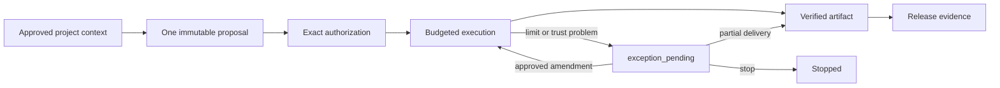

# Agentic SDLC documentation

This page is the documentation map. Start with the goal that matches what you want to do; you do not need to read every page in order.

## Start here

- [Project overview](../README.md) — what the plugin does, installation, the normal two-checkpoint experience, and maintainer commands.
- [How it works](how-it-works.md) — the end-to-end lifecycle from project context and `requirement:v2` agreement through per-delivery autonomy, execution, verification, and release evidence.
- [Limits and metering](limits-and-metering.md) — how requirement ceilings and explicit pull-request or local-release choices constrain actions, files, capabilities, time, steps, tokens, calls, cost, and custom metrics.
- [Change Observatory](change-observatory.md) — open and interpret the bundled visual request/change/decision lineage.
- [Token efficiency](token-efficiency.md) — reduce derived JSON and shell-output context without changing canonical evidence.

## Find a page by goal

| I want to... | Read this | What it answers |
|---|---|---|
| Understand the normal user journey | [How it works](how-it-works.md) | What happens at each checkpoint and which records are created |
| Run or explain an assessment | [Assessment interactions](agent-interactions.md) | What Codex asks, what the user must answer, and concrete examples |
| Choose autonomy for a requirement, pull request, or local release | [Limits and metering](limits-and-metering.md) | Requirement ceiling, per-delivery selection, local rollback, exception boundaries, and resource limits |
| Measure local Codex usage with CodeBurn | [Limits and metering](limits-and-metering.md#codeburn-advisory-metering) | The complete `start` and `record` workflow, option meanings, and metric mappings |
| Integrate the CodeBurn library adapter | [CodeBurn adapter reference](codeburn-metering.md) | Snapshot and delta contracts, integrity rules, and library APIs |
| Reduce token-heavy tool output | [Token efficiency](token-efficiency.md) | Compact JSON defaults, RTK setup, bypass rules, and measurement |
| Understand the architecture and trust model | [Architecture](architecture.md) | Components, canonical records, validation, and release evidence |
| Open visual project lineage | [Change Observatory](change-observatory.md) | Launch paths, explainability, raw evidence, and local security boundaries |
| Understand `.sdlc/` storage | [Knowledge-base structure](kb-structure.md) | Which files are canonical, derived, append-only, or releasable |
| Install, update, or repair the plugin | [Portable install](portable-install.md) | Cross-platform installation, local marketplace setup, and troubleshooting |
| Understand the product assessment | [Product assessment](product-assessment.md) | Product intent, strengths, gaps, and improvement direction |

## Recommended reading paths

### User approving work

1. [How it works](how-it-works.md)
2. [Assessment interactions](agent-interactions.md)
3. [Limits and metering](limits-and-metering.md)

### Operator configuring controls

1. [Limits and metering](limits-and-metering.md)
2. [Architecture](architecture.md)
3. [Knowledge-base structure](kb-structure.md)
4. [CodeBurn adapter reference](codeburn-metering.md)

### Maintainer changing the plugin

1. [Project overview](../README.md)
2. [Architecture](architecture.md)
3. [Change Observatory](change-observatory.md)
4. [Token efficiency](token-efficiency.md)
5. [Knowledge-base structure](kb-structure.md)
6. [Portable install](portable-install.md)

## The core idea in one diagram

The proposal says what may happen. The authorization permits only the proposal’s exact action-and-subject pairs. The budget says how much measurable work may happen. Receipts prove what was actually used. For a detailed walkthrough, continue with [How it works](how-it-works.md); for the control model, continue with [Limits and metering](limits-and-metering.md).
