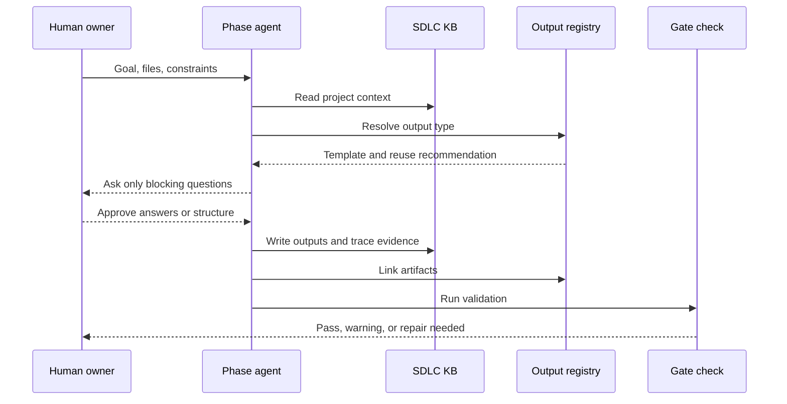
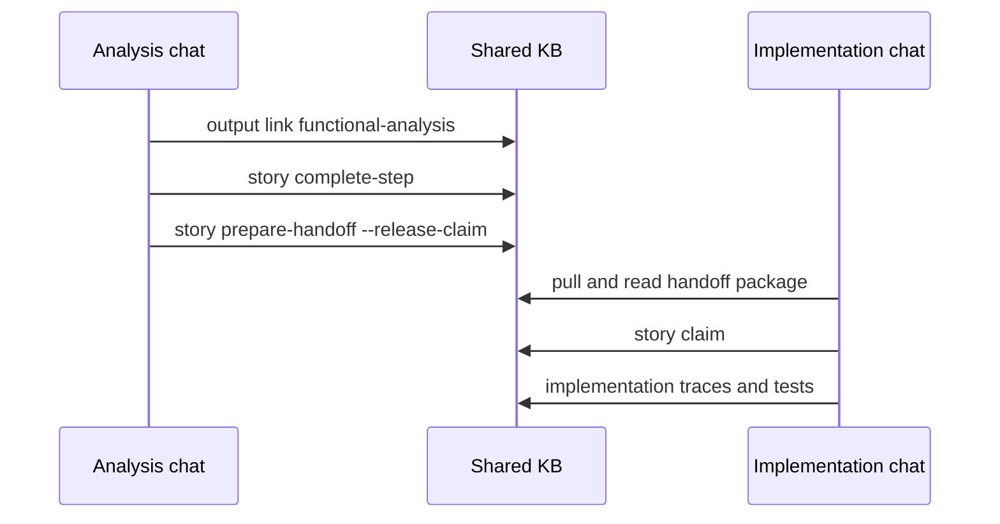
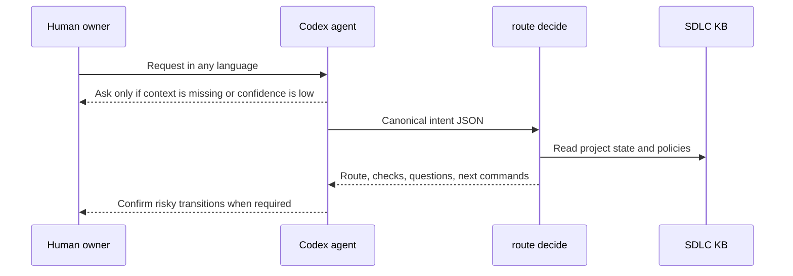
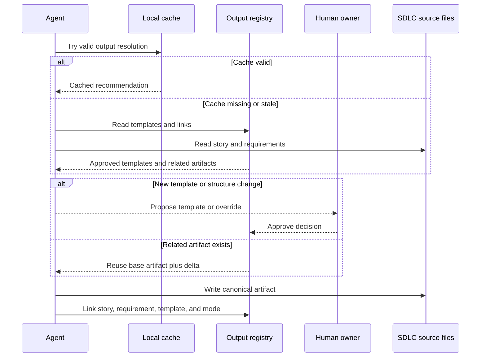
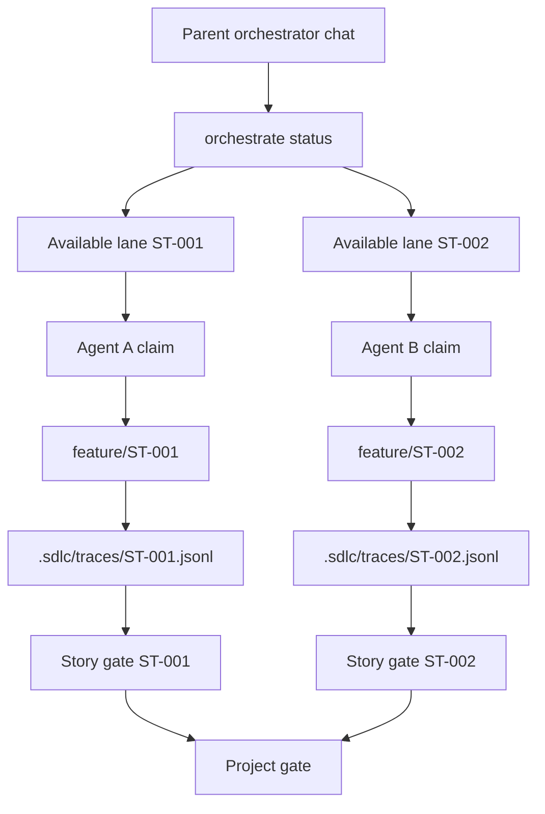

# Agent Interactions

Agentic SDLC models software delivery as a sequence of contract-governed agent handoffs. The plugin is stateless; every project-specific artifact is written under the target project's `.sdlc/` directory.

The examples below use neutral product placeholders. The plugin behavior is not tied to any domain.

## Interaction Pattern

Each phase follows the same loop:

```text
phase contract
  -> agent reads required inputs from .sdlc/
  -> agent resolves approved output contracts
  -> agent proposes reuse, delta, or new output structure
  -> user approves new templates or structural changes
  -> agent produces phase outputs
  -> agent links outputs in .sdlc/output-contracts/registry.json
  -> agent appends trace evidence
  -> gate check validates required artifacts
  -> human approves or sends the phase back for repair
  -> next agent receives structured inputs
```



When a lane is complete, the agent records the step before handing work to another lane:

```bash
node bin/agentic-sdlc.mjs story complete-step \
  --id ST-001 \
  --step functional-analysis \
  --type functional-analysis \
  --summary "Functional analysis accepted for implementation"

node bin/agentic-sdlc.mjs story prepare-handoff \
  --id ST-001 \
  --to-agent implementation-agent \
  --release-claim \
  --summary "Ready for implementation"
```



The operating model is not "agents freely coding." It is bounded execution:

- contracts define the work;
- execution policy defines model/reasoning inheritance or overrides;
- output contracts keep generated artifact structures consistent;
- the KB stores the durable context;
- local cache speeds lookup but is never source of truth;
- traces explain what happened;
- gates catch missing evidence;
- humans approve important transitions.

Activity reports reconstruct the real timeline from trace files:

```bash
node bin/agentic-sdlc.mjs report activity --since 3d --view business
node bin/agentic-sdlc.mjs report activity --since 3d --view dev --story ST-001
```

Each report item cites the trace file and line that produced it. If a decision, test, push, or handoff was not recorded in the KB, the report will not invent it.

## Request Router Behavior

When the user's request is ambiguous, the first agent acts as an intent normalizer rather than a keyword classifier. It maps the conversation and supplied files to canonical route intent JSON, then asks the CLI for a deterministic decision:

```bash
node bin/agentic-sdlc.mjs route decide --json --intent-json '<canonical-route-intent-json>'
```



The router can distinguish intake, story decomposition, contract creation, implementation, validation, release, phase skip confirmation, or clarification from canonical fields and KB state. It never writes canonical artifacts and never treats `.sdlc/cache/` as the authority.

## Contract Builder Behavior

The contract-building agent is generic. It does not know the project domain in advance. Before creating a contract it should:

1. Read `.sdlc/project.json`.
2. Search or inspect relevant `.sdlc/` artifacts.
3. Read user-provided files when the user points to them.
4. Ask concise questions for missing critical context.
5. Confirm whether the contract should inherit the main Codex thread model/reasoning or store an explicit override.
6. Store the evidence, answers, assumptions, constraints, execution policy, and open questions inside the generated contract.

Example:

```bash
node bin/agentic-sdlc.mjs contract create \
  --phase analysis \
  --context-file .sdlc/requirements/REQ-001.md \
  --context-summary "Analyze the MVP around the approved business workflow." \
  --qa "Who approves this phase?|Product owner" \
  --question "Which external provider is authoritative for MVP?" \
  --constraint "Provider-specific logic must stay behind an adapter" \
  --reasoning high \
  --execution-note "Higher reasoning requested for integration-risk analysis"
```

## Output Contract Behavior

Before generating a durable output, an agent checks `.sdlc/output-contracts/registry.json`:

```bash
node bin/agentic-sdlc.mjs output resolve --story ST-001 --type functional-analysis
```

If no approved template exists, the agent proposes one and waits for user approval:

```bash
node bin/agentic-sdlc.mjs output template propose --type functional-analysis --summary "Standard functional analysis"
node bin/agentic-sdlc.mjs output template approve \
  --id functional-analysis-v1 \
  --actor-type human \
  --approval-source explicit-user \
  --summary "Approved functional analysis template"
```

If a related story already covers the same requirement, the agent reuses the base artifact and creates only a delta:

```bash
node bin/agentic-sdlc.mjs output link \
  --story ST-002 \
  --type functional-analysis \
  --artifact .sdlc/requirements/ST-002-functional-analysis-delta.md \
  --template functional-analysis-v1 \
  --mode delta \
  --base-artifact .sdlc/requirements/functional-analysis.md \
  --requirement REQ-001
```

New templates, duplicate new outputs, and incompatible structures are human decisions, not silent agent choices.



## Example 1: Discovery Agent

The Discovery Agent starts from an idea or product request.

```bash
node bin/agentic-sdlc.mjs init --project-name "My Product"
node bin/agentic-sdlc.mjs contract create --phase discovery
```

Reads:

```text
.sdlc/project.json
.sdlc/contracts/contract-discovery-v1.json
.sdlc/requirements/
.sdlc/assumptions/
```

Produces:

```text
.sdlc/requirements/REQ-001.md
.sdlc/assumptions/ASM-001.md
.sdlc/risks/RISK-001.md
.sdlc/decisions/ADR-0001-problem-framing.md
```

Trace example:

```bash
node bin/agentic-sdlc.mjs trace append \
  --type decision \
  --summary "Target the MVP on the approved business workflow instead of a generic process."
```

Handoff to Analysis:

```text
Problem statement, target users, constraints, competitor alternatives,
discarded options, and success metrics are now durable KB artifacts.
```

## Example 2: Analysis Agent

The Analysis Agent turns discovery output into functional and technical boundaries.

```bash
node bin/agentic-sdlc.mjs contract create --phase analysis
```

Reads:

```text
.sdlc/requirements/
.sdlc/assumptions/
.sdlc/risks/
.sdlc/decisions/
.sdlc/contracts/contract-analysis-v1.json
```

Produces:

```text
.sdlc/requirements/functional-analysis.md
.sdlc/requirements/integration-map.md
.sdlc/risks/RISK-002-provider-api-availability.md
.sdlc/decisions/ADR-0002-provider-strategy.md
```

Trace example:

```bash
node bin/agentic-sdlc.mjs trace append \
  --type assumption \
  --summary "Provider data can be refreshed at workflow checkpoint granularity for MVP."
```

Handoff to Design:

```text
Functional flows, edge cases, API/mock strategy, and integration risks.
```

## Example 3: Design Agent

The Design Agent converts analysis into story workspaces and acceptance criteria.

```bash
node bin/agentic-sdlc.mjs contract create --phase design
node bin/agentic-sdlc.mjs story create \
  --id ST-001 \
  --title "Implement the approved workflow trigger" \
  --phase design \
  --acceptance "Given the approved trigger, the system proposes the expected alternative workflow."
```

Reads:

```text
.sdlc/requirements/functional-analysis.md
.sdlc/requirements/integration-map.md
.sdlc/decisions/
.sdlc/risks/
```

Produces:

```text
.sdlc/stories/ST-001/story.json
.sdlc/stories/ST-001/plan.md
.sdlc/stories/ST-001/implementation-log.md
.sdlc/tests/ST-001-test-strategy.md
.sdlc/decisions/ADR-0003-workflow-scope.md
```

Handoff to Implementation:

```text
Story ID, acceptance criteria, active contract, planned branch,
test strategy, and relevant decisions.
```

## Example 4: Implementation Agent

The Implementation Agent works only after a story has been claimed.

```bash
node bin/agentic-sdlc.mjs contract create \
  --phase implementation \
  --story ST-001 \
  --id contract-ST-001-implementation

node bin/agentic-sdlc.mjs story claim \
  --id ST-001 \
  --agent codex \
  --branch feature/ST-001
```

Reads:

```text
.sdlc/stories/ST-001/story.json
.sdlc/stories/ST-001/claim.json
.sdlc/contracts/contract-ST-001-implementation.json
.sdlc/tests/ST-001-test-strategy.md
.sdlc/decisions/
```

Produces:

```text
application code changes
.sdlc/stories/ST-001/implementation-log.md
.sdlc/traces/ST-001.jsonl
.sdlc/tests/ST-001-test-run.json
```

Trace examples:

```bash
node bin/agentic-sdlc.mjs trace append \
  --story ST-001 \
  --type implementation \
  --summary "Added domain-event workflow service and fallback selector."

node bin/agentic-sdlc.mjs trace append \
  --story ST-001 \
  --type test \
  --summary "Unit and integration tests passed for the trigger-driven workflow." \
  --evidence .sdlc/tests/ST-001-test-run.json
```

Handoff to Validation:

```text
Code diff, implementation log, test evidence, unresolved risks,
and trace events linked to the story.
```

## Example 5: Validation Agent

The Validation Agent checks whether the story satisfies its contract and acceptance criteria.

```bash
node bin/agentic-sdlc.mjs gate check --story ST-001 --strict --out .sdlc/reports/ST-001-gate-report.md
```

Reads:

```text
.sdlc/stories/ST-001/story.json
.sdlc/contracts/contract-ST-001-implementation.json
.sdlc/traces/ST-001.jsonl
.sdlc/tests/
.sdlc/risks/
```

Produces:

```text
.sdlc/reports/ST-001-gate-report.md
.sdlc/tests/ST-001-validation-summary.md
.sdlc/traces/ST-001.jsonl
```

Trace example:

```bash
node bin/agentic-sdlc.mjs trace append \
  --story ST-001 \
  --type gate \
  --summary "Validation gate passed with test evidence linked."
```

Handoff to Release:

```text
Gate result, validation summary, accepted risks, and release notes input.
```

## Example 6: Release Agent

The Release Agent packages the validated change and keeps feedback observable.

Reads:

```text
.sdlc/reports/
.sdlc/tests/
.sdlc/traces/
.sdlc/decisions/
.sdlc/risks/
```

Produces:

```text
.sdlc/releases/REL-001.md
.sdlc/releases/observability-plan.md
.sdlc/releases/feedback-loop.md
.sdlc/traces/ST-001.jsonl
```

Trace example:

```bash
node bin/agentic-sdlc.mjs trace append \
  --story ST-001 \
  --type release \
  --summary "Released workflow MVP with provider signal monitoring." \
  --evidence .sdlc/releases/REL-001.md
```

## Parallel Agent Example

Two agents can work at the same time when work is split by story:

```text
Agent A
  story: ST-001
  branch: feature/ST-001
  trace: .sdlc/traces/ST-001.jsonl

Agent B
  story: ST-002
  branch: feature/ST-002
  trace: .sdlc/traces/ST-002.jsonl
```

They share global context through `.sdlc/requirements`, `.sdlc/decisions`, and `.sdlc/risks`, but their active work and evidence stay story-scoped.



## Multiple Codex Chats

Use this when separate Codex chats work on separate stories:

```bash
node bin/agentic-sdlc.mjs orchestrate status --json
node bin/agentic-sdlc.mjs story claim --id ST-001 --agent analysis-chat --branch feature/ST-001 --thread-id codex-thread-a
node bin/agentic-sdlc.mjs story claim --id ST-002 --agent implementation-chat --branch feature/ST-002 --thread-id codex-thread-b
```

Each chat records its own evidence:

```bash
node bin/agentic-sdlc.mjs trace append --story ST-001 --type decision --summary "Functional flow accepted" --actor analysis-chat --actor-type agent
node bin/agentic-sdlc.mjs sync record --story ST-001 --event push --summary "Pushed analysis artifacts"
node bin/agentic-sdlc.mjs story handoff --id ST-001 --to-agent implementation-agent --artifact .sdlc/requirements/functional-analysis.md
node bin/agentic-sdlc.mjs story handoff close --id HND-ST-001-20260701123000 --status closed
node bin/agentic-sdlc.mjs gate check --story ST-001 --strict --out .sdlc/reports/ST-001-gate-report.json
```

When output resolution becomes slow or the KB grows, each chat can rebuild a local cache:

```bash
node bin/agentic-sdlc.mjs cache rebuild
node bin/agentic-sdlc.mjs cache status
```

The cache accelerates lookup only. Agents must still cite canonical `.sdlc/` source artifacts in links, traces, and gates.

## Parent Orchestrator Chat

A parent chat coordinates available lanes without taking over worker claims:

```bash
node bin/agentic-sdlc.mjs orchestrate plan --json
node bin/agentic-sdlc.mjs phase lock --phase analysis --reason "Updating shared integration map"
node bin/agentic-sdlc.mjs phase release --id LOCK-analysis-20260701123000 --reason "Integration map stable"
node bin/agentic-sdlc.mjs gate check --scope all --strict --out .sdlc/reports/project-gate-report.json
```

## Human Governance

Humans approve phase gates, resolve conflicting decisions, split stories, accept risks, and decide when a trace or contract must be corrected. Agents can propose changes and produce evidence, but they should not silently bypass gates.
