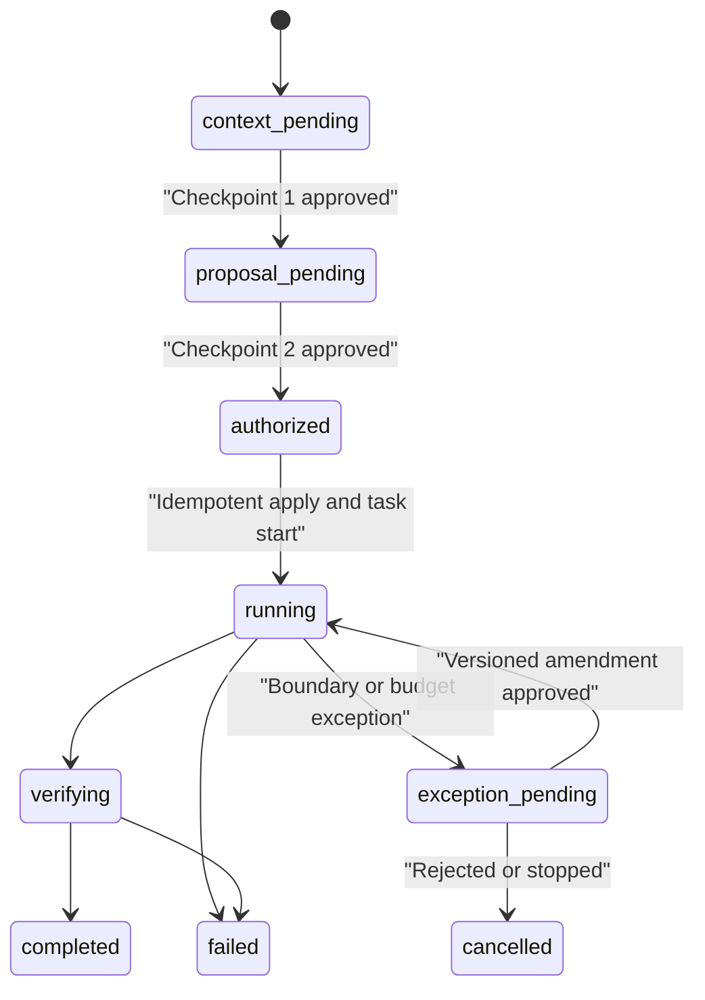

# Assessment Interactions

This document defines the user-facing behavior of the `Project Assessment` skill. The product asks for two business decisions and keeps SDLC bookkeeping behind them.

## Activation

The first starter prompt is:

```text
Contextualize this project and prepare an initial technical assessment.
```

Equivalent requests in any language select the same journey, including “Contestualizza il progetto e prepara un assessment tecnico”, “Assess the architecture and risks”, and requests for Word, Excel, PDF, PowerPoint, HTML, JSON, CSV, or Markdown delivery.

Preserve any root, format, destination, exclusions, evidence sources, autonomy boundary, or budget already provided. Do not ask twice for the same unchanged, hash-bound choice. A new pull request or local release is a new delivery unit and must always receive its own explicit autonomy selection.

## Exactly Two Normal Checkpoints

The normal local assessment always has these two logical checkpoints:

1. project context;
2. immutable combined proposal and complete execution tranche.

There is no separate normal decision for requirement, story, capabilities, template, contract, start, verification, or budget when all are visible inside the immutable bundle. If the assessment will create one pull request or local release, that delivery's autonomy selection is included in checkpoint 2. A fresh approved context may make checkpoint 1 short, but it remains correctable when the user requested contextualization.

An additional decision is required for a different delivery unit, material requirement or delivery drift, protected-branch merge, remote deployment, install, external access, secret, production access, destructive action, out-of-scope write, material proposal change, or unapproved budget extension.



## Contract For Every Question

Every question shown to the user—including a clarification, exception, or budget-extension request—must include:

- what is being asked;
- why it is required now;
- what the response authorizes;
- what it does not authorize;
- valid answer examples in Italian and English.

A bare “Proceed?” or “Approve?” is invalid. The host or CI system must persist the direct answer as `host_approval_receipt:v1`; an agent cannot create authority by declaring itself a human actor.

Open questions use the configurable `open_question_guidance` policy. It classifies questions as objective, users/stakeholders, constraints/NFRs, output/delivery, integrations, approval boundaries, or budget/time; each category supplies keywords, why the answer matters, Italian and English examples, and the exact proposal effect. An unmatched question uses the configured fallback. The original question is always the “what”; guidance must not replace it with an internal category label.

Assessment routing is also data-driven. `assessment_workflow.requested_actions` lists the normalized actions that must enter the baseline-plus-combined-proposal journey. Adding an action there changes routing policy without changing CLI code; it must never be used to bypass either logical checkpoint.

## Checkpoint 1 — Project Context

Inspect the repository and user-provided local files read-only. Explain:

- evidenced product purpose, users, and lifecycle state;
- stack, runtime, deployment model, integrations, boundaries, and components;
- exact evidence inspected;
- constraints and non-goals;
- observed facts versus inferences;
- assumptions, contradictions, confidence, open questions, and facts that cannot be recovered.

Paths are supporting evidence, not the explanation.

### Required question

- **What is being asked:** approve or correct only the displayed project context.
- **Why:** the assessment needs a canonical baseline and cannot convert inference into fact silently.
- **Authorizes:** approval of the represented baseline content hash.
- **Does not authorize:** assessment scope, requirement/story creation, format, tools, writes, external access, budget, contract, or start.
- **Question:** “Do you approve this context, or what should I correct?”
- **Italian examples:** “Approvo il contesto”; “Correggi: usiamo Kubernetes, non ECS.”
- **English examples:** “I approve the context”; “Correct this: we use Kubernetes, not ECS.”

Apply corrections inside this same checkpoint. Internally use `onboard existing-project` and `baseline approve`. The baseline approval must never be reused as checkpoint 2 approval.

## Prepare The Immutable Proposal

After checkpoint 1, run `assessment proposal prepare`. It creates:

- an `assessment_proposal:v1` in `proposal_pending` state;
- an `assessment_workflow:v1` resumable state record;
- a complete `execution_budget:v1`;
- stable reservations for requirement, story, template, contract, authorization, output, and receipts.

The proposal binds `baseline_ref.approved_content_hash` and hashes the complete approval payload with `proposal_hash`. It includes:

- scope ID/title/summary and real requirement ID;
- exact `requirement:v2` revision and requirement execution profile ceiling;
- story reservation and acceptance criteria;
- artifact type, preset, sections, canonical delivery, generator, verifier, and destination;
- capabilities, permissions, targets, and evidence plan;
- contract draft and route intent;
- exact `write_set[]` actions, subject IDs/hashes, paths, and artifact types;
- execution budget and stop policy;
- security boundaries, approval boundary, and idempotent application plan.
- when delivery is in scope, one exact pull-request or local-release profile and its requested/effective autonomy level.

The system may not fill in material content after approval. Changing any bound field creates a new proposal hash and requires checkpoint 2 again.

## Checkpoint 2 — Combined Proposal And Complete Tranche

Use six primary blocks when a delivery unit is in scope; omit block 5 only for an assessment that produces no pull request or local release:

1. **Outcome, scope, evidence** — supported decision, audience, inclusions/exclusions, depth, requirement/story, reuse mode, sources, and checks.
2. **Deliverable, verification** — sections, format, extension, media type, path, delivery mode, generator, verifier, and required verification dimensions.
3. **Tools, security, writes** — installed capabilities, permissions, targets, full write-set, and excluded risky operations.
4. **Budget and stop policy** — the complete execution tranche.
5. **Delivery autonomy** — requirement ceiling, one named PR or local-release profile, selected/effective level, target, actions, paths, checkpoints, non-reuse, and merge/deploy exclusions.
6. **Start and boundary** — internal records/actions, task start, final delivery, exception triggers, and exclusions.

Put proposal/baseline hashes, requirement/story/template/contract IDs, subject hashes, authorization actions, artifact types, and idempotency key in a compact technical appendix. It may be collapsible, but not hidden from the decision.

### Budget in the same checkpoint

Show concrete values and metering accuracy/source for:

- target and maximum active time, excluding user and approved external waiting; the default is exact, soft at 2,700 seconds and hard at 3,600 seconds;
- aggregate main-agent and subagent steps; the default is exact, soft at 40 and hard at 60;
- aggregate main-agent and subagent tokens; the default is an estimated soft threshold of 200,000 with no hard limit;
- cost/currency only when both a reliable metering/pricing adapter and a currency are configured;
- configured warnings, normally 70% and 90%;
- completion and verification reserve, normally 15%;
- action at limit: request extension, partial delivery, or stop;
- any bounded automatic extension. Default is none.

Label every metric `exact`, `estimated`, or `unavailable`. Estimated or unavailable limits cannot be presented as hard enforcement. In particular, when no trustworthy pricing adapter, pricing reference, or currency is available, checkpoint 2 must label cost `unavailable` and non-binding; it must not invent or imply a cost cap. The tranche includes analysis, generation, verification, linking, gates, receipts, and final delivery.

### Required question

- **What is being asked:** approve the exact proposal ID/hash and complete tranche, or request a change.
- **Why:** one decision can replace fragmented approvals only when every authorized subject, write, tool, verification step, and budget limit is fixed and visible.
- **Authorizes:** only the displayed requirement/story, exact subject hashes and write-set, proposal-bound automation uses, task start, analysis, artifact, layered verification, KB linking, budget policy, final summary, and—when present—the selected level for that one delivery profile.
- **Does not authorize:** another PR or local release; protected-branch merge; remote deployment; installs; undisplayed external/production access; secrets; destructive actions; different subjects, paths, or artifacts; material changes; or unbounded budget extensions.
- **Question:** “Do you approve proposal `<id>` at hash `<hash>`, including this budget and stop policy, or what should I change?”
- **Italian examples:** “Approvo la proposta `<id>` con questo budget”; “Modifica: massimo 45 minuti, nessuna fonte esterna, DOCX.”
- **English examples:** “I approve proposal `<id>` with this budget”; “Change it: 45 minutes maximum, no external sources, DOCX.”

One short approval covers only the visible hash-bound bundle. It does not approve the eventual findings themselves.

## Internal Command Choreography

The supported assessment lifecycle is:

```text
onboard existing-project
baseline approve
assessment proposal prepare
assessment proposal approve
assessment proposal apply
assessment proposal status
budget usage record
budget status
assessment proposal complete
```

Supporting commands are `requirement propose|approve|revise|supersede|status` and, for an approved exceptional change, `budget amend`. `requirement create` remains only a compatibility alias for proposal creation; it must not bypass approval.

- `assessment proposal approve` validates the unchanged proposal hash, records the host approval, and creates a proposal-bound content authorization.
- `assessment proposal apply` applies the displayed write-set idempotently. A partial failure is resumed through workflow state, not a new normal checkpoint.
- Every automation approval and task start writes an immutable usage receipt with the authorization snapshot and `valid_at_use`. Canonical assessment authorization uses `authorization-usage-receipt:v2`; the compatibility CLI uses pair-bound `authorization-usage-receipt:legacy-v2`. Later closure or revocation does not invalidate historically valid uses.
- `assessment proposal complete` is internal and succeeds only after required output, verification, linkage, usage accounting, and gates. It is not a third decision.

## Requirement And Story Lineage

The assessment uses one real `requirement:v2` such as `REQ-INITIAL-ASSESSMENT`, one approved requirement execution profile, and one story such as `ST-INITIAL-ASSESSMENT`. If it produces a pull request or local release, it also uses one delivery execution profile. Every example and record must use those same IDs consistently:

```text
Requirement: REQ-INITIAL-ASSESSMENT
Requirement execution profile: AUT-REQ-INITIAL-ASSESSMENT
Story: ST-INITIAL-ASSESSMENT
Profile: CAP-PROFILE-ST-INITIAL-ASSESSMENT
Recommendation: CAP-REC-ST-INITIAL-ASSESSMENT
Template: technical-analysis-v1
Contract: contract-ST-INITIAL-ASSESSMENT-analysis
Delivery execution profile: AUT-DELIVERY-ASSESSMENT-001
Authorization: AUTH-ST-INITIAL-ASSESSMENT
```

Use `requirement propose|approve|revise|supersede|status`. Reuse only when identity, revision, content hash, and material scope match. Never write a fake `REQ-001` merely to satisfy output linking. A material revision supersedes the prior requirement and invalidates delivery profiles bound to its old hash.

## Delivery Autonomy Choice

The requirement execution profile supplies only an autonomy ceiling. It does not authorize execution. Before each delivery begins, show one explicit choice among `supervised`, `checkpointed`, and `bounded-autonomous` for exactly one delivery kind:

- `pull_request`: show repository, base branch, head branch, canonical actions, explicit write paths, the one story/approved-contract pair, exclusions, and whether merge is requested;
- `local_release`: show the local root, canonical allowed actions and write paths, shell-free JSON-argv smoke tests, the one story/approved-contract pair, required rollback, and explicit denial of external, production, and destructive access.

Explain the recommended level using requirement clarity, testability, reversibility, environment, data/security impact, known tools, write paths, and budget. Prior successful runs may inform that recommendation but never grant the level. The effective result is the most restrictive of host, project, requirement, delivery, contract, capability, environment, and budget.

The choice applies to one delivery ID and content hash, exactly one story/approved-contract pair, cannot be reused for another PR or local release, permits at most one concurrent run, and closes when terminal. `audit_only` authority is capped at `checkpointed`, including for local release. Effective `bounded-autonomous` requires an external host/CI Ed25519 receipt for the exact profile-approval subject, `authority_policy.mode: host_verified`, a matching trusted public key, and `--host-receipt-file` on approval. Merge to `main` or another protected branch and every remote or production deployment remain explicit exceptions.

For delivery work, reserve the planned profile ID in the requirement-bound story contract and approve the contract first. Then create the matching profile and bind it to the immutable requirement, story, and contract hashes. The reserved ID is not a profile hash or approval. Task start supplies the profile and rejects drift; do not rewrite the approved contract to create a circular reference.

After start, explain the action lifecycle as **authorize → execute the exact recorded operation → complete with evidence**. The authorization receipt does not run Git or call a provider. At a `host_verified` checkpoint, require an external Ed25519 receipt for action `autonomy.delivery.action.<canonical-action>` and the exact profile/delivery/runtime/action-details subject; `audit_only` records explicit approval without claiming verified authority. Passing `release.local` completion runs the exact approved smoke argv in a supported read-only/no-network sandbox; passing release or merge completion writes the terminal receipt automatically. Push/merge authorization records a live remote pre-state, and completion queries the exact Git remote or GitHub PR for its post-state. These observations are not provider-signed offline attestations, so also preserve durable host/CI/provider evidence.

## Proposal-Bound Authorization

New assessments use `content-authorization:v2`, not a free-text grant alone. Requirement and delivery profiles constrain what may be derived but are not executable credentials. The authorization contains:

- exact proposal ID/hash;
- exact delivery ID, kind, profile hash, and material target when delivery is in scope;
- canonical `allowed_uses` bindings for each exact action + subject-content hash pair, plus derived action/subject indexes;
- bounded use policy and terminal closure rule;
- host or CI authority assurance;
- validity window and immutable authorization hash.

Empty arrays are not wildcards. Legacy v1 snapshots with multiple actions and multiple subjects are ambiguous and fail closed; only v1 snapshots with one action or one subject can be mapped safely. Each use is evaluated at its own timestamp and persisted as an `authorization-usage-receipt:v2` before the authorized mutation.

For direct `authorization grant` usage outside the assessment proposal, declare repeated `--allow-use action=subject` values whenever both dimensions are plural. `--allow-action` plus `--allow-subject` remains compatible only when one side has a single value, so it cannot silently grant the cross-product of two independent lists.

`host_verified` additionally requires `host-approval-receipt:v2`: the host signs the canonical unsigned payload hash with Ed25519, and `attestation.key_id` must resolve to exactly one public key in `authority_policy.trusted_host_keys`. The signed question contract must name what is and is not authorized, and `constraints.subject_hash` must equal the approved subject hash. Missing trust roots, signatures, question fields, or subject-bound constraints fail closed and remain `audit_only`.

## Budget Monitoring And Amendment

Warnings are non-blocking progress updates. Before exceeding a non-automatic limit, ask one exception question using the full question contract. Show remaining budget, accuracy, completed/remaining work, requested increment/new total, reason, and partial-delivery alternative.

- **Authorizes:** only the displayed budget delta.
- **Does not authorize:** wider scope, tools, access, paths, or subjects.
- **Italian examples:** “Approvo altri 20 minuti, totale 60”; “Consegna parziale senza estensione.”
- **English examples:** “Approve 20 more minutes, 60 total”; “Deliver the partial result without extending.”

`budget amend` creates `budget_amendment:v1` against the base budget/proposal hashes. Never mutate the approved base budget. `budget usage record` persists actual/estimated values, reservations, source, and accuracy; the final response reports them honestly.

## Canonical Formats

| Canonical format | Aliases | Extension | Media type | Generator/verifier |
| --- | --- | --- | --- | --- |
| `markdown` | `md`, `markdown` | `.md` | `text/markdown` | native checks |
| `docx` | `word`, `doc`, `docx` | `.docx` | `application/vnd.openxmlformats-officedocument.wordprocessingml.document` | `documents` |
| `xlsx` | `excel`, `spreadsheet`, `workbook`, `xlsx` | `.xlsx` | `application/vnd.openxmlformats-officedocument.spreadsheetml.sheet` | `spreadsheets` |
| `pdf` | `pdf` | `.pdf` | `application/pdf` | `pdf` |
| `pptx` | `powerpoint`, `slides`, `pptx` | `.pptx` | `application/vnd.openxmlformats-officedocument.presentationml.presentation` | `presentations` |
| `html` | `html` | `.html` | `text/html` | native generation plus browser rendering |
| `json` | `json` | `.json` | `application/json` | native schema/syntax checks |
| `csv` | `csv` | `.csv` | `text/csv` | `spreadsheets` |

Use `artifact` or `artifact-plus-chat-summary`, defaulting to the latter. Never fake a format by changing an extension.

## Generation Receipt And Layered Verification

The format capability emits `artifact_generator_receipt:v1` for the exact artifact. Pass it separately from render evidence:

```bash
node <plugin-root>/bin/agentic-sdlc.mjs output link \
  --root <target-project> \
  --story ST-INITIAL-ASSESSMENT \
  --type technical-analysis \
  --artifact docs/technical-assessment.docx \
  --template technical-analysis-v1 \
  --mode new \
  --requirement REQ-INITIAL-ASSESSMENT \
  --authorization <authorization-id-from-assessment-proposal-approve> \
  --receipt-file .sdlc/receipts/generation/GEN-ST-INITIAL-ASSESSMENT.json \
  --evidence .sdlc/tests/ST-INITIAL-ASSESSMENT-docx-render.png
```

`--authorization` is the exact proposal-bound ID emitted by approval; the link consumes only its `output.link` action/subject pair and stores a use receipt. `--receipt-file` attests which generator produced the exact artifact hash. `--evidence` supplies separate render/content proof; neither substitutes for the other.

The `verification_receipt:v1` reports separately:

- `container_verified` — real format/container syntax;
- `content_verified` — required sections, stable IDs, evidence lineage, and semantic checks;
- `render_verified` — pages/sheets/slides/viewports are complete and legible;
- optionally `independent_verified` — a genuinely separate verifier.

Say “verified” only when all proposal-required dimensions pass. Otherwise qualify the claim. A legacy `status: passed` structural receipt is not evidence of semantic or rendered correctness.

## Release And Archive

Completion produces lineage from baseline and proposal through requirement revision/profile, delivery profile, story/contract, authorization uses, artifact generation, layered verification, and execution usage. A pull-request completion does not imply protected-branch merge. A local release additionally requires evidence for its exact local target, smoke tests, and rollback procedure, and does not imply remote deployment. A `release-manifest:v1` inventories those hashes, while `release-gate-receipt:v1` records the deterministic checks that admitted that exact manifest. An `archive-record:v1` is a logical, hash-bound declaration that identified legacy artifacts remain historical but are outside that release scope; it does not move files. The historical `archive closed` command instead emits a distinct `archive_plan` governed by `archive-plan.schema.json`; applying that plan verifies source hashes under a lock and rolls back incomplete moves.

For an existing KB, run an active-only migration as a dry run first:

```bash
agentic-sdlc migration active --release-manifest RELEASE-ASSESSMENT-001
agentic-sdlc migration active --release-manifest RELEASE-ASSESSMENT-001 --apply
```

The selected release manifest answers the otherwise ambiguous question “what is active?” The command validates every immutable requirement, story, contract, proposal, workflow, receipt, budget, gate, and artifact reference in that manifest. `--apply` persists missing configuration defaults but does not rewrite those approved records. Evidence belonging only to older valid release manifests is retained in place and bound into an `archive-record:v1`; unfinished work outside both releases is not classified as history.

Use `migration identity` only for an explicit identity-correction request. Preview the declarative source/target mapping first. The command validates legacy and canonical authorization lineage, exact action-subject bindings, revocations, receipts (including all earlier migration receipts), and supported byte references before it plans every dependent hash rewrite. It fails closed for stale supported references, opaque records, and signed or attested evidence affected directly or transitively; that evidence requires reissuance by its original authority. Apply the exact emitted `plan_hash`; a missing or changed hash means the canonical snapshot must be reviewed again. `--apply --plan-hash <preview-plan-hash>` builds and validates the complete result in a same-filesystem shadow tree, including derived state, then activates it through a journaled directory swap and leaves a digest-only receipt under `.sdlc/migrations/identity/`. After an interrupted process, use only `--recover --recovery-nonce <nonce-from-lock> --plan-hash <hash-from-lock>`; recovery is fail-closed, exclusive, and cannot roll back a committed result. This receipt explains the historical transformation without preserving the corrected source email in clear text.

## Completion Message

After `assessment proposal complete`, return:

- verdict and decision implications;
- major risks and prioritized recommendations;
- artifact path and hash;
- exact verification dimensions and evidence;
- budget target/actual, metering accuracy/source, and amendments;
- limitations and open decisions.

Do not add a routine post-delivery approval. The user may request a revision, which either stays inside the approved proposal or becomes a material exception.
