# Architecture

Agentic SDLC separates the reusable method from project-specific knowledge.

```text
Codex plugin
  -> skill instructions
  -> templates
  -> schemas
  -> cross-platform CLI

Target project
     -> .sdlc/
        -> baseline
        -> assessments
        -> budgets
        -> contracts
        -> autonomy
        -> authorizations
        -> authorization-uses
        -> receipts
        -> capability-discovery
        -> output-contracts
     -> work-items
     -> work-breakdown
     -> dependencies
     -> stories
     -> orchestration
     -> locks
     -> handoffs
     -> decisions
     -> traces
     -> tests
     -> releases
     -> manifests
     -> archive
     -> cache
     -> indexes
```

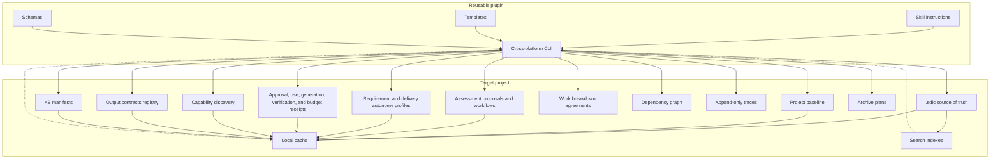

## Core Design Choices

The plugin is static and reusable. It contains the SDLC process, CLI, schemas, and templates.

The project knowledge base is dynamic and shared. It is created inside the target repository so it can be reviewed, branched, merged, and audited with normal Git workflows.

The source of truth is text and JSON. Cache and search indexes are derived artifacts that can be rebuilt. Reports are durable evidence when they support a review, gate, or release decision.

The scale layer is source-backed and explicit. `report activity` reads trace JSONL and reports source file/line for each statement. `manifest rebuild` creates a shared compact KB map from canonical files. `trace compact` creates additive summaries while retaining raw traces. `archive closed` is plan-first and only moves old reports or compactions with explicit `--apply`.

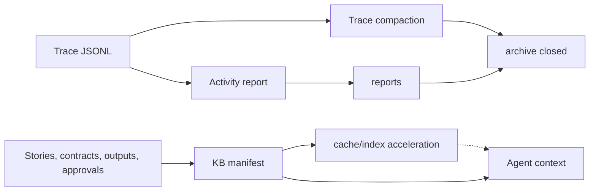

During `init`, the plugin copies the effective SDLC configuration to `.sdlc/config.json`. Later gate and orchestration commands read that project-local config, so a different `--template-dir` cannot silently weaken an initialized project's policy.

## Local Observability And Integrity Boundary

The practical goal is simple: when an operation fails, an operator can connect
the error to the relevant local activity without exposing project content or
pretending that a local hash is a trusted signature.

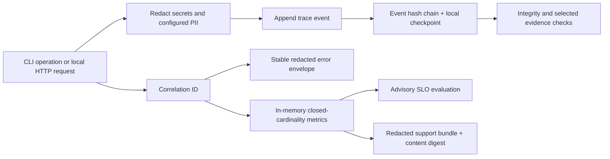

Every new general trace event receives a sequence, previous-event hash, and
event hash. A sibling checkpoint under `.sdlc/traces/.integrity/` anchors the
legacy prefix and the newly sealed chain. Appends use a local lock, no-follow
file opens, synchronized writes, and atomic checkpoint replacement. Recovery
may adopt a complete valid event or remove only an interrupted partial tail; it
does not silently discard a complete invalid record. Strict gates verify the
trace/checkpoint pair and any evidence reference marked for current-content
verification.

This mechanism provides local tamper evidence and content integrity. It can
detect an edited, reordered, truncated, or mismatched trace, but it does not
authenticate the actor, origin, or time and is not tamper-proof. A privileged
party able to replace both the trace and checkpoint can construct another
consistent pair. Authenticity requires an independent signed or append-only
anchor outside this local boundary.

Operational redaction runs before trace persistence and again at Observatory
presentation boundaries. Sensitive keys, known credential forms, configured
secret/PII patterns, email addresses, bearer values, credential assignments,
and private-key blocks are replaced. Entropy alone never classifies a value as
a secret. SHA digests, UUIDs, `corr-<uuid>` values, exact
`AUT-ACT-<timestamp>-<suffix>` authorization action IDs, and other opaque audit
references therefore remain readable unless an explicit privacy rule matches
them. Identifier allow rules cannot override a credential detector or a
configured secret/PII pattern. Trace evidence fingerprints use the redacted
UTF-8 representation rather than the original sensitive bytes.

One `corr-<uuid>` context follows a CLI operation or Observatory request into
trace records, response headers, and stable error envelopes. Unexpected errors
are normalized before display, so callers receive a safe error code,
retryability, and correlation ID without a stack, token, secret-bearing path,
or raw exception detail. A safe canonical or project-relative path may be
retained when it is the actionable location the operator must correct.

Change Observatory keeps request, latency, cache, and readiness metrics only in
process memory. Metric labels come from fixed allowlists, so a path, story ID,
token, or error message cannot create unbounded series. Availability and
readiness objectives are advisory and report insufficient data until the
configured minimum sample count is reached. The support bundle contains only
allowlisted redacted sections and a SHA-256 digest of its canonical redacted
content; that digest detects content changes but is not a signature or proof of
origin. `external_sinks: disabled` is enforced by configuration, so the plugin
does not export these signals.

The Observatory model cache still validates the canonical project revision.
Its strong `ETag` is retained by the browser client only in memory; a later
`If-None-Match` request can reuse the same model on `304`. A `304` without a
matching client cache fails closed instead of displaying an unknown model.

## Command-Scoped Canonical Queries

Each read-heavy command opens one bounded query session over the canonical `.sdlc` tree. The session builds its sorted file catalog lazily once, memoizes parsed JSON and JSONL by content hash, and reuses small deterministic indexes for story, requirement, output, dependency, and trace lookups. This removes repeated directory walks and all-pairs joins without changing command output, exit codes, or the source of truth.

The session never treats configured derived directories such as `.sdlc/cache/` or `.sdlc/indexes/` as canonical input. Writers invalidate the affected session state; a later command can always rebuild it from source files. Paths still pass through the canonical store boundary, including traversal, outside-root, and symlink checks.

The reproducible enterprise benchmark exercises 1,000 source files, 1,000 stories, 10,000 work records, 5,000 dependency edges, and 100,000 trace events. It enforces a single catalog build, complete deterministic counts, platform-specific query and warm-response latency budgets, and a bounded RSS budget on Unix and Windows.

## Existing Project Baseline

Existing repositories do not have a reliable SDLC history. The plugin creates a baseline of the observable current state instead of inventing past decisions.

`onboard existing-project` initializes `.sdlc/` when needed, scans repo manifests and key files, imports user-provided documents as hashed evidence, and writes:

- `.sdlc/baseline/<id>.json` as the machine-readable baseline proposal;
- `.sdlc/baseline/<id>-current-state.md` as a readable review artifact.

The baseline starts as `proposed`. It marks inferred facts as not approved and records open questions. Only a formal baseline approval can move it to canonical project context.

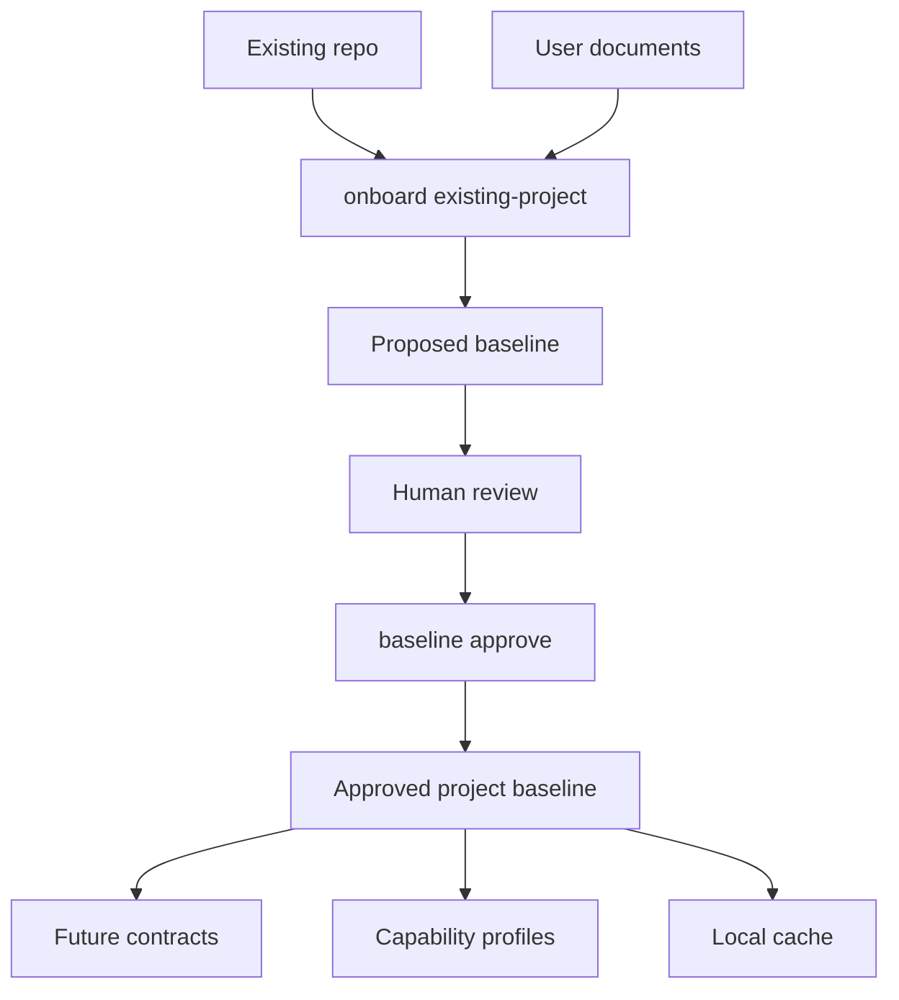

## Assessment Control Plane

The assessment journey is a dedicated state machine with exactly two normal checkpoints. Checkpoint 1 approves only the project baseline. `assessment proposal prepare` then builds a complete immutable approval payload containing baseline hash, requirement/story reservation, deliverable, capabilities, contract draft, route intent, write-set, execution budget, security, approval boundary, and idempotent application plan.

Checkpoint 2 approves the `proposal_hash`, not a free-text intention. `assessment proposal approve` records host/CI authority and creates a proposal-bound content authorization. `assessment proposal apply` applies only the displayed write-set and can resume after a partial failure without duplicating records. Runtime state lives in `assessment_workflow:v1`; it is not part of the immutable approval payload.

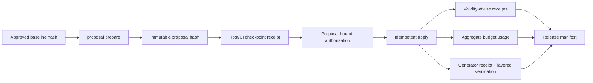

Budget policy is data-driven. Project configuration supplies metric templates, maxima, warning thresholds, completion reserve, and stop/extension rules. A hard limit is valid only for exactly metered usage. Amendments reference the approved base budget and proposal hashes; they never mutate the base tranche or widen scope.

## Configurable Workflow Plane

The reusable workflow engine separates process order from execution authority. A versioned definition says which states and transitions exist. A governed overlay may change human labels, descriptions, metadata, and parameters for an already allowlisted guard, but cannot change identifiers, initial state, transition direction, ordered phases, or recorded history.

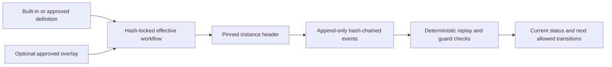

The engine ships software-project, change-request, technical-assessment, and generic-governed-process presets. The software preset preserves the exact six existing phases: discovery, analysis, design, implementation, validation, and release. The assessment preset preserves exactly two normal user checkpoints and complements, rather than replaces, `assessment-proposal:v1` and `assessment-workflow:v1`.

An instance pins the definition, optional overlay, and effective content hashes at start. A later definition or overlay version affects only a new instance. Events carry a monotonic sequence, previous-event hash, event hash, actor, timestamp, and idempotency key. Replay fails closed for modified, reordered, duplicated, or truncated evidence when a known checkpoint is supplied. Guards are declarative allowlisted identifiers with validated parameters; workflow records are never evaluated, dynamically imported, or passed to a shell.

Workflow approval grants no filesystem, tool, external-service, merge, or release authority. Those limits remain in requirements, contracts, capability policy, and the non-reusable profile selected for each pull request or local release. See [Configurable workflows](configurable-workflows.md) for the user and CLI journey.

## Autonomy Control Plane

Autonomy is represented by separate, composable records rather than a global trust score:

- `requirement:v2` is the immutable, revisioned business requirement;
- `requirement-execution-profile:v1` is its approved maximum autonomy envelope;
- `delivery-execution-profile:v1` is the user's explicit selection for one `pull_request` or `local_release`;
- `autonomy-decision:v1` is the deterministic explanation of the effective result.

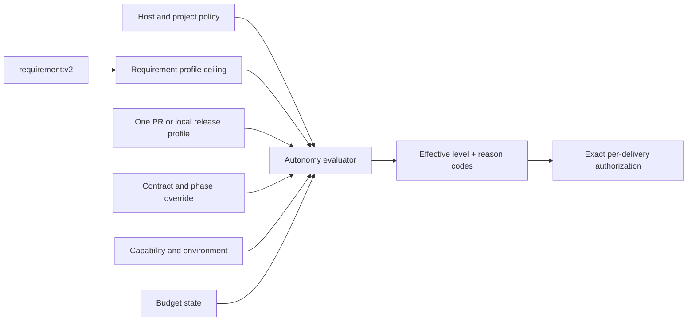

The evaluator computes the most restrictive result across host, project, requirement, delivery, contract, capability, environment, and budget. A downstream layer can only narrow authority. Multiple linked requirements use the lowest ceiling. Missing, unknown, stale, expired, revoked, or materially drifted inputs fail closed.

In user-facing language, the three choices mean: work together at every important step, let the agent proceed between agreed checkpoints, or let it complete the agreed PR independently. The choice is made separately for each PR or local release and never carries over automatically. The interface leads with what the agent may do, when it will stop, and where the choice applies; implementation codes appear only in technical details.

Internally those levels are `supervised`, `checkpointed`, and `bounded-autonomous`. `audit_only` authority is capped at `checkpointed`, including for local targets. Effective `bounded-autonomous` requires an external host/CI Ed25519 receipt for the exact delivery-profile approval subject, `authority_policy.mode: host_verified`, its public key in `trusted_host_keys`, and that receipt at approval time. The CLI validates but cannot self-issue trusted authority. Previous delivery history may support a recommendation but is not an input that can increase authority.

Delivery profiles are exact and terminal. One profile binds exactly one story and its one approved contract; an agreed aggregation story/contract is required when several changes must ship together. A pull-request profile binds repository, base branch, head branch, canonical actions, explicit write paths, material scope, and requirement profile hashes. A local-release profile binds a local target root, allowed writes/actions, shell-free JSON-argv smoke tests, and rollback while keeping external, production, and destructive access false. Neither profile may be reused for another delivery. Protected-branch merge and remote or production deployment are explicit exceptions.

Delivery binding is intentionally one-way to avoid circular hashes: reserve the planned profile ID in the final requirement-bound story contract, approve that contract, then bind the matching delivery profile to the immutable requirement-profile, story, and contract hashes. The ID is not a profile hash or approval. Task start supplies the profile to the evaluator; the approved contract is not rewritten to point back to it.

Task-start automation comes from the effective level's configured `automatic_phases`, not from a hardcoded progression or successful-run count. `supervised` always confirms. The stock `checkpointed` preset starts analysis, design, implementation, and validation automatically but retains release checkpoints.

Delivery actions form a receipt chain: immutable start → exact action authorization → external/host execution → outcome plus evidence → terminal close. An authorization receipt is policy, not an executor. A checkpoint under `host_verified` additionally requires an external Ed25519 receipt whose action is `autonomy.delivery.action.<canonical-action>` and whose subject binds the exact profile, delivery, runtime target, and action details; `audit_only` records the explicit approval without claiming verified authority. Passing `release.local` completion runs the exact approved smoke argv in a supported read-only/no-network sandbox and automatically closes `released`; passing `pull_request.merge` completion closes `merged`. The CLI validates local Git identity, branches, SHA transitions, paths, and evidence hashes, but currently relies on a host/CI/provider for durable proof that a remote push or merge actually occurred.

## Intent Routing Layer

The routing layer separates language understanding from deterministic SDLC control. Codex or another LLM normalizes the user conversation into the canonical intent schema; the CLI consumes only that JSON plus project-local `.sdlc/` state.

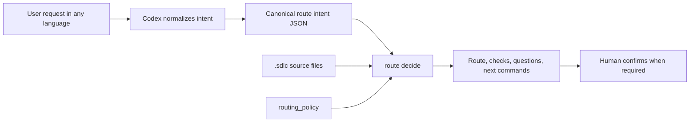

This keeps the deterministic layer language-agnostic: it does not search for words in the user's sentence. It validates configured `requested_action` values, confidence, referenced entities, missing context, artifact type, phase skips, story claims, contracts, and output registry state. `route decide` does not create source-of-truth artifacts; it returns a plan that the agent and user can accept, adjust, or rerun with a corrected intent.

`assessment_workflow.requested_actions` is the configurable route boundary for the dedicated assessment journey. When an intent matches, task start must require the approved baseline and immutable combined proposal instead of entering a generic contract path. `open_question_guidance` separately maps unresolved questions to configurable reasons, bilingual examples, and proposal effects, with an explicit fallback; classification never grants authority or changes the question itself.

## Contract Model

Every SDLC phase is governed by a contract. A contract defines:

- phase objective;
- responsible agent role;
- required inputs;
- required outputs;
- validation criteria;
- allowed tools;
- required knowledge base writes;
- human approval gate;
- requirement execution profile and delivery execution profile references;
- any per-phase autonomy override, which may only narrow the effective level;
- Codex execution policy for model and reasoning inheritance or override;
- operational metrics.

This keeps agent work bounded and reviewable. The contract does not grant autonomy by itself; it participates in the restrictive intersection evaluated for the current delivery.

Story-specific contracts can also declare `output_contract_refs`. In strict mode, each declared output ref must be satisfied by a linked artifact in `.sdlc/output-contracts/registry.json`. Contract approvals store a stable hash of the approved contract content; changing the contract after approval requires a new approval.

Contracts can declare `capability_policy`, `capability_bindings`, and `capability_recommendation_refs` to record agreed skills, MCPs, tools, concrete targets, permissions, source recommendations, and actions that require approval. Strict gates reject invalid policies, required MCP/tool capabilities that have neither a binding nor an explicit open contract question, stale recommendation refs, and install-required capabilities without install approval.

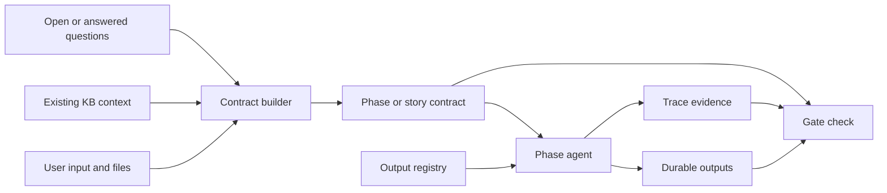

## Approval Governance

The approval model separates operational authorization from formal SDLC approval. A user saying "implement and push" does not automatically approve a contract, output template, baseline, requirement ceiling, delivery autonomy selection, capability recommendation, dependency graph, duplicate-output decision, or assessment proposal.

Formal approvals store:

- approver actor and type;
- `approval_source` such as `explicit-user`, `ci`, `automation`, or `bootstrap`;
- summary or immutable evidence;
- approved content hash;
- Git and Codex run metadata.

For new assessment and autonomy workflows, a human actor flag plus summary is insufficient by itself. A host/CI receipt binds the exact question, immutable subject hash, response, actor, host message, and timestamp. The derived content authorization enumerates exact actions, subject IDs/hashes, delivery identity, artifact types, validity, and use policy. Each mutation writes a snapshot receipt evaluated at the use timestamp; closing or revoking the grant blocks future use without rewriting history. `bootstrap` remains provisional and does not satisfy strict gates by default.

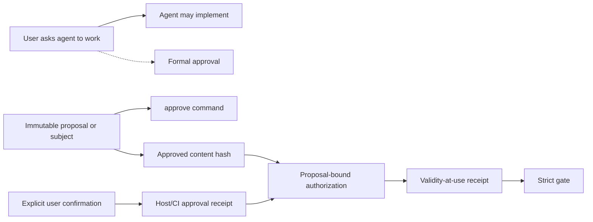

## Capability Discovery Layer

Capability discovery is a project-specific architect step before technical analysis or high-impact contract creation. The plugin stays agnostic: Codex or another LLM can normalize context into profile and recommendation JSON, while the CLI only validates and persists canonical records with evidence and approvals.

`.sdlc/capability-discovery/` stores approved profiles and recommendations:

- profiles describe the story/project subject, detected stack, constraints, integrations, evidence, confidence, source paths, and source hashes;
- recommendations describe skills, MCPs, tools, plugins, connectors, models, bindings, decision matrices, open questions, install requirements, and execution-policy suggestions;
- contract refs store the approved recommendation hash, so changing a recommendation after approval makes downstream gates fail.

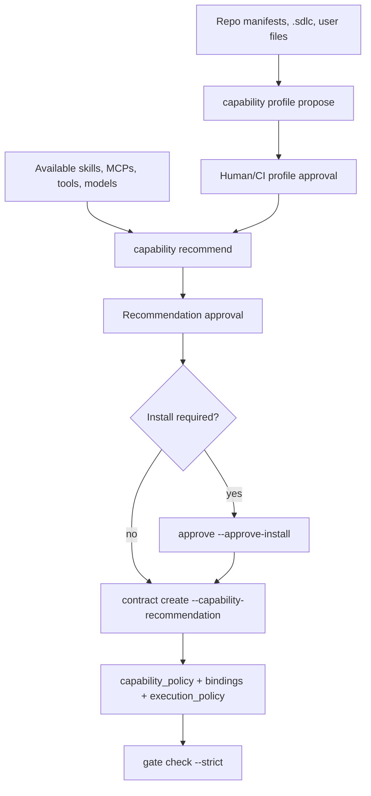

The deterministic detector can read project manifests such as `package.json`, `tsconfig.json`, `pyproject.toml`, `Dockerfile`, `go.mod`, `Cargo.toml`, `Package.swift`, Gradle, Maven, and common frontend config files. Richer app understanding should be provided as canonical profile JSON by Codex, then reviewed and approved. This avoids language-specific routing and avoids hardcoding product domains into the plugin.

## Work Breakdown And Dependencies

Work breakdown is internal to `.sdlc/`. Epics and tasks can be stored under `.sdlc/work-items/`, while approved decomposition choices live under `.sdlc/work-breakdown/`. Story remains the default delivery and strict-gate unit.

Dependencies are proposed first and become canonical only after approval into `.sdlc/dependencies/graph.json`. Orchestration uses hard dependencies to block unavailable stories and soft dependencies as context warnings. If an upstream linked artifact changes, downstream stories become stale until they record a `dependency.revalidate` trace.

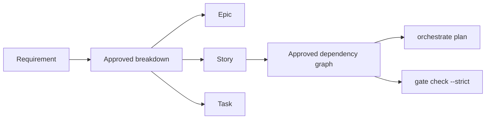

## Output Consistency Layer

Phase and story contracts define what work must happen. Output contracts define the approved shape of durable artifacts produced by that work.

`.sdlc/output-contracts/registry.json` is project-wide and source-of-truth. It stores:

- approved and draft templates by artifact type;
- story to requirement to artifact links;
- reuse, delta, or new output mode;
- user-approved decisions for new templates, structure changes, and justified duplicates.

Before creating a functional analysis, technical analysis, test plan, or similar artifact, an agent resolves the output type for the story. If a related story already covers the same requirement, the default recommendation is `reuse_delta`: reuse the approved base artifact and create only a targeted delta. A new template or incompatible output structure requires explicit user approval before it becomes canonical.

Template approvals store the approved template hash. Output links store fingerprints for the artifact, base artifact, and template. Non-native files also reference an artifact-generator receipt for the exact delivered hash. Verification receipts report container, content, and render dimensions separately; render evidence is distinct from generator attestation. Override decisions are bound to a specific link subject, so the same decision id cannot be reused for a different duplicate output. Registry mutations are serialized with a local lock file to avoid lost updates when multiple chats work in one workspace.

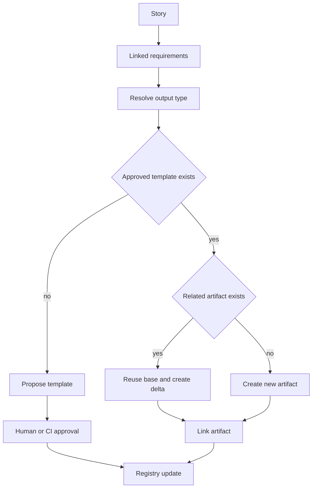

## Change Observatory Presentation Layer

Change Observatory is a read-only projection over canonical project evidence. It is packaged as browser-native assets under `ui/change-observatory/`; no generated bundle, frontend dependency, CDN, telemetry, or hosted component is required.

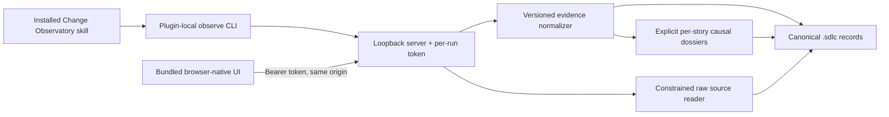

`observe` is dispatched before mutable SDLC workflow configuration is built, so it can diagnose a partial or malformed project without attempting initialization or writes. The launcher resolves assets relative to the installed module, binds only to `127.0.0.1`, selects an ephemeral port by default, and opens a fragment-token URL through shell-free platform commands.

The server pins the device/inode identity of the project and asset roots for the session. `.sdlc` and every requested source component must be non-symlink canonical paths. Raw inspection is restricted to JSON, JSONL, Markdown, and text; cache/index paths, traversal, case-variant policy bypasses, unsupported formats, oversized files, and malformed structured bytes fail closed. Evidence APIs require the per-run bearer capability, while static assets and health remain non-sensitive.

The normalizer emits `change-observatory:view:v1` and preserves `recorded`, `inferred`, `missing`, and `malformed` provenance. Its additive iteration dossier projection joins Asked, Decided, Contract, Done, and Verified lanes only through explicit story, requirement, related-record, contract, and evidence-path bindings. It does not use timestamps, filenames, or free-text similarity; unbound records remain global evidence plus diagnostics. Overview selection is delegated to the configurable policy in `lib/change-observatory/summary-ranking.mjs`, preventing newer operational bookkeeping from displacing more meaningful implementation or approval evidence. Equivalent diagnostics are aggregated server-side and again in the browser model as a defensive boundary.

Optional `trace-narrative:v1` records contain only shareable inputs, outputs, rationale summaries, alternatives, and labeled explanations with `recorded-evidence-only` scope. The rationale remains separate from the generated explanation in the API and UI. Sensitive reasoning keys and narratives explicitly marked as containing private reasoning are removed from both normalized and raw surfaces.

## Local Optimization Layer

`.sdlc/cache/` contains regenerable lookup data such as full-text entries, story-requirement graphs, artifact fingerprints, template resolution, compact KB summaries, dependency graphs, and output resolution results.

Cache entries carry `source_paths`, `source_hashes`, `generated_at`, and `schema_version`. A hash mismatch marks the cache stale. Stale or missing cache is a warning because the CLI can fall back to canonical KB files. A canonical artifact under `.sdlc/cache/` or `.sdlc/indexes/` is a strict gate error because derived files cannot become source of truth. Cached output resolutions are compared with canonical KB resolution before use; if they differ, the CLI asks for `cache rebuild` instead of trusting the cache.

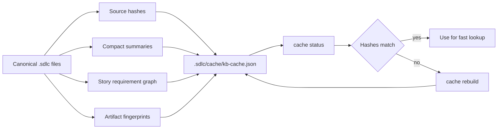

## Parallel Work Model

Parallelism is story-scoped. Each agent or developer claims a story and works on a dedicated branch. The claim is stored in the story folder, while events are appended to a trace log.

For multiple Codex chats, one chat can act as parent orchestrator by reading `orchestrate status --json` and assigning available story lanes. Worker chats claim exactly one story, write attributed traces, record push/sync events, and release or hand off their claim when done.

Phase locks are reserved for shared artifacts that cannot be safely edited by multiple story lanes at once. Handoff records capture transfer between analysis, implementation, validation, and release agents.

This avoids one shared mutable planning document becoming a collaboration bottleneck.

For phase-by-phase examples, see [Agent Interactions](agent-interactions.md).

## Gate Model

Gate checks are mechanical validations over `.sdlc/` artifacts. They do not replace human judgment, but they catch missing contracts, missing acceptance criteria, incomplete traceability, stale claims, invalid statuses or expiry dates, missing or drifted requirement/delivery profiles, delivery levels above their ceiling, authorization reuse across deliveries, unapproved or changed output templates, unjustified duplicate outputs, stale cache warnings, and test/release evidence gaps. Use `gate check --out <path>` to persist JSON or Markdown reports under `.sdlc/reports/`.

Canonical KB and trace paths always use `/` separators so the same records remain stable across Linux, macOS, and Windows. IDs reject names that cannot be represented portably, including Windows device names and trailing periods. Assessment gates validate the baseline/proposal hashes, requirement revision and ceiling, current delivery profile, story/contract lineage, exact authorization-use receipts, generator receipt, required verification dimensions, execution budget/usage/amendments, local smoke/rollback evidence when applicable, and release manifest rather than trusting IDs or a single `passed` flag.

Release tags run the complete Linux, macOS, and Windows matrix for every supported Node line before the package job can publish. The package regression test creates a real tarball, installs it into a clean prefix, and runs the installed CLI doctor so source-tree success cannot hide a missing packaged resource.

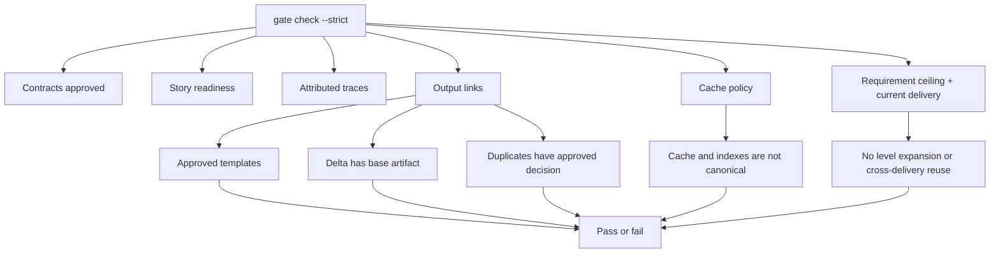

## Extension Points

The CLI accepts a custom template directory through `--template-dir`. Teams can replace the SDLC phase configuration without changing the plugin code.

`autonomy_policy` is also project-local configuration: rollout mode, allowed levels, legacy ceiling, host-verification requirement, delivery kinds, preset checkpoints, and exception triggers are data rather than product-specific branches. The evaluator remains generic and consumes the configured policies plus hash-bound records.

The schemas can be used by CI, pre-merge checks, or future MCP tools.

For the full project knowledge base layout, see [Knowledge Base Structure](kb-structure.md).
