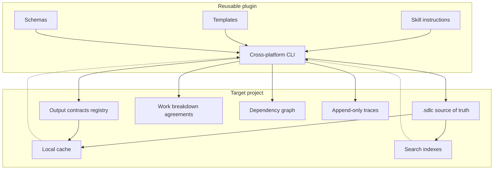
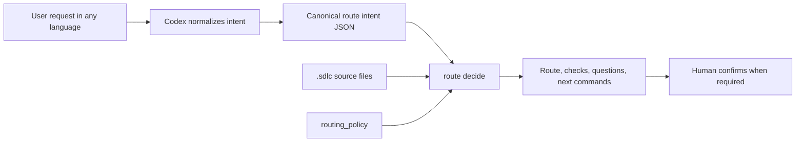
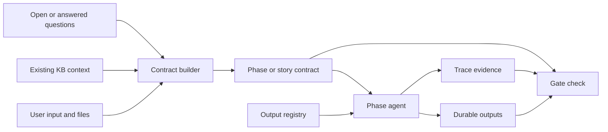
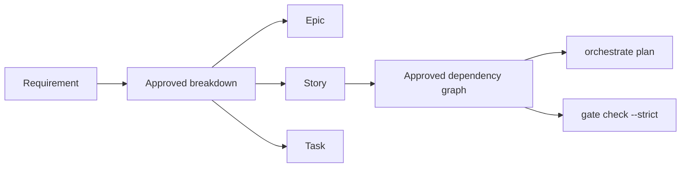
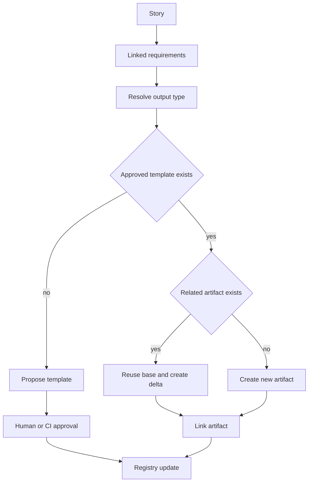
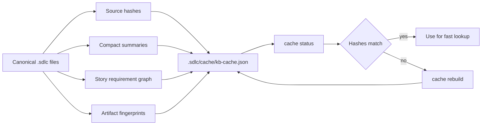
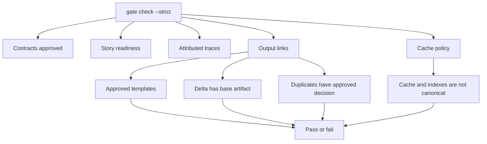

# Architecture

Agentic SDLC separates the reusable method from project-specific knowledge.

```text
Codex plugin
  -> skill instructions
  -> templates
  -> schemas
  -> cross-platform CLI

Target project
  -> .sdlc/
     -> contracts
     -> output-contracts
     -> work-items
     -> work-breakdown
     -> dependencies
     -> stories
     -> orchestration
     -> locks
     -> handoffs
     -> decisions
     -> traces
     -> tests
     -> releases
     -> cache
     -> indexes
```



## Core Design Choices

The plugin is static and reusable. It contains the SDLC process, CLI, schemas, and templates.

The project knowledge base is dynamic and shared. It is created inside the target repository so it can be reviewed, branched, merged, and audited with normal Git workflows.

The source of truth is text and JSON. Cache and search indexes are derived artifacts that can be rebuilt. Reports are durable evidence when they support a review, gate, or release decision.

During `init`, the plugin copies the effective SDLC configuration to `.sdlc/config.json`. Later gate and orchestration commands read that project-local config, so a different `--template-dir` cannot silently weaken an initialized project's policy.

## Intent Routing Layer

The routing layer separates language understanding from deterministic SDLC control. Codex or another LLM normalizes the user conversation into the canonical intent schema; the CLI consumes only that JSON plus project-local `.sdlc/` state.



This keeps the deterministic layer language-agnostic: it does not search for words in the user's sentence. It validates configured `requested_action` values, confidence, referenced entities, missing context, artifact type, phase skips, story claims, contracts, and output registry state. `route decide` does not create source-of-truth artifacts; it returns a plan that the agent and user can accept, adjust, or rerun with a corrected intent.

## Contract Model

Every SDLC phase is governed by a contract. A contract defines:

- phase objective;
- responsible agent role;
- required inputs;
- required outputs;
- validation criteria;
- allowed tools;
- required knowledge base writes;
- human approval gate;
- Codex execution policy for model and reasoning inheritance or override;
- operational metrics.

This keeps agent work bounded and reviewable.

Story-specific contracts can also declare `output_contract_refs`. In strict mode, each declared output ref must be satisfied by a linked artifact in `.sdlc/output-contracts/registry.json`. Contract approvals store a stable hash of the approved contract content; changing the contract after approval requires a new approval.

Contracts can declare `capability_policy` and `capability_bindings` to record agreed skills, MCPs, tools, concrete targets, permissions, and actions that require approval. Strict gates reject invalid policies and required MCP/tool capabilities that have neither a binding nor an explicit open contract question.



## Work Breakdown And Dependencies

Work breakdown is internal to `.sdlc/`. Epics and tasks can be stored under `.sdlc/work-items/`, while approved decomposition choices live under `.sdlc/work-breakdown/`. Story remains the default delivery and strict-gate unit.

Dependencies are proposed first and become canonical only after approval into `.sdlc/dependencies/graph.json`. Orchestration uses hard dependencies to block unavailable stories and soft dependencies as context warnings. If an upstream linked artifact changes, downstream stories become stale until they record a `dependency.revalidate` trace.



## Output Consistency Layer

Phase and story contracts define what work must happen. Output contracts define the approved shape of durable artifacts produced by that work.

`.sdlc/output-contracts/registry.json` is project-wide and source-of-truth. It stores:

- approved and draft templates by artifact type;
- story to requirement to artifact links;
- reuse, delta, or new output mode;
- user-approved decisions for new templates, structure changes, and justified duplicates.

Before creating a functional analysis, technical analysis, test plan, or similar artifact, an agent resolves the output type for the story. If a related story already covers the same requirement, the default recommendation is `reuse_delta`: reuse the approved base artifact and create only a targeted delta. A new template or incompatible output structure requires explicit user approval before it becomes canonical.

Template approvals store the approved template hash. Output links store fingerprints for the artifact, base artifact, and template. Override decisions are bound to a specific link subject, so the same decision id cannot be reused for a different duplicate output. Registry mutations are serialized with a local lock file to avoid lost updates when multiple chats work in one workspace.



## Local Optimization Layer

`.sdlc/cache/` contains regenerable lookup data such as full-text entries, story-requirement graphs, artifact fingerprints, template resolution, compact KB summaries, dependency graphs, and output resolution results.

Cache entries carry `source_paths`, `source_hashes`, `generated_at`, and `schema_version`. A hash mismatch marks the cache stale. Stale or missing cache is a warning because the CLI can fall back to canonical KB files. A canonical artifact under `.sdlc/cache/` or `.sdlc/indexes/` is a strict gate error because derived files cannot become source of truth. Cached output resolutions are compared with canonical KB resolution before use; if they differ, the CLI asks for `cache rebuild` instead of trusting the cache.



## Parallel Work Model

Parallelism is story-scoped. Each agent or developer claims a story and works on a dedicated branch. The claim is stored in the story folder, while events are appended to a trace log.

For multiple Codex chats, one chat can act as parent orchestrator by reading `orchestrate status --json` and assigning available story lanes. Worker chats claim exactly one story, write attributed traces, record push/sync events, and release or hand off their claim when done.

Phase locks are reserved for shared artifacts that cannot be safely edited by multiple story lanes at once. Handoff records capture transfer between analysis, implementation, validation, and release agents.

This avoids one shared mutable planning document becoming a collaboration bottleneck.

For phase-by-phase examples, see [Agent Interactions](agent-interactions.md).

## Gate Model

Gate checks are mechanical validations over `.sdlc/` artifacts. They do not replace human judgment, but they catch missing contracts, missing acceptance criteria, incomplete traceability, stale claims, invalid statuses or expiry dates, unapproved or changed output templates, unjustified duplicate outputs, stale cache warnings, and test/release evidence gaps. Use `gate check --out <path>` to persist JSON or Markdown reports under `.sdlc/reports/`.



## Extension Points

The CLI accepts a custom template directory through `--template-dir`. Teams can replace the SDLC phase configuration without changing the plugin code.

The schemas can be used by CI, pre-merge checks, or future MCP tools.

For the full project knowledge base layout, see [Knowledge Base Structure](kb-structure.md).
