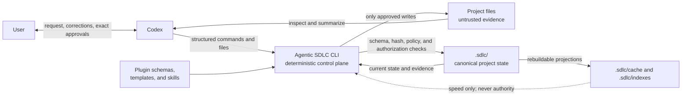
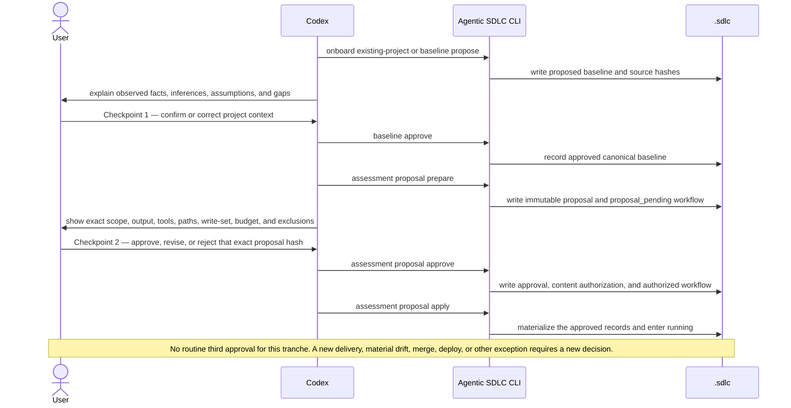
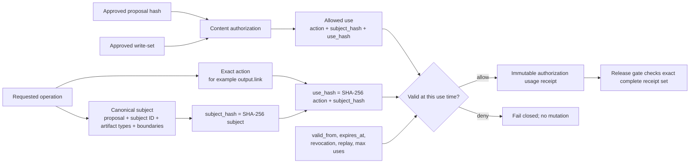
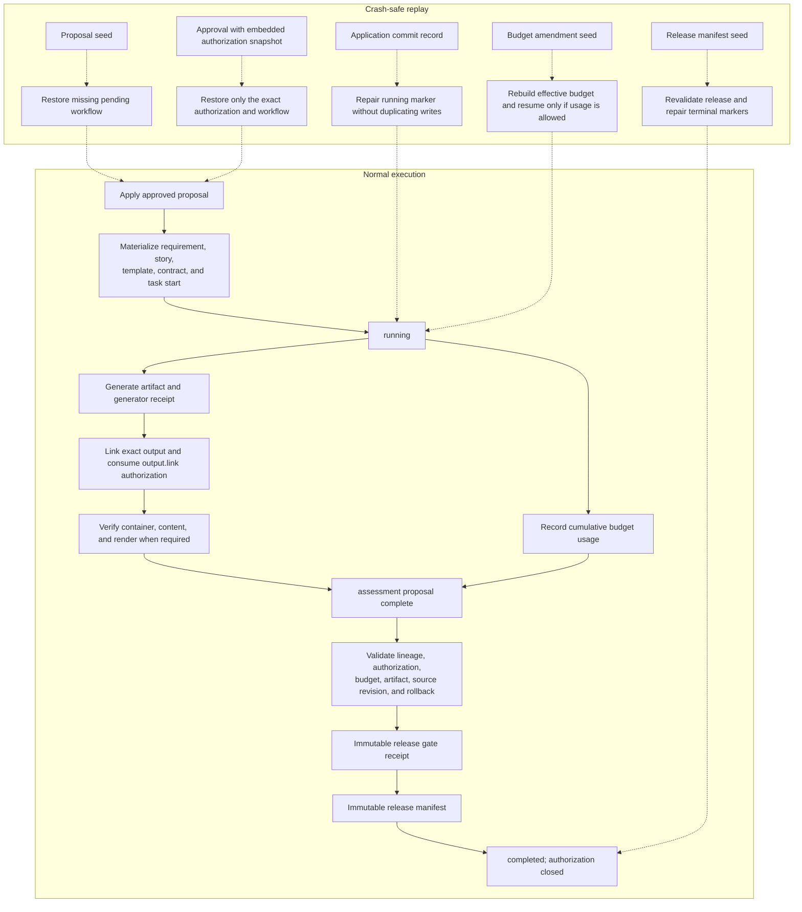
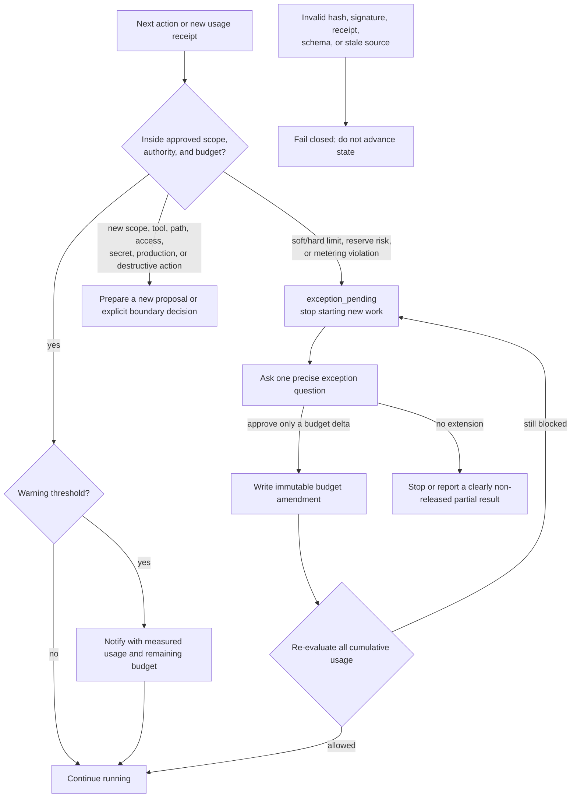

# How Agentic SDLC 0.11.0 Works

Agentic SDLC turns a natural-language request into a bounded, reproducible execution tranche. Codex handles conversation and reasoning; the CLI handles deterministic validation and state changes; the target repository keeps the evidence under `.sdlc/`.

The core rule is simple: **Codex may reason broadly, but it may write only what the approved requirement, current delivery unit, and exact authorization all allow.**

For the adjacent details, see [Limits and Metering](limits-and-metering.md), [Agent Interactions](agent-interactions.md), and the deeper [Architecture](architecture.md).

## 1. The Mental Model



Each part has one job:

- **The user** confirms the observed project context, agrees each requirement and its autonomy ceiling, and explicitly selects an autonomy level for every pull request or local release.
- **Codex** reads the conversation and repository, separates evidence from inference, explains questions, and prepares structured CLI input. Repository text is data, not authority: an instruction found in a README cannot grant a tool, a secret, or a wider write scope.
- **The CLI** does not interpret natural language. It validates schemas, hashes, state transitions, budgets, signatures, authorization uses, and release evidence before it writes.
- **`.sdlc/`** is the project-local control plane. It travels through normal Git review and contains the records needed to reproduce why a write or release was allowed.
- **The plugin** is reusable and project-agnostic. Project-specific choices live in `.sdlc/config.json` and in approved records, rather than in hardcoded product logic.

The installed command is `agentic-sdlc`. From a source checkout, the equivalent entry point is:

```bash
node /path/to/agentic-sdlc-codex-plugin/bin/agentic-sdlc.mjs --help
```

All examples below use commands exposed by the `Agentic SDLC 0.11.0` help output and assume the shell is in the target project:

```bash
cd /path/to/target-project
```

## 2. Canonical State Versus Derived State

**Canonical** means “authoritative for a decision or release.” It does not mean that every canonical file is forever static. Immutable records, such as an approved proposal or a usage receipt, are never silently rewritten. Controlled state records, such as a workflow or application, advance through validated, self-hashed revisions.

Default locations are shown below. Their roots are configurable, but the same separation is enforced.

| Data | Default location | Meaning |
| --- | --- | --- |
| Project policy and identity | `.sdlc/config.json`, `.sdlc/project.json` | Effective local policy and project identity |
| Checkpoint 1 | `.sdlc/baseline/` | Source hashes, observed context, assumptions, questions, and baseline approval |
| Checkpoint 2 | `.sdlc/assessments/proposals/`, `workflows/`, `approvals/`, `applications/` | Immutable proposal, state machine, exact approval, and application commit record |
| Materialized plan | `.sdlc/requirements/`, `.sdlc/stories/`, `.sdlc/contracts/`, `.sdlc/output-contracts/` | The requirement, story, contract, template, task start, and output link created from the proposal |
| Autonomy policy | `.sdlc/autonomy/` | Requirement execution profiles, per-delivery profiles, and deterministic effective-level decisions |
| Authority | `.sdlc/authorizations/`, `.sdlc/authorization-uses/` | Exact grants and historical validity-at-use receipts |
| Limits and usage | `.sdlc/budgets/<proposal>/` | Effective budget, amendments, metering snapshots, and usage receipts |
| Context optimization | `.sdlc/context-optimization/<proposal>/observations/` | Hash-bound RTK lifecycle observations; advisory evidence with zero budget credit |
| Verification | `.sdlc/receipts/generation/`, `.sdlc/receipts/verification/` | Generator identity, artifact hash, semantic checks, and render evidence |
| Release | `.sdlc/releases/gates/`, `.sdlc/releases/manifests/`, `.sdlc/archive/` | Gate decision, released lineage, rollback information, and logical history classification |
| Delivered artifact | The approved project path, for example `docs/technical-assessment.md` | Canonical only after it is linked, hash-bound, and verified |
| Derived acceleration | `.sdlc/cache/`, `.sdlc/indexes/` | Rebuildable lookup data; never accepted as approval or release evidence |

Hashes bind the chain together:

1. JSON records use a stable canonical JSON SHA-256 hash.
2. Files use the SHA-256 hash of their exact bytes.
3. Downstream records store the upstream ID, path, and hash.
4. A changed source, proposal, authorization, artifact, receipt, gate, or manifest therefore breaks validation instead of silently changing meaning.

Hashes provide integrity and binding; they are not encryption and do not make untrusted input safe by themselves.

## 3. The Two-Checkpoint Assessment

A normal assessment has exactly two logical user checkpoints. Internal records are not seven extra approvals; they are materialized from the one approved proposal. When that proposal already names one pull request or local release, the delivery autonomy choice is included in checkpoint 2. A later, different delivery unit still requires its own explicit selection.



### Checkpoint 1: confirm project context

Codex inspects the repository and proposes a baseline containing source paths and hashes, detected stack, observable current state, imported documents, assumptions, and open questions. The user confirms or corrects that summary.

This approval means: “this is an acceptable project context for preparing a proposal.” It does **not** authorize the assessment, implementation, tool installation, external access, or any output.

```bash
agentic-sdlc onboard existing-project \
  --project-name "Example Service" \
  --document README.md \
  --source src \
  --summary "Observable current state for review"

agentic-sdlc baseline status --id BASELINE-INITIAL

agentic-sdlc baseline approve \
  --id BASELINE-INITIAL \
  --actor-type human \
  --approval-source explicit-user \
  --summary "The context is accurate; treat the roadmap as outdated"
```

If a hashed baseline source changes after approval, proposal application fails. Codex must refresh the baseline and ask for checkpoint 1 again; an old approval cannot authorize a new context.

### Checkpoint 2: approve one complete tranche

The proposal includes the exact:

- objective, boundary, requirement, and reserved story;
- exact `requirement:v2` revision and approved requirement execution profile ceiling;
- when delivery is in scope, one pull-request or local-release profile with selected/effective level, target, actions, paths, non-reuse, and exceptions;
- output type, format, template, path, sections, and acceptance criteria;
- contract draft, route intent, capabilities, external/production access flags, and security rules;
- action/path write-set;
- limits, measurement accuracy, warnings, hard-stop behavior, and completion reserve;
- baseline reference and every field covered by `proposal_hash`.

```bash
agentic-sdlc assessment proposal prepare \
  --id ASSESS-001 \
  --baseline BASELINE-INITIAL \
  --scope-title "Architecture assessment" \
  --scope-summary "Assess current architecture, delivery risks, and prioritized improvements" \
  --story ST-ASSESS-001 \
  --requirement REQ-ASSESS-001 \
  --type technical-analysis \
  --artifact docs/technical-assessment.md \
  --template technical-analysis-v1 \
  --format markdown \
  --section "Executive summary" \
  --section "Architecture and risks" \
  --acceptance "Every major claim is linked to approved baseline evidence"

agentic-sdlc assessment proposal approve \
  --id ASSESS-001 \
  --actor-type human \
  --approval-source explicit-user \
  --summary "I approve the exact displayed proposal ASSESS-001"
```

Approval means: “perform only this proposal hash.” If the bundle contains a delivery profile, the autonomy selection applies only to that exact delivery ID and hash. It does not approve a future pull request, future conclusions, a larger budget, a different file, extra tools, secrets, protected-branch merge, deployment, production access, or destructive work.

In the default `audit_only` authority mode, the actor is recorded but the CLI cannot independently prove who invoked it. In `host_verified` mode, `--host-receipt-file` must supply an Ed25519-signed host/CI receipt bound to the exact question, proposal hash, response, actor, constraints, and decision time. The signing key must be in `authority_policy.trusted_host_keys`.

Every question presented by Codex should state, in plain language:

1. what is being asked;
2. why the answer is needed;
3. what a “yes” authorizes;
4. what it does not authorize;
5. an exact example answer; and
6. how each answer changes the proposal or workflow.

## 4. Requirement Ceiling And Per-Delivery Selection

New requirements use `requirement:v2`. The approved requirement content records the outcome, acceptance criteria, non-goals, constraints, non-functional requirements, integrations, immutable revision lineage, and the ID of its requirement execution profile.

The requirement execution profile is an approved policy ceiling. It records the maximum autonomy level, optional per-phase levels, material scope hash, allowed tools, capabilities, environments and write paths, checkpoints, exception actions, budget reference, validity, and authority assurance. It is not an executable authorization.

Before work starts for a delivery, the user explicitly chooses one of `supervised`, `checkpointed`, or `bounded-autonomous` for a single delivery execution profile:

| Delivery kind | Required target boundary | Always separate by default |
| --- | --- | --- |
| `pull_request` | Repository, base branch, head branch, allowed actions, and whether merge is allowed | A new PR needs a new profile; merge to `main` or another protected branch is an explicit exception |
| `local_release` | Local root, allowed actions and write paths, smoke tests, and a required rollback procedure | Remote deployment, production, external access, destructive work, machine-global changes, and writes outside the workspace |

The selection is single-delivery, single-concurrent-run, receipt-backed, terminally closed, and never reusable across deliveries. Its implementation unit is exactly one story and that story's one approved contract. If several changes need to ship together, model an explicit aggregation story/contract rather than attaching unrelated contracts to the same profile. Successful prior runs can inform the recommendation shown to the user, but they cannot grant or increase authority.

For delivery work, reserve the planned profile ID in the requirement-bound story contract and approve that contract first. The matching delivery profile then binds the immutable contract hash together with the requirement-profile and story hashes. The reserved ID is not a profile hash or approval. Task start supplies the profile and rejects drift; the contract is not rewritten to point back to it.

The deterministic evaluator uses the most restrictive boundary:

> effective autonomy = minimum of host, project, requirement, delivery, contract, capability, environment, and budget constraints

A contract or phase override may narrow the level but never widen it. If one delivery covers several requirements, the lowest applicable ceiling wins. Missing, stale, expired, revoked, unknown, or materially drifted inputs fail closed. Legacy `requirement:v1` records default to a `supervised` ceiling and do not silently acquire a delivery selection.

`bounded-autonomous` requires `host_verified` authority or trusted CI attestation. `audit_only` can record attribution but cannot prove it, so the evaluator caps effective autonomy at `checkpointed`, even when the target is only local. Effective bounded execution therefore has an external prerequisite: a trusted host/CI issues an Ed25519 receipt for the exact delivery-profile approval subject, the project sets `authority_policy.mode` to `host_verified` and registers that public key in `authority_policy.trusted_host_keys`, and approval supplies the receipt through `--host-receipt-file`. The CLI verifies the authority; it cannot sign itself into a higher level.

The reviewer should inspect the full proposed JSON before approval: requirement ceiling, requested/effective cap, delivery and target identity, one story/contract pair, canonical actions, write paths, automatic phases, checkpoints, exceptions, expiry, and explicit non-reuse. A prose level such as “checkpointed” without those boundaries is not an informed approval.

Task-start behavior is configuration-driven. `supervised` always stops for confirmation. For any other effective level, a phase starts automatically only when it is listed in `autonomy_policy.presets.<level>.automatic_phases`; an unlisted phase still returns an exact confirmation checkpoint. The stock `checkpointed` preset makes analysis, design, implementation, and validation automatic while leaving release actions checkpointed. This is phase policy, not a trust score learned from earlier successes.

## 5. Exact Authorization: Action × Subject

An authorization is not a bag of actions plus a bag of subjects. That would accidentally allow every combination. Version 2 stores each permitted **action–subject pair** separately. Requirement and delivery profiles constrain what may be authorized; they are not credentials themselves. The CLI derives narrow, per-delivery uses only after the requested work is proven to be a subset of every policy input.



For example, these are different permissions:

- `requirement.propose × REQ-ASSESS-001`;
- `contract.approve × contract-ST-ASSESS-001-analysis`;
- `output.link × ST-ASSESS-001` for artifact type `technical-analysis`;
- `assessment.proposal.complete × ASSESS-001`.

Permission to link the output does not imply permission to create another requirement. Permission for one story does not imply permission for another story, even when both IDs appear somewhere in the same proposal.

Likewise, permission for one pull request or local release does not imply permission for another. The repository, branches, local root, actions, paths, target hash, and delivery profile hash are part of the canonical subject. A terminal delivery closes its authorization, and a new delivery requires a new selection and new exact uses.

### Delivery actions are authorized, executed, then completed

After the immutable delivery-start receipt exists, each state-changing delivery operation follows this sequence:

1. `autonomy delivery action` evaluates the current effective policy and writes a single-use `authorized` receipt for the exact canonical action, runtime target, and action details. A configured checkpoint first returns `checkpoint_required`; only an explicitly confirmed rerun may authorize it. Under `host_verified`, that rerun also requires an external Ed25519 `--host-receipt-file` for action `autonomy.delivery.action.<canonical-action>` and the exact profile/delivery/runtime/action-details subject. Under `audit_only`, the explicit approval remains recorded but unverified.
2. The host, Git client, CI job, or local tooling executes exactly that recorded operation. The authorization receipt does not perform the operation.
3. The same command records `--outcome passed|failed` plus at least one immutable evidence file and consumes the authorization. Replay or a changed runtime boundary fails closed.

Canonical PR actions are `repository.read`, `repository.write`, `test.run`, `git.commit`, `git.push`, `pull_request.create`, `pull_request.update`, and `pull_request.merge`. Canonical local actions are `build.local`, `test.run`, and `release.local`. `git.commit` authorization additionally binds repeatable exact `--scope-path` values; completion accepts only one non-merge commit with the authorized parent and file set. `git.push` binds one matching remote, source SHA, destination ref, and non-force/non-delete semantics. Before push authorization, the CLI observes the base SHA directly on that remote; every commit from that SHA to the exact head must have one passing completed `git.commit` receipt, and every fetch/push URL configured for the selected remote must identify the approved repository. Merge authorization binds the exact `--pr-url`.

For local release, smoke tests are shell-free JSON argv arrays such as `--smoke-test '["npm","run","smoke:local"]'`. Completion must repeat the exact approved command set and rollback procedure. The CLI executes those commands in a supported read-only, no-network sandbox, records command/cwd/sandbox/exit/output hashes, and only then creates a `released` close receipt. Successful completion currently requires `/usr/bin/sandbox-exec` on macOS or `/usr/bin/bwrap` on Linux; unsupported hosts and Linux without `bwrap` fail closed and leave the delivery started. A passing `pull_request.merge` completion similarly creates `merged` automatically. Manual close remains available for approved `closed`, `cancelled`, `rolled_back`, `superseded`, or other valid non-success terminal outcomes; it cannot be used to assert `merged` or `released` without the terminal action receipt.

The remote boundary is deliberately explicit. For push, authorization records the destination ref before the operation and completion queries that exact ref for the authorized source SHA. For merge, authorization requires the exact open, non-draft GitHub PR at the approved head/base/SHA and completion queries it again for a later merged state and merge commit. These live authenticated observations are hash-bound but are not provider-signed offline attestations. Retain durable host/CI/provider evidence, and do not describe a generic evidence file as signed remote proof.

Immediately before a covered mutation, the CLI validates:

- the authorization schema and immutable hash;
- the proposal ID and proposal hash;
- the exact action–subject `use_hash`;
- artifact types and approval boundaries in the canonical subject;
- `valid_from`, `expires_at`, closure or revocation time;
- replay policy and maximum accepted uses;
- scope and authority assurance constraints.

If allowed, the CLI writes a receipt that embeds the authorization snapshot and the exact `used_at` decision. Closing or revoking an authorization blocks future uses, but a valid historical receipt remains auditable at the time it was used. Completion requires the exact proposal-defined set of accepted use receipts; one broad or unrelated receipt cannot satisfy the gate.

## 6. Execution, Verification, Recovery, and Release

The normal workflow state is:

```text
proposal_pending → authorized → running → verifying → completed
```

Execution and recovery share the same validation rules:



### Apply is exact and idempotent

`assessment proposal apply` consumes the proposal-bound authorization and materializes only the approved write-set. Existing records are reused only when their semantic content exactly matches the proposal. The application record is the commit marker for that materialization.

```bash
agentic-sdlc assessment proposal apply --id ASSESS-001
agentic-sdlc assessment proposal status --id ASSESS-001
```

The authorization ID returned by approval may also be supplied explicitly with `--authorization`. Omitting it uses the authorization referenced by the matching approval.

### Execution is measured as one tree

Main-agent and subagent usage is aggregated into the proposal budget. Manual values are estimated or unavailable. Exact hard-limit evidence must come from a configured trusted adapter with a valid signed attestation.

An exact runtime receipt is imported like this:

```bash
agentic-sdlc budget usage record \
  --proposal ASSESS-001 \
  --receipt-file .sdlc/receipts/runtime/USAGE-001.json
```

CodeBurn can provide a local advisory baseline and incremental observations. It is always estimated/advisory and cannot, by itself, prove a financial or token hard limit:

```bash
agentic-sdlc budget meter start \
  --proposal ASSESS-001 \
  --adapter codeburn \
  --id METER-ASSESS-001-CODEBURN \
  --provider codex \
  --project "Example Service" \
  --from 2026-07-15 \
  --to 2026-07-15

agentic-sdlc budget meter record \
  --proposal ASSESS-001 \
  --adapter codeburn \
  --baseline METER-ASSESS-001-CODEBURN

agentic-sdlc budget status --proposal ASSESS-001
```

Capture the CodeBurn baseline after checkpoint 2 approval and before `apply`. See [Limits and Metering](limits-and-metering.md) for exact-versus-advisory rules and cost attribution.

RTK is a separate context-optimization gateway, not another usage meter. Inspect
its provider and project-cumulative counters, route a supported noisy command,
or capture a manual diagnostic with:

```bash
agentic-sdlc optimization status --proposal ASSESS-001 --json
agentic-sdlc optimization run --proposal ASSESS-001 --command-json '["npm","test"]'
agentic-sdlc optimization capture --proposal ASSESS-001 --phase manual --json
```

The gateway passes an argument vector without a shell. Supported fixed test,
execution-safe read-only Git, and `rg` profiles use RTK when its configured
version is operational; `--exact` preserves the same allowlisted argv while
bypassing filtering, and the default fallback runs that same safe command when
RTK is unavailable. With active assessment work, `--proposal` is required and
the cost gate is evaluated before either route starts. Apply,
budget-checkpoint, and completion hooks automatically
capture configured lifecycle observations. Operators use `phase=manual` only
for diagnostics; lifecycle phase labels belong to those automatic hooks.

RTK gain counters are cumulative for the project root and can include concurrent
activity. The hash-linked observation delta estimates the change since the
previous proposal observation; it is not provider token usage or billing truth.
Both are reported so the project total is never confused with proposal-local
evidence. Every observation fixes `usage_adjustment_applied` at `0` and
`gate_override` at `false`: usage receipts alone determine `budget_decision`,
and warning, soft-limit, completion-reserve, hard-limit, and metering-violation
policy remains sovereign. See [Token Efficiency](token-efficiency.md) for the
full gateway and evidence model.

### Output verification is layered

Codex creates the approved artifact, and the CLI links it to the approved story, requirement, template, and proposal authorization. The link stores the artifact fingerprint and a separate verification receipt.

“Verified” is not a single Boolean:

- `container_verified` proves the real file/container is structurally valid;
- `content_verified` proves required semantic content is present;
- `render_verified` proves visual formats render legibly using separate evidence;
- `independent_verified` is optional evidence from a genuinely separate verifier.

A generator receipt proves which capability produced the exact artifact hash; it does not replace render evidence. Inspect the persisted result with:

```bash
agentic-sdlc output status \
  --story ST-ASSESS-001 \
  --type technical-analysis \
  --json
```

Format-specific linking examples are in [Agent Interactions](agent-interactions.md).

### Completion is a release transaction

```bash
agentic-sdlc assessment proposal complete --id ASSESS-001

agentic-sdlc gate check \
  --scope release-manifest \
  --release-manifest RELEASE-ASSESS-001 \
  --strict \
  --json
```

Completion admits the release only when all seven mandatory gate checks pass.
When RTK lifecycle observations exist, it adds an eighth
`context_optimization` evidence check; this validates their hashes, lineage,
proposal binding, and zero-credit fields without changing the budget decision.

| Gate check | What it proves |
| --- | --- |
| `proposal_integrity` | The exact immutable proposal is still valid |
| `active_scope_lineage` | Requirement revision/profile, delivery profile, story, contract, workflow, and approved materialization agree |
| `layered_output_verification` | The linked artifact hash and required verification dimensions pass |
| `execution_budget` | Effective budget, amendments, usage, reserve, accuracy, and final coverage are valid |
| `context_optimization` (optional) | Referenced RTK observations are intact, proposal-bound, advisory-only, and grant no budget or gate override |
| `historical_authorization_at_use` | Every required action–subject use has an accepted, historically valid receipt |
| `source_revision` | The release is bound to an exact Git revision or project snapshot |
| `rollback` | Rollback instructions and target agree with that source revision |

The gate receipt attests those checks. The release manifest inventories their exact IDs, paths, and hashes. Completion then closes both the content authorization and the delivery use policy so neither can be reused for future work.

For a `pull_request`, completion can mean that the exact PR is tested and ready for review; it does not imply merge to `main` or another protected branch. For a `local_release`, completion additionally requires the declared local target, successful smoke-test evidence, and a usable rollback procedure. Neither target implies remote deployment or production access.

### What crash recovery does—and does not do

Each mutating lane uses a local lock. Replay looks for a narrow immutable seed and reconstructs only missing state:

| Interrupted operation | Recovery seed | Safe recovery behavior |
| --- | --- | --- |
| Proposal preparation | Immutable proposal | Recreate only the missing `proposal_pending` workflow |
| Proposal approval | Approval containing the authorization snapshot | Restore that exact authorization and authorized workflow after host/hash validation |
| Proposal application | Exact materialized records and application commit record | Reuse matching records and repair a missing `running` marker without duplicating writes |
| Budget amendment | Immutable amendment | Rebuild the effective budget/application reference and resume only after re-evaluating all usage |
| Completion | Gate/manifest evidence | Revalidate the full release and repair story, application, or workflow terminal markers |

Completion state writes are validated as a transaction and rolled back if validation fails. If a recovery seed is absent, corrupt, stale, signed by an untrusted key, or semantically different, recovery fails closed. It never recreates a wider permission from a free-text summary.

## 7. Failure and Exception Paths

Warnings report progress. A new delivery ID, material requirement or delivery drift, protected-branch merge, remote deployment, production access, another boundary crossing, or a non-automatic limit creates an explicit exception; it never silently expands the approved tranche.



An exception question must show the current value, measurement accuracy and source, remaining budget, completed and remaining work, requested increment, proposed new total, reason, and partial-delivery alternative.

Good exact answers are:

```text
Approve 20 additional active minutes for ASSESS-001, changing the total from 60 to 80 minutes. Do not change scope, tools, access, or output paths.
```

```text
Do not extend the budget. Stop and report the evidence collected so far as a non-released partial result, including every unmet acceptance criterion.
```

A budget amendment changes only the displayed limits. It cannot authorize a new artifact, path, tool, external system, secret, production action, destructive operation, or wider scope. If the amended budget is still exceeded, the workflow remains `exception_pending`.

Common fail-closed cases include:

- a baseline source changed after approval;
- the proposal, artifact, receipt, or manifest hash no longer matches;
- the requested action–subject pair was never granted or was already consumed;
- authorization expired or was revoked before use;
- a `host_verified` signature or trusted key check fails;
- a hard metric has no fresh, cumulative, trusted exact measurement;
- a visual artifact lacks separate render evidence;
- release lineage is incomplete or a rollback target does not match the source revision.

## 8. Active-Release Migration

Migration updates the control plane without rewriting approved history.

First run a dry plan against the newest valid released manifest:

```bash
agentic-sdlc migration active \
  --release-manifest RELEASE-ASSESS-001
```

The dry run:

1. validates the selected manifest, its one canonical gate receipt, and all referenced immutable active records;
2. rejects an older selected release when a newer valid release exists;
3. calculates missing configuration defaults;
4. identifies evidence belonging only to older valid releases;
5. quarantines corrupt or incomplete historical releases from the archive inventory instead of treating them as trustworthy history; and
6. reports the exact changes without writing them.

Apply that plan explicitly:

```bash
agentic-sdlc migration active \
  --release-manifest RELEASE-ASSESS-001 \
  --apply
```

`--apply` may merge missing configuration defaults and write an immutable `archive-record:v1` that classifies older released evidence as outside the active release scope. It rewrites **zero** immutable active records and moves **zero** files. The configuration/archive update is rolled back if the migration transaction fails.

Logical active-release migration is deliberately different from `archive closed --apply`, which is the separate, plan-first workflow for physical movement of eligible closed reports or trace compactions.

## 9. Identity-Lineage Repair

An explicit identity correction uses its own dry-run-first migration because attribution can be inside approved records and historical authorization receipts:

```bash
agentic-sdlc migration identity \
  --identity-map-json '{"source":{"email":"old@example.invalid"},"target":{"email":"new@example.test","name":"Current User"}}'
```

The planner first validates existing approval lineage and both legacy and canonical authorization v1/v2 integrity, including exact action-subject bindings, revocations, usage receipts, all prior identity-migration receipts, schemas, and supported byte-exact file references. It updates structured identity values and propagates subject, use, scope, authorization, revocation, receipt, and matching file-reference hashes until stable. Unsupported non-JSON or opaque integrity records fail closed. Signed or attested evidence also fails closed when its content or any dependency would change; it must be reissued rather than silently re-signed. The preview writes nothing and emits a deterministic plan hash bound to every canonical input file and planned rewrite.

With `--apply --plan-hash <preview-plan-hash>`, the CLI first rejects preview/apply drift, then acquires a fully initialized exclusive lock without automatic stale-lock deletion and verifies that the complete canonical input snapshot still matches the plan. It creates a same-filesystem shadow `.sdlc`, applies every canonical rewrite there, rebuilds cache and indexes there, verifies the complete post-state and source-identity absence, and records each intent/state transition in a generation-monotonic, hash-checked journal before a directory swap. Caught failures restore the byte-exact prior tree. If the process stops abruptly, read the nonce and plan hash from the verified lock and run `migration identity --recover --recovery-nonce <nonce> --plan-hash <hash>`: pre-commit states roll back, while a committed state can only be finalized. All other CLI commands are blocked until recovery completes, and a separate claim prevents concurrent recovery. The resulting `identity-migration-receipt:v1` records the plan hash, identity digests, changed paths, and old/new hashes without retaining the corrected source email in clear text. Directory `fsync` is attempted where supported; guarantees across host or power loss remain filesystem- and platform-dependent.

## 10. The Short Version

1. Codex inspects the repository as untrusted evidence.
2. The user confirms the project baseline.
3. The user agrees a `requirement:v2` revision and its maximum autonomy profile.
4. For every pull request or local release, the user explicitly selects a level for that delivery only.
5. The CLI computes the most restrictive host/project/requirement/delivery/contract/capability/environment/budget result.
6. Codex presents one complete, hash-bound proposal or delivery tranche.
7. The user approves exactly that bundle; `audit_only` cannot grant `bounded-autonomous`.
8. The CLI creates an authorization containing exact per-delivery action–subject pairs.
9. Every mutation records whether that permission was valid at the time of use.
10. Usage from the main agent and all subagents is aggregated under one budget.
11. The artifact is linked and verified in separate structural, semantic, and render dimensions; local releases also prove smoke tests and rollback.
12. Release checks bind the proposal, requirement/profile, delivery/profile, materialized records, usage, authorization, artifact, source revision, and rollback into one manifest; protected-branch merge and remote/production deploy remain explicit exceptions.
13. Replays repair only exact missing state; ambiguity, stale evidence, cross-delivery reuse, or wider authority fails closed.

For conversational examples, continue with [Agent Interactions](agent-interactions.md). For the full component model, use [Architecture](architecture.md). For time, steps, tokens, costs, CodeBurn, hard limits, and amendments, use [Limits and Metering](limits-and-metering.md).
