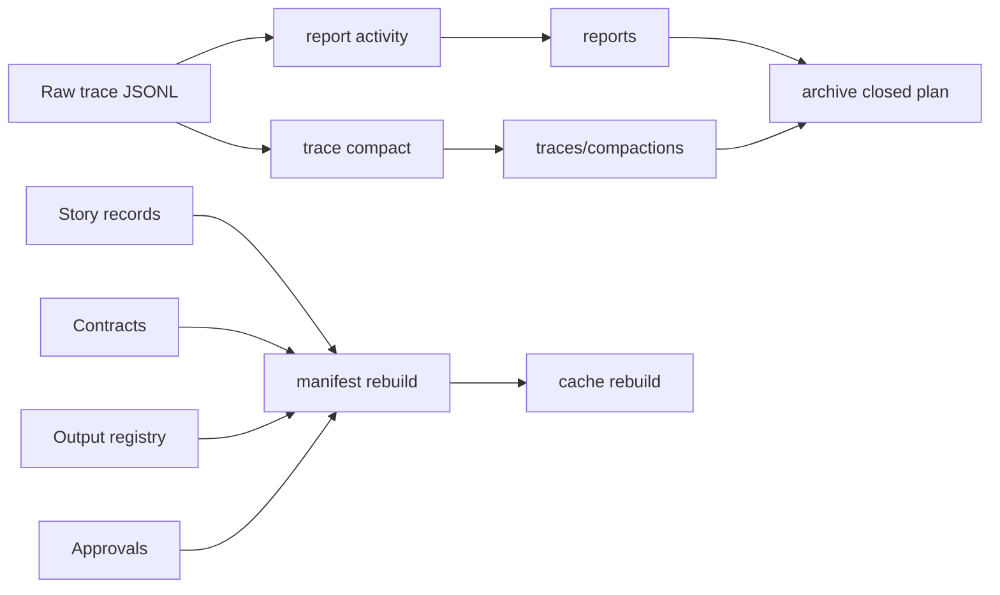
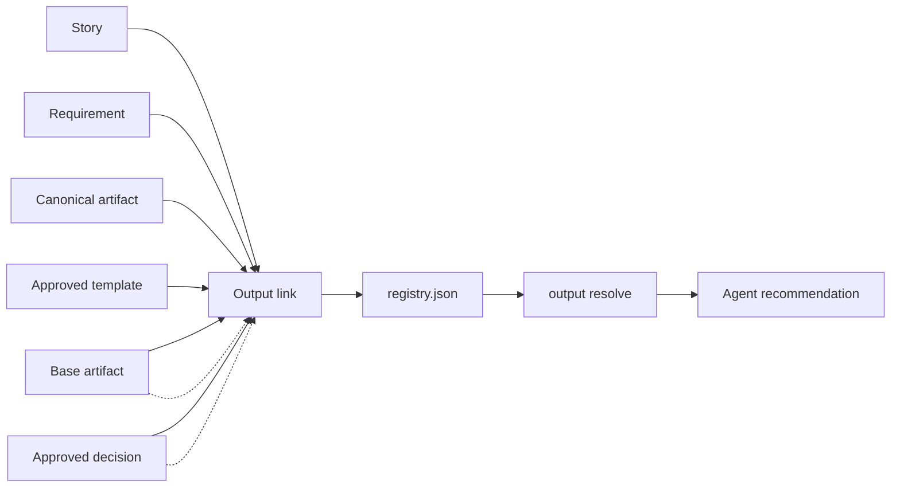

# Knowledge Base Structure

Agentic SDLC uses a Git-first project knowledge base. The plugin is stateless; the KB is created inside each target project.

The sample records below use neutral placeholders. The structure is generic and should be reused for any project.

```text
<target-project>/
  .sdlc/
    project.json
    README.md
    baseline/
    assessments/
    budgets/
    contracts/
    autonomy/
    authorizations/
    authorization-uses/
    receipts/
    capability-discovery/
    output-contracts/
    requirements/
    work-items/
    work-breakdown/
    dependencies/
    stories/
    orchestration/
    locks/
    handoffs/
    decisions/
    assumptions/
    risks/
    tests/
    observations/
    traces/
    releases/
    manifests/
    archive/
    cache/
    indexes/
    reports/
```

## Source Of Truth

The source of truth is the human-readable and machine-readable files under `.sdlc/`:

- JSON for structured contracts, stories, claims, and machine validation.
- Markdown for narrative requirements, decisions, risks, plans, reports, and release notes.
- JSONL for append-only trace logs.

Cache and indexes are derived artifacts. They can be rebuilt from source files and must not be used as canonical requirements, approvals, decisions, or output artifacts. Reports are durable evidence when they support a gate or release decision.

Manifests and archive plans are canonical KB files. Cache and indexes are not. Trace compactions are additive summaries under `traces/compactions/`; they point back to raw trace JSONL source paths and do not replace them.

```mermaid
flowchart TB
  Source["Source of truth"]
  Source --> Baseline["baseline"]
  Source --> Assessments["assessments"]
  Source --> Budgets["budgets"]
  Source --> Contracts["contracts"]
  Source --> Autonomy["requirement and delivery autonomy"]
  Source --> AuthorizationUses["authorization uses"]
  Source --> Receipts["receipts"]
  Source --> Capabilities["capability-discovery"]
  Source --> OutputContracts["output-contracts"]
  Source --> Requirements["requirements"]
  Source --> WorkItems["work-items"]
  Source --> Breakdown["work-breakdown"]
  Source --> Dependencies["dependencies"]
  Source --> Stories["stories"]
  Source --> Decisions["decisions"]
  Source --> Tests["tests"]
  Source --> Observations["external content-free observations"]
  Source --> Traces["traces"]
  Source --> Manifests["manifests"]
  Source --> Archive["archive plans"]
  Source --> Reports["reports as evidence"]

  Baseline --> Cache["cache"]
  Assessments --> Cache
  Budgets --> Cache
  Contracts --> Cache
  Autonomy --> Cache
  AuthorizationUses --> Cache
  Receipts --> Cache
  Capabilities --> Cache
  OutputContracts --> Cache
  Requirements --> Cache
  WorkItems --> Cache
  Breakdown --> Cache
  Dependencies --> Cache
  Stories --> Cache
  Decisions --> Cache
  Tests --> Cache
  Observations --> Cache
  Traces --> Cache
  Manifests --> Cache
  Archive --> Cache

  Baseline --> Indexes["indexes"]
  Contracts --> Indexes
  Requirements --> Indexes
  Stories --> Indexes
  Traces --> Indexes

  Cache -.-> FastLookup["fast lookup"]
  Indexes -.-> Search["search"]
  FastLookup -.-> Gate["strict gate"]
  Search -.-> Gate
```





## `project.json`

Project metadata and KB policy.

Example:

```json
{
  "project_id": "my-product",
  "project_name": "My Product",
  "schema_version": "0.1.0",
  "sdlc_version": "0.1.0",
  "knowledge_base": {
    "storage": "git",
    "canonical_path": ".sdlc",
    "stateless_plugin": true,
    "concurrency_model": "story-scoped workspaces with append-only traces",
    "source_of_truth": "JSON and Markdown files under .sdlc",
    "derived_artifacts": ["cache", "indexes"],
    "output_contracts_registry": ".sdlc/output-contracts/registry.json",
    "cache_policy_path": ".sdlc/cache/kb-cache.json"
  }
}
```

## `baseline/`

Baselines describe the current observable state of an existing project when SDLC tracking starts after the project already exists.

Examples:

```text
.sdlc/baseline/BASELINE-INITIAL.json
.sdlc/baseline/BASELINE-INITIAL-current-state.md
```

The JSON record stores detected stack, key files, imported documents, inferred context, source hashes, open questions, and approval records. A baseline starts as `proposed` and explicitly separates inferred facts from confirmed canonical facts.

```json
{
  "id": "BASELINE-INITIAL",
  "status": "proposed",
  "kind": "existing-project",
  "summary": "Initial baseline for an existing product.",
  "canonicality": {
    "state": "inferred",
    "inferred_not_approved": true,
    "user_confirmation_required": true
  },
  "source_paths": ["README.md", "package.json"],
  "source_hashes": {
    "README.md": "content-hash",
    "package.json": "content-hash"
  },
  "open_questions": ["Which inferred facts are canonical?"]
}
```

Approve a baseline only after the user confirms what is canonical:

```bash
node bin/agentic-sdlc.mjs baseline approve \
  --id BASELINE-INITIAL \
  --actor-type human \
  --approval-source explicit-user \
  --summary "Confirmed baseline scope and current-state assumptions"
```

## `assessments/`

Assessment proposal and workflow control records. Paths are configured in `.sdlc/config.json`; the default layout is:

```text
.sdlc/assessments/proposals/ASSESSMENT-001.json
.sdlc/assessments/workflows/ASSESSMENT-001.json
.sdlc/budgets/ASSESSMENT-001/BUDGET-ASSESSMENT-001.json
.sdlc/budgets/ASSESSMENT-001/AMEND-ASSESSMENT-001-01.json
```

The proposal is the immutable checkpoint 2 approval payload (`assessment-proposal:v1`). Its hash binds the approved baseline, scope/requirement, story reservation, deliverable, capabilities, contract draft, route intent, write-set, budget, security, and application plan. Mutable progress, failure, retry, exception, and receipt references live in `assessment-workflow:v1`. Storage roots are configured through `assessment_workflow.storage_root` and `budget_policy.storage_root`; the paths above are defaults.

`execution-budget:v1` aggregates the full proposal execution tree, including subagents. The shipped defaults are exact active time (soft 2,700 seconds, hard 3,600), exact steps (soft 40, hard 60), and estimated tokens (soft 200,000, no hard limit). It records exact/estimated/unavailable metering, configurable warnings, verification reserve, and limit behavior. No default cost limit exists: cost remains unavailable and non-binding until a trustworthy metering/pricing adapter, pricing reference, and currency are configured. `budget-amendment:v1` is append-only and references the base hashes; `execution-usage-receipt:v1` records actual or estimated usage and source.

```text
assessment proposal prepare
assessment proposal approve
assessment proposal apply
assessment proposal status
budget usage record
budget status
budget amend
assessment proposal complete
```

## `receipts/`

Immutable evidence of authority and execution. Exact paths are configurable; categories include:

```text
.sdlc/receipts/host-approvals/
.sdlc/authorization-uses/
.sdlc/receipts/generation/
.sdlc/receipts/verification/
.sdlc/receipts/execution-usage/
```

- `host-approval-receipt:v2` binds the question, subject hash, constraints, answer, actor, and host/CI message, then authenticates the canonical payload hash with an Ed25519 key configured in `authority_policy.trusted_host_keys`.
- `authorization-usage-receipt:v2` freezes authorization state, the exact action-subject `use_hash`, and validity at the use timestamp. Ambiguous v1 action/subject sets fail closed.
- `artifact-generator-receipt:v1` identifies which capability produced the exact artifact hash.
- `verification-receipt:v1` separates container, content, render, and optional independent verification.
- `execution-usage-receipt:v1` reports budget consumption, reservations, metering accuracy, and source.

Receipts are canonical evidence. Screenshots and rendered pages remain separate evidence files referenced by the verification receipt.

`authority_policy.usage_receipts_root` configures authorization-use storage; `authorization-uses` is only the portable default for new projects. `authority_policy.trusted_host_keys` is an array of `{ key_id, algorithm: "Ed25519", public_key }`; `host_verified` requires at least one trusted public key.

## `contracts/`

Contracts define how phases and story work must be executed and validated.

Examples:

```text
.sdlc/contracts/contract-discovery-v1.json
.sdlc/contracts/contract-analysis-v1.json
.sdlc/contracts/contract-ST-001-implementation.json
```

Contracts are generated from `templates/sdlc-config.json` and follow the shape documented in `templates/contract-template.json`.

Every generated contract is bound to the current project and records contextualization data:

```json
{
  "id": "contract-ST-001-analysis",
  "project": {
    "project_id": "my-product",
    "project_name": "My Product"
  },
  "phase": "analysis",
  "execution_policy": {
    "runtime": "codex",
    "model": {
      "mode": "inherit",
      "value": null
    },
    "reasoning": {
      "mode": "override",
      "level": "high"
    },
    "notes": [
      "Higher reasoning requested for integration-risk analysis"
    ]
  },
  "contextualization": {
    "summary": "Analyze the MVP around the approved business workflow.",
    "context_sources": [
      {
        "path": ".sdlc/requirements/REQ-001.json",
        "sha256": "content-hash",
        "size_bytes": 1200,
        "excerpt": "Problem statement and constraints..."
      }
    ],
    "questions": [
      {
        "question": "Which external provider is authoritative for MVP?",
        "answer": null,
        "status": "open"
      }
    ],
    "constraints": [
      "Provider-specific logic must stay behind an adapter"
    ],
    "assumptions": [
      "External provider sandbox access is available"
    ],
    "open_questions": 1
  }
}
```

Contracts may also include `capability_policy` and `capability_bindings` so the user and agent agree which skills, MCPs, tools, concrete targets, permissions, and approval-required actions are allowed for the step.

Contracts may also include `capability_recommendation_refs[]`. These references point to approved records under `.sdlc/capability-discovery/recommendations/` and store the approved content hash. If a recommendation, its source files, or its upstream profile changes after approval, strict gates require a refreshed recommendation and contract approval.

## `capability-discovery/`

Capability discovery records the technical architect context used to choose skills, MCPs, tools, models, connectors, and bindings without hardcoding technologies into the plugin.

Examples:

```text
.sdlc/capability-discovery/profiles/CAP-PROFILE-ST-001.json
.sdlc/capability-discovery/recommendations/CAP-REC-ST-001.json
```

A profile is proposed from repo files, `.sdlc/` context, user-provided files, or canonical JSON normalized by Codex:

```json
{
  "id": "CAP-PROFILE-ST-001",
  "status": "approved",
  "subject": {
    "story_id": "ST-001",
    "requirement_ids": ["REQ-001"],
    "phase": "analysis",
    "scope": "project"
  },
  "detected_stack": [
    {
      "name": "package-json",
      "type": "node",
      "source_path": "package.json"
    }
  ],
  "source_paths": ["package.json"],
  "source_hashes": {
    "package.json": "content-hash"
  }
}
```

A recommendation consumes an approved profile plus an optional available-capabilities snapshot:

```json
{
  "id": "CAP-REC-ST-001",
  "status": "approved",
  "profile_id": "CAP-PROFILE-ST-001",
  "recommendations": [
    {
      "type": "skill",
      "name": "agentic-sdlc",
      "availability": "available",
      "install_required": false
    }
  ],
  "policy_patch": {
    "skills": {
      "required": ["agentic-sdlc"],
      "allowed": [],
      "forbidden": []
    }
  },
  "bindings": []
}
```

Install-required capabilities are not usable by a contract until a human or CI approval records `--approve-install`. Recommendation records are canonical KB artifacts; cache may index them but must never be the source of approval.

## `work-items/`, `work-breakdown/`, And `dependencies/`

These directories keep planning structure inside the project KB, independent of Jira or any external tracker.

Examples:

```text
.sdlc/work-items/epics/EP-001.json
.sdlc/work-items/tasks/TASK-001.json
.sdlc/work-breakdown/BD-REQ-001.json
.sdlc/dependencies/graph.json
```

Breakdowns and dependency proposals are proposed by agents and approved by a human/CI actor or delegated automation under an explicit user-approved scope before they become authoritative. Strict gates enforce approved breakdown freshness and blocking dependencies for story delivery.

## `output-contracts/`

Project-wide registry for approved output templates and artifact reuse decisions.

Example:

```text
.sdlc/output-contracts/registry.json
.sdlc/output-contracts/templates/functional-analysis-v1.md
.sdlc/output-contracts/decisions/
```

The registry stores templates, links, and structural decisions:

```json
{
  "schema_version": "0.1.0",
  "project_id": "my-product",
  "policy": {
    "template_registry_scope": "project",
    "default_related_story_mode": "reuse+delta",
    "cache_is_source_of_truth": false
  },
  "templates": [
    {
      "id": "functional-analysis-v1",
      "type": "functional-analysis",
      "status": "approved",
      "path": ".sdlc/output-contracts/templates/functional-analysis-v1.md"
    }
  ],
  "links": [
    {
      "id": "OUT-ST-001-functional-analysis",
      "story_id": "ST-001",
      "artifact_type": "functional-analysis",
      "artifact_path": ".sdlc/requirements/functional-analysis.md",
      "template_id": "functional-analysis-v1",
      "mode": "new",
      "requirements": ["REQ-001"]
    }
  ],
  "decisions": []
}
```

Agents must resolve the output contract before generating a durable artifact:

```bash
node bin/agentic-sdlc.mjs output resolve --root <target-project> --story ST-001 --type functional-analysis
```

For related stories, the default is to reuse the existing base artifact and link a delta:

```bash
node bin/agentic-sdlc.mjs output link \
  --root <target-project> \
  --story ST-002 \
  --type functional-analysis \
  --artifact .sdlc/requirements/ST-002-functional-analysis-delta.md \
  --template functional-analysis-v1 \
  --mode delta \
  --base-artifact .sdlc/requirements/functional-analysis.md \
  --requirement REQ-001
```



## `requirements/`

Requirements and analysis artifacts. New governed requirements use `requirement:v2`: the logical requirement is revisioned, hash-bound, explicitly approved, and linked to one requirement execution profile.

Examples:

```text
.sdlc/requirements/REQ-001.md
.sdlc/requirements/REQ-001.json
.sdlc/requirements/lifecycle/REQ-SUP-<unique-suffix>.json
.sdlc/requirements/non-functional-requirements.md
.sdlc/requirements/functional-analysis.md
.sdlc/requirements/integration-map.md
```

The v2 record contains outcome, acceptance criteria, non-goals, constraints, non-functional requirements, integrations, source hashes, revision lineage, approvals, and `autonomy_profile_id`. Use `proposed → approved → active → satisfied` for normal progression. A material change creates a new revision and a hash-bound supersession event rather than rewriting approved history.

Agents must link stories, contracts, tests, output links, autonomy profiles, and release evidence back to the exact requirement ID, revision, and content hash. A legacy `requirement:v1` remains readable but receives a `supervised` autonomy ceiling by policy.

## `autonomy/`

Canonical policy records for requirement ceilings and individual delivery units.

Examples:

```text
.sdlc/autonomy/requirements/AUT-REQ-001-R1.json
.sdlc/autonomy/deliveries/AUT-PR-184.json
.sdlc/autonomy/deliveries/AUT-LOCAL-REL-009.json
.sdlc/autonomy/decisions/AUT-DECISION-PR-184.json
.sdlc/autonomy/executions/AUT-PR-184/start.json
.sdlc/autonomy/executions/AUT-PR-184/close.json
.sdlc/autonomy/actions/AUT-ACT-....json
```

`requirement-execution-profile:v1` binds one immutable requirement revision and stores its maximum level, optional phase levels, material scope hash, tools, capabilities, environments, write paths, forbidden actions, checkpoints, exception actions, budget reference, validity, and authority assurance. It is a ceiling, not an executable authorization.

`delivery-execution-profile:v1` stores the explicit selection for exactly one delivery and exactly one story/approved-contract pair. When several changes need to ship together, first model an agreed aggregation story/contract instead of treating a profile as an unrelated multi-story bundle:

- `pull_request` binds repository, base branch, head branch, canonical actions, explicit write paths, one story/contract hash pair, and whether merge is allowed;
- `local_release` binds the local root, actions, write paths, smoke tests, and required rollback while denying external, production, and destructive access.

Both kinds bind the applicable requirement profile hashes and material scope. Their use policy is exact-delivery, non-reusable, one concurrent run, receipt-backed, and closed on terminal state. A new pull request or local release always needs a new selection, even when it implements the same requirement.

Delivery binding is one-way: reserve the planned profile ID in the final requirement-bound story contract, approve that contract, then bind the matching delivery profile to the immutable requirement-profile, story, and contract hashes. The ID is not a profile hash or approval. Task start records the profile; do not mutate an approved contract to point back to it.

`autonomy-decision:v1` records the requested and effective levels, source constraints, reason codes, material drift, checkpoint/approval state, and decision hash. The effective level is the most restrictive of host, project, requirement, delivery, contract, capability, environment, and budget. `audit_only` is capped at `checkpointed`, including for local release; `bounded-autonomous` requires a trusted external host/CI Ed25519 receipt under `host_verified` policy. Protected-branch merge and remote or production deployment are explicit exceptions.

`executions/<profile>/start.json` and `close.json` are the immutable single-run lifecycle. Action receipts under `actions/` record the canonical action, exact runtime target/details, effective decision, any checkpoint approval, evidence hashes, and single-use authorization linkage. They implement authorize → external/tool execution → complete. Passing `pull_request.merge` or `release.local` completion creates the corresponding `merged` or `released` close receipt automatically; other valid terminal states require a separately approved close.

Local smoke commands are JSON argv arrays, never shell strings. Their completion receipt records target, command, cwd, sandbox, exit status, outcome, and output hashes from a supported read-only/no-network sandbox. Remote push/merge evidence is different: the CLI records a live remote pre-state and queries the exact Git remote or GitHub PR at completion. The hash-bound observation is not a provider-signed offline attestation; retain durable host/CI/provider evidence as well.

## `stories/`

Story-scoped workspaces. This is the main parallel work unit.

Example:

```text
.sdlc/stories/ST-001/
  story.json
  claim.json
  plan.md
  implementation-log.md
```

`story.json` stores structured story data:

```json
{
  "id": "ST-001",
  "title": "Implement a business workflow",
  "status": "draft",
  "phase": "implementation",
  "contract_id": "contract-ST-001-implementation",
  "acceptance_criteria": [
    "Given the approved trigger, the system proposes the expected alternative workflow."
  ]
}
```

`claim.json` prevents accidental parallel writes to the same story:

```json
{
  "story_id": "ST-001",
  "agent": "codex",
  "branch": "feature/ST-001",
  "status": "active",
  "claimed_at": "2026-07-01T08:48:28.935Z",
  "audit": {
    "claimed_by": {
      "id": "codex",
      "type": "agent"
    },
    "git": {
      "branch": "feature/ST-001",
      "head_sha": "..."
    },
    "run": {
      "thread_id": "codex-thread-id"
    }
  }
}
```

## `orchestration/`

Parent-chat orchestration snapshots and plans. These records are useful when one Codex chat coordinates multiple worker chats.

## `locks/`

Phase or shared-artifact locks. Use these only for global artifacts that cannot be edited safely by several story lanes at the same time.

## `handoffs/`

Story handoff records between phases, agents, or chats. A handoff should identify the source actor, target agent, required artifacts, and open items.

## `decisions/`

Decision records explain why a technical or product choice was made.

Recommended naming:

```text
.sdlc/decisions/ADR-0001-problem-framing.md
.sdlc/decisions/ADR-0002-provider-strategy.md
```

Recommended content:

```text
# ADR-0002 Provider Strategy

Status: Accepted
Context: ...
Decision: ...
Alternatives Considered: ...
Consequences: ...
Related: REQ-003, ST-001
```

## `assumptions/`

Explicit assumptions that need validation or later review.

Examples:

```text
.sdlc/assumptions/ASM-001-provider-refresh-rate.md
.sdlc/assumptions/ASM-002-user-permission.md
```

## `risks/`

Delivery, product, technical, operational, or compliance risks.

Examples:

```text
.sdlc/risks/RISK-001-provider-api-cost.md
.sdlc/risks/RISK-002-provider-api-availability.md
```

## `tests/`

Test plans and test evidence.

Examples:

```text
.sdlc/tests/ST-001-test-strategy.md
.sdlc/tests/ST-001-test-run.json
.sdlc/tests/ST-001-validation-summary.md
```

Tests should link to acceptance criteria and requirements.

## `observations/`

Canonical, non-authoritative observations produced by an external runtime. The
first supported adapter reads strict content-free IntentABI Codex shadow
envelopes:

```text
.sdlc/observations/intentabi/<event-id>.json
```

The lowercase UUID v4 filename must exactly match the envelope `eventId`;
descriptive names, nested paths, and JSONL batches are intentionally rejected.

The envelope does not contain an SDLC story or phase. Link it only by recording
its exact path in a trace `evidence` array whose trace also has `story_id`.
Change Observatory otherwise shows it as unlinked. Observation presence, proof
presence, or a stored MAC does not establish semantic equivalence, cache
admission, token savings, authorization, phase completion, or verification.

## `traces/`

Append-only JSONL event logs. Traces show what agents did, what they decided, and what evidence they produced.

Example:

```text
.sdlc/traces/ST-001.jsonl
```

Example event:

```json
{
  "id": "TR-20260701084828-7514f5",
  "story_id": "ST-001",
  "type": "decision",
  "summary": "Use domain events as workflow triggers",
  "actor": {
    "id": "codex",
    "type": "agent",
    "source": "cli"
  },
  "action": "decision",
  "evidence": [],
  "related": ["ADR-0002", "REQ-003"],
  "git": {
    "branch": "feature/ST-001",
    "head_sha": "..."
  },
  "run": {
    "thread_id": "codex-thread-id",
    "tool": "agentic-sdlc-cli"
  },
  "created_at": "2026-07-01T08:48:28.935Z"
}
```

Valid trace types:

```text
assumption, decision, gate, claim, handoff, implementation, lock, release, risk, sync, test
```

Use `sync` traces for push, pull, merge, rebase, branch, and PR events so parallel chats can see what moved in Git.

## `releases/`

Release notes, rollout plans, observability signals, and feedback loops. A local release is a delivery target, not shorthand for unrestricted machine access.

Examples:

```text
.sdlc/releases/REL-001.md
.sdlc/releases/observability-plan.md
.sdlc/releases/feedback-loop.md
.sdlc/releases/manifests/REL-001.json
```

A `release-manifest:v1` inventories source revision, proposal/requirement/story hashes, delivered artifacts, authorization-use receipts, execution usage, verification receipts, gates, and rollback instructions. It is release evidence, distinct from the compact KB manifest below.

For `local_release`, the manifest and traces must identify the delivery profile, exact local target, allowed writes/actions, successful smoke-test evidence, and rollback procedure. For `pull_request`, readiness evidence does not imply merge to `main` or another protected branch.

## `manifests/`

Shared compact maps of the KB, generated from canonical source files.

Example:

```text
.sdlc/manifests/kb-manifest.json
```

Rebuild with:

```bash
node bin/agentic-sdlc.mjs manifest rebuild --root <target-project>
```

The manifest summarizes stories, claims, completed steps, contracts, output links, approvals, and trace activity. It records source paths and hashes, so it is auditable and useful for fast context assembly. It is still derived from canonical KB files; when in doubt, agents must inspect the source paths listed in the manifest.

## `archive/`

Two intentionally distinct archive records live here:

- `archive-plan.schema.json` governs the existing plan-first filesystem move performed by `archive closed`;
- `archive-record:v1` is an immutable logical declaration that specific legacy artifacts are retained as history but excluded from a named release manifest.

Example:

```text
.sdlc/archive/ARCH-20260701123000.json
```

Create a plan with:

```bash
node bin/agentic-sdlc.mjs archive closed --root <target-project> --before 90d
```

The command is plan-first and emits `kind: archive_plan`. It verifies source hashes under a lock, applies the move atomically, and rolls back on failure. It only moves configured closed evidence when `--apply` is explicitly provided. Live story files, contracts, approvals, dependency graphs, output links, and raw trace JSONL are not moved by this command.

Create a separate `archive-record:v1` only when a release must make the historical exclusion explicit. That logical record references the release manifest and the exact paths and hashes, but does not itself move or delete anything.

Use the dry-run-first active migration to create it from prior valid releases without guessing which unfinished records are historical:

```bash
node bin/agentic-sdlc.mjs migration active --root <target-project> --release-manifest RELEASE-ASSESSMENT-001
node bin/agentic-sdlc.mjs migration active --root <target-project> --release-manifest RELEASE-ASSESSMENT-001 --apply
```

Only missing configuration defaults are written during migration. Immutable records in the selected manifest are schema- and hash-validated, not rewritten. Older release evidence uses `retention: retain-in-place`, so `physical_files_moved` remains zero.

Identity correction is intentionally a different migration class because it must rewrite attribution embedded in historical canonical records. Preview it with a declarative mapping, then apply the same command explicitly:

```bash
node bin/agentic-sdlc.mjs migration identity --root <target-project> \
  --identity-map-json '{"source":{"email":"old@example.invalid"},"target":{"email":"new@example.test","name":"Current User"}}'
node bin/agentic-sdlc.mjs migration identity --root <target-project> \
  --identity-map-json '{"source":{"email":"old@example.invalid"},"target":{"email":"new@example.test","name":"Current User"}}' --apply --plan-hash <preview-plan-hash>
```

The planner updates structured JSON/JSONL values only; schema- and hash-validates legacy/canonical authorization, action-subject bindings, revocations, every prior migration receipt, and supported byte references; and propagates approval, subject, use, scope, authorization, revocation, receipt, and matching file-reference hashes to convergence. Unsupported or stale supported lineage fails closed. Signed and attested envelopes are immutable boundaries: any direct or transitive impact requires authoritative reissuance. The preview plan hash binds every canonical input and planned rewrite. Apply uses exact preview-hash verification, a fully initialized exclusive lock with no automatic stale reclaim, complete-input preconditions, a same-filesystem shadow tree, derived cache/index rebuild inside that shadow, full post-state/source-identity/receipt validation, and a journaled directory swap. A caught failure restores the complete rollback snapshot. After an interrupted process, authenticated recovery requires the verified lock's nonce and plan hash; it rolls back pre-commit state or finalizes a committed tree, while all other CLI commands remain blocked. `.sdlc/migrations/identity/` holds a digest-only `identity-migration-receipt:v1`; it records the plan hash, changed paths, and old/new hashes without retaining the corrected source identity in clear text.

## `traces/compactions/`

Non-destructive summaries of raw trace history. Use them when a story trace becomes too long for efficient agent context.

```bash
node bin/agentic-sdlc.mjs trace compact --root <target-project> --story ST-001
```

Compactions keep `source_paths` and `source_hashes` for the raw traces they summarize. They help agents read history faster, but they do not replace trace JSONL as the canonical event log.

## `cache/`

Local, regenerable optimization data.

Example:

```text
.sdlc/cache/kb-cache.json
```

Rebuild and inspect with:

```bash
node bin/agentic-sdlc.mjs cache rebuild --root <target-project>
node bin/agentic-sdlc.mjs cache status --root <target-project>
```

The cache may contain full-text lookup entries, story-requirement graphs, artifact fingerprints, template resolution, compact summaries, dependency graphs, and previous `output resolve` results. Each cache build records source hashes so a changed requirement, story, output registry, or trace makes the cache stale. Stale cache is a warning; using cache or index files as canonical output evidence is a strict gate error. Cached output resolution is verified against canonical KB files before use, so a cache entry cannot override the registry or story files by itself.

## Query Reports

`report query` filters canonical KB records after Codex or another LLM normalizes a natural-language request into `schemas/report-query.schema.json`. It can query activity traces, stories, completed steps, outputs, contracts, handoffs, work items, approvals, and tests. Trace activity supports separate executor, requester, and authorizer filters so agent-executed work can still be reported as requested or authorized by a human.

```bash
node bin/agentic-sdlc.mjs report query --root <target-project> --query-json '<canonical-report-query-json>' --json
```

For example, use `filters.requester` for "work done on my request" and `filters.executor` for "work executed by Codex".

Raw `--text` is accepted only for audit/debug and returns a normalization request when no canonical query is provided. The CLI does not keyword-match raw language.

## `indexes/`

Generated search indexes.

Example:

```text
.sdlc/indexes/kb-index.json
```

Rebuild with:

```bash
node bin/agentic-sdlc.mjs index rebuild --root <target-project>
```

## `reports/`

Gate, audit, or quality reports. Reports are durable review evidence and should be committed when they support a gate or release decision. Generate gate reports with `gate check --out .sdlc/reports/<name>.json` or `.md`. Temporary report scratch files can use `.tmp` and stay ignored.

## Merge Strategy

Review `.sdlc/` changes with code changes. A pull request should show:

- the implementation diff;
- the requirement revision and execution ceiling;
- the delivery profile containing the autonomy level selected specifically for that PR;
- the contract, story, autonomy decision, authorization receipt, trace, and test evidence that explain the implementation.

This keeps agent work auditable after the chat session is gone. Never copy a delivery profile from a previous PR as authority for a new one. Merge to a protected branch remains a separate explicit decision unless that exact merge action and target were authoritatively approved.
