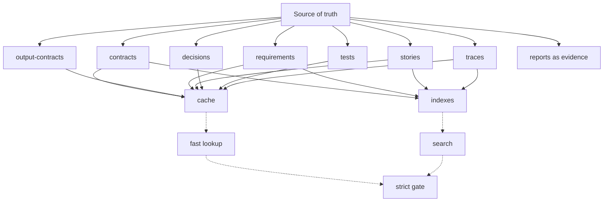
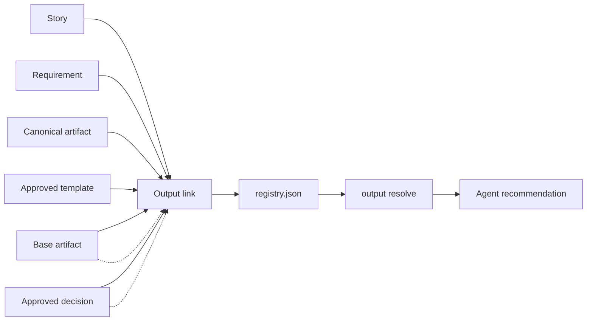

# Knowledge Base Structure

Agentic SDLC uses a Git-first project knowledge base. The plugin is stateless; the KB is created inside each target project.

The sample records below use neutral placeholders. The structure is generic and should be reused for any project.

```text
<target-project>/
  .sdlc/
    project.json
    README.md
    contracts/
    output-contracts/
    requirements/
    stories/
    orchestration/
    locks/
    handoffs/
    decisions/
    assumptions/
    risks/
    tests/
    traces/
    releases/
    cache/
    indexes/
    reports/
```

## Source Of Truth

The source of truth is the human-readable and machine-readable files under `.sdlc/`:

- JSON for structured contracts, stories, claims, and machine validation.
- Markdown for narrative requirements, decisions, risks, plans, reports, and release notes.
- JSONL for append-only trace logs.

Cache and indexes are derived artifacts. They can be rebuilt from source files and must not be used as canonical requirements, approvals, decisions, or output artifacts. Reports are durable evidence when they support a gate or release decision.



## `project.json`

Project metadata and KB policy.

Example:

```json
{
  "project_id": "my-product",
  "project_name": "My Product",
  "schema_version": "0.1.0",
  "sdlc_version": "0.1.0",
  "knowledge_base": {
    "storage": "git",
    "canonical_path": ".sdlc",
    "stateless_plugin": true,
    "concurrency_model": "story-scoped workspaces with append-only traces",
    "source_of_truth": "JSON and Markdown files under .sdlc",
    "derived_artifacts": ["cache", "indexes"],
    "output_contracts_registry": ".sdlc/output-contracts/registry.json",
    "cache_policy_path": ".sdlc/cache/kb-cache.json"
  }
}
```

## `contracts/`

Contracts define how phases and story work must be executed and validated.

Examples:

```text
.sdlc/contracts/contract-discovery-v1.json
.sdlc/contracts/contract-analysis-v1.json
.sdlc/contracts/contract-ST-001-implementation.json
```

Contracts are generated from `templates/sdlc-config.json` and follow the shape documented in `templates/contract-template.json`.

Every generated contract is bound to the current project and records contextualization data:

```json
{
  "id": "contract-ST-001-analysis",
  "project": {
    "project_id": "my-product",
    "project_name": "My Product"
  },
  "phase": "analysis",
  "execution_policy": {
    "runtime": "codex",
    "model": {
      "mode": "inherit",
      "value": null
    },
    "reasoning": {
      "mode": "override",
      "level": "high"
    },
    "notes": [
      "Higher reasoning requested for integration-risk analysis"
    ]
  },
  "contextualization": {
    "summary": "Analyze the MVP around the approved business workflow.",
    "context_sources": [
      {
        "path": ".sdlc/requirements/REQ-001.md",
        "sha256": "content-hash",
        "size_bytes": 1200,
        "excerpt": "Problem statement and constraints..."
      }
    ],
    "questions": [
      {
        "question": "Which external provider is authoritative for MVP?",
        "answer": null,
        "status": "open"
      }
    ],
    "constraints": [
      "Provider-specific logic must stay behind an adapter"
    ],
    "assumptions": [
      "External provider sandbox access is available"
    ],
    "open_questions": 1
  }
}
```

## `output-contracts/`

Project-wide registry for approved output templates and artifact reuse decisions.

Example:

```text
.sdlc/output-contracts/registry.json
.sdlc/output-contracts/templates/functional-analysis-v1.md
.sdlc/output-contracts/decisions/
```

The registry stores templates, links, and structural decisions:

```json
{
  "schema_version": "0.1.0",
  "project_id": "my-product",
  "policy": {
    "template_registry_scope": "project",
    "default_related_story_mode": "reuse+delta",
    "cache_is_source_of_truth": false
  },
  "templates": [
    {
      "id": "functional-analysis-v1",
      "type": "functional-analysis",
      "status": "approved",
      "path": ".sdlc/output-contracts/templates/functional-analysis-v1.md"
    }
  ],
  "links": [
    {
      "id": "OUT-ST-001-functional-analysis",
      "story_id": "ST-001",
      "artifact_type": "functional-analysis",
      "artifact_path": ".sdlc/requirements/functional-analysis.md",
      "template_id": "functional-analysis-v1",
      "mode": "new",
      "requirements": ["REQ-001"]
    }
  ],
  "decisions": []
}
```

Agents must resolve the output contract before generating a durable artifact:

```bash
node bin/agentic-sdlc.mjs output resolve --root <target-project> --story ST-001 --type functional-analysis
```

For related stories, the default is to reuse the existing base artifact and link a delta:

```bash
node bin/agentic-sdlc.mjs output link \
  --root <target-project> \
  --story ST-002 \
  --type functional-analysis \
  --artifact .sdlc/requirements/ST-002-functional-analysis-delta.md \
  --template functional-analysis-v1 \
  --mode delta \
  --base-artifact .sdlc/requirements/functional-analysis.md \
  --requirement REQ-001
```



## `requirements/`

Requirements and analysis artifacts.

Examples:

```text
.sdlc/requirements/REQ-001.md
.sdlc/requirements/non-functional-requirements.md
.sdlc/requirements/functional-analysis.md
.sdlc/requirements/integration-map.md
```

Agents should link stories and tests back to requirement IDs when possible.

## `stories/`

Story-scoped workspaces. This is the main parallel work unit.

Example:

```text
.sdlc/stories/ST-001/
  story.json
  claim.json
  plan.md
  implementation-log.md
```

`story.json` stores structured story data:

```json
{
  "id": "ST-001",
  "title": "Implement a business workflow",
  "status": "draft",
  "phase": "implementation",
  "contract_id": "contract-ST-001-implementation",
  "acceptance_criteria": [
    "Given the approved trigger, the system proposes the expected alternative workflow."
  ]
}
```

`claim.json` prevents accidental parallel writes to the same story:

```json
{
  "story_id": "ST-001",
  "agent": "codex",
  "branch": "feature/ST-001",
  "status": "active",
  "claimed_at": "2026-07-01T08:48:28.935Z",
  "audit": {
    "claimed_by": {
      "id": "codex",
      "type": "agent"
    },
    "git": {
      "branch": "feature/ST-001",
      "head_sha": "..."
    },
    "run": {
      "thread_id": "codex-thread-id"
    }
  }
}
```

## `orchestration/`

Parent-chat orchestration snapshots and plans. These records are useful when one Codex chat coordinates multiple worker chats.

## `locks/`

Phase or shared-artifact locks. Use these only for global artifacts that cannot be edited safely by several story lanes at the same time.

## `handoffs/`

Story handoff records between phases, agents, or chats. A handoff should identify the source actor, target agent, required artifacts, and open items.

## `decisions/`

Decision records explain why a technical or product choice was made.

Recommended naming:

```text
.sdlc/decisions/ADR-0001-problem-framing.md
.sdlc/decisions/ADR-0002-provider-strategy.md
```

Recommended content:

```text
# ADR-0002 Provider Strategy

Status: Accepted
Context: ...
Decision: ...
Alternatives Considered: ...
Consequences: ...
Related: REQ-003, ST-001
```

## `assumptions/`

Explicit assumptions that need validation or later review.

Examples:

```text
.sdlc/assumptions/ASM-001-provider-refresh-rate.md
.sdlc/assumptions/ASM-002-user-permission.md
```

## `risks/`

Delivery, product, technical, operational, or compliance risks.

Examples:

```text
.sdlc/risks/RISK-001-provider-api-cost.md
.sdlc/risks/RISK-002-provider-api-availability.md
```

## `tests/`

Test plans and test evidence.

Examples:

```text
.sdlc/tests/ST-001-test-strategy.md
.sdlc/tests/ST-001-test-run.json
.sdlc/tests/ST-001-validation-summary.md
```

Tests should link to acceptance criteria and requirements.

## `traces/`

Append-only JSONL event logs. Traces show what agents did, what they decided, and what evidence they produced.

Example:

```text
.sdlc/traces/ST-001.jsonl
```

Example event:

```json
{
  "id": "TR-20260701084828-7514f5",
  "story_id": "ST-001",
  "type": "decision",
  "summary": "Use domain events as workflow triggers",
  "actor": {
    "id": "codex",
    "type": "agent",
    "source": "cli"
  },
  "action": "decision",
  "evidence": [],
  "related": ["ADR-0002", "REQ-003"],
  "git": {
    "branch": "feature/ST-001",
    "head_sha": "..."
  },
  "run": {
    "thread_id": "codex-thread-id",
    "tool": "agentic-sdlc-cli"
  },
  "created_at": "2026-07-01T08:48:28.935Z"
}
```

Valid trace types:

```text
assumption, decision, gate, claim, handoff, implementation, lock, release, risk, sync, test
```

Use `sync` traces for push, pull, merge, rebase, branch, and PR events so parallel chats can see what moved in Git.

## `releases/`

Release notes, rollout plans, observability signals, and feedback loops.

Examples:

```text
.sdlc/releases/REL-001.md
.sdlc/releases/observability-plan.md
.sdlc/releases/feedback-loop.md
```

## `cache/`

Local, regenerable optimization data.

Example:

```text
.sdlc/cache/kb-cache.json
```

Rebuild and inspect with:

```bash
node bin/agentic-sdlc.mjs cache rebuild --root <target-project>
node bin/agentic-sdlc.mjs cache status --root <target-project>
```

The cache may contain full-text lookup entries, story-requirement graphs, artifact fingerprints, template resolution, compact summaries, dependency graphs, and previous `output resolve` results. Each cache build records source hashes so a changed requirement, story, output registry, or trace makes the cache stale. Stale cache is a warning; using cache or index files as canonical output evidence is a strict gate error. Cached output resolution is verified against canonical KB files before use, so a cache entry cannot override the registry or story files by itself.

## `indexes/`

Generated search indexes.

Example:

```text
.sdlc/indexes/kb-index.json
```

Rebuild with:

```bash
node bin/agentic-sdlc.mjs index rebuild --root <target-project>
```

## `reports/`

Gate, audit, or quality reports. Reports are durable review evidence and should be committed when they support a gate or release decision. Generate gate reports with `gate check --out .sdlc/reports/<name>.json` or `.md`. Temporary report scratch files can use `.tmp` and stay ignored.

## Merge Strategy

Review `.sdlc/` changes with code changes. A pull request should show both:

- the implementation diff;
- the contract, story, decision, trace, and test evidence that explain the implementation.

This keeps agent work auditable after the chat session is gone.
