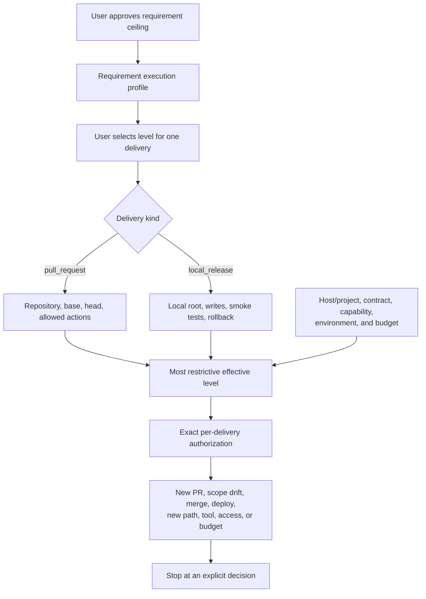
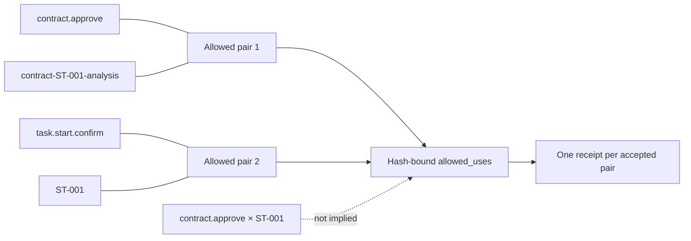
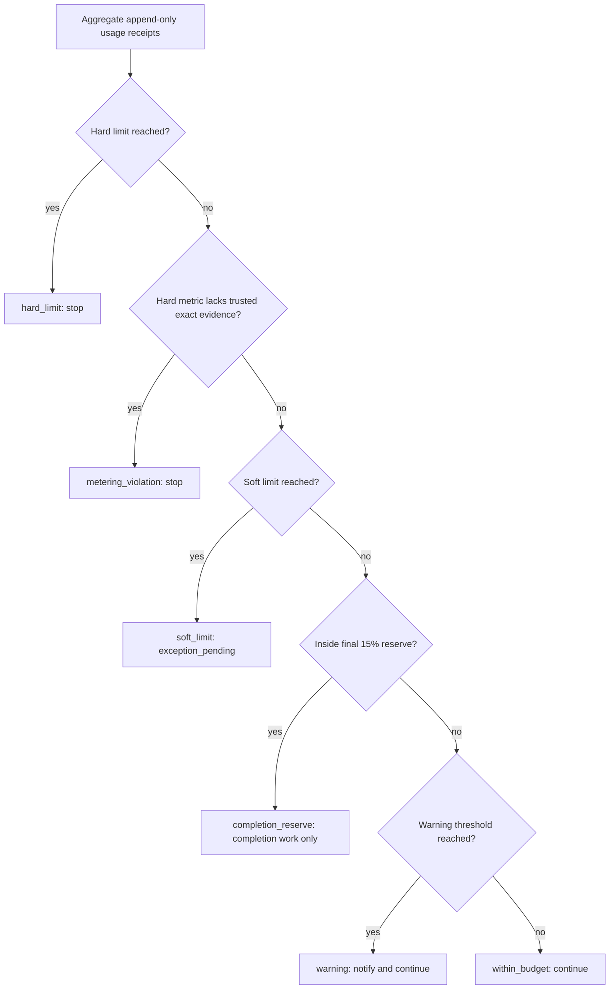
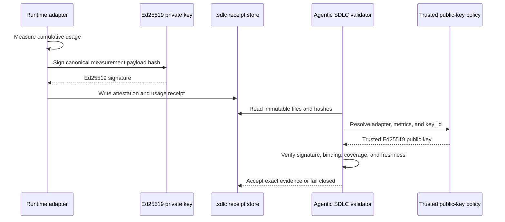
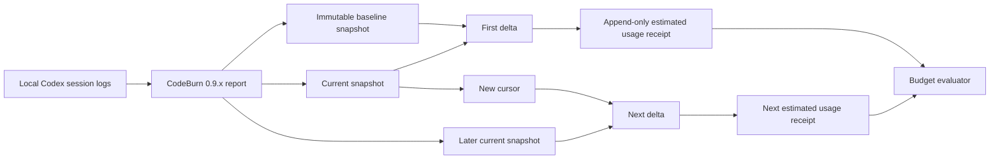
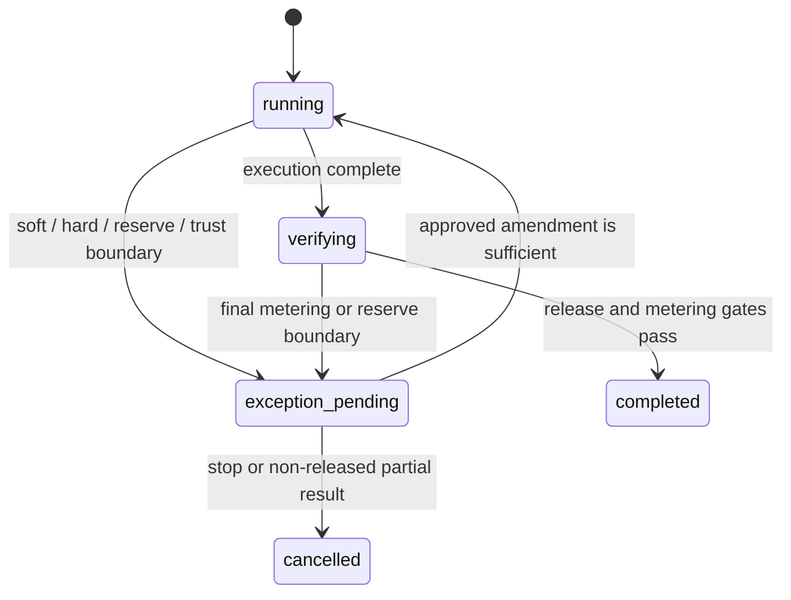

# Limits, autonomy, and metering

Yes: you can give an agent broad autonomy and still constrain it from several directions. The important qualification is that autonomy has two explicit scopes: an approved requirement execution profile sets the maximum, and a separate delivery execution profile selects the level for one pull request or local release. Neither is a permanent global blank cheque.

In simple terms:

> effective autonomy = host/project cap ∩ requirement ceiling ∩ delivery selection ∩ contract ∩ capability ∩ environment ∩ remaining budget

If any part does not allow an operation, the operation is not authorized. A larger budget does not expand scope, and a broader scope does not increase the budget.

See [How it works](how-it-works.md) for the complete lifecycle, [the documentation map](README.md) for related topics, and the [project overview](../README.md) for installation and quick-start commands.

## What “blank cheque” means here

A user may say, for example:

> For pull request PR-184, use bounded autonomy. You may inspect and update the displayed paths, implement, run local tests, commit, push, and update that PR. Do not merge the protected branch, deploy, use production, secrets, new external services, destructive operations, or additional spend. Stop if the approved budget is insufficient. Do not apply this choice to another PR.

That grants high day-to-day autonomy, but it still has an envelope:

| Control | What is fixed by the approved requirement and delivery envelope |
|---|---|
| Requirement ceiling | The highest autonomy level allowed for this immutable `requirement:v2` revision |
| Delivery selection | The explicit level and target for exactly one `pull_request` or `local_release` |
| Outcome | The objective, acceptance criteria, and requested deliverable |
| Scope | Included and excluded subjects, depth, and delivery mode |
| Writes | The explicit write set: action, subject, path, and artifact type |
| Capabilities | Required and allowed tools or capability bindings |
| Environment | External and production access boundaries |
| Safety | Secret handling, destructive-action boundaries, and repository content treated as untrusted data |
| Resources | Time, steps, tokens, calls, cost, and custom metrics |
| Lifetime | Proposal hash, authorization validity window, use count, and terminal workflow state |

The current guided assessment command prepares proposals with `external_access: false` and `production_access: false`. It does not expose switches that silently turn those fields on. Installs, secrets, production access, destructive actions, out-of-scope writes, material requirement or delivery changes, protected-branch merge, remote deployment, and budget extensions are exception boundaries that require an explicit decision.

Read and write boundaries are also separate. Approved baseline sources and the proposal scope define what may be treated as input evidence. Each durable write must match a `write_set` entry containing its action, subject, project-relative path, and artifact type. Capability permission answers “which tool may do it”; path permission answers “where it may do it.” Both must allow the operation. The host filesystem sandbox remains an additional lower-level boundary.



The three configured levels are:

- `supervised`: task start and every state-changing action stop for the configured human checkpoints;
- `checkpointed`: only phases listed in `autonomy_policy.presets.checkpointed.automatic_phases` start automatically; the stock configuration includes analysis, design, implementation, and validation, while release actions remain checkpoints;
- `bounded-autonomous`: configured phases and allowed delivery actions can proceed without routine prompts, subject to explicit checkpoint actions and every narrower boundary, but only under `host_verified` authority or trusted CI attestation.

In `audit_only` mode, attribution is recorded but not independently proven. The effective level is therefore capped at `checkpointed`, including for a local-only target; the CLI must narrow or block rather than treating declared human identity as verified authority. Effective `bounded-autonomous` has an external prerequisite: configure `authority_policy.mode: host_verified`, register the trusted host/CI Ed25519 public key in `authority_policy.trusted_host_keys`, and pass that host's receipt for the exact profile-approval subject through `--host-receipt-file`. The CLI validates the signature and subject; it cannot issue the trusted receipt to itself.

Rollout is configuration-driven through `autonomy_policy.mode`: `off`, `observe`, `enforce_new_only`, or `enforce_all`. The default `enforce_new_only` governs new v2/profile records without rewriting approved history. Legacy requirements and unknown inputs remain `supervised` and fail closed; observe mode may report the decision but must not pretend it granted executable autonomy.

Delivery binding is one-way: reserve the planned profile ID in the requirement-bound story contract, approve that contract, then bind the matching delivery profile to its immutable hash together with the requirement-profile and story hashes. The ID is not a profile hash or approval. Task start supplies the profile and rejects drift; the contract is not rewritten to point back to it. One profile is one delivery lane with exactly one story and its one approved contract. If several changes must ship together, use an agreed aggregation story/contract instead of treating the profile as an unrelated multi-story bundle.

## Exact action × subject permissions

An authorization does not store one independent list of actions and another independent list of subjects and then combine every action with every subject. That would create accidental permissions.

A requirement execution profile and delivery execution profile are policy inputs, not executable credentials. After the evaluator proves that the delivery is a subset of every upstream boundary, the CLI derives exact action-subject uses for that one delivery. The delivery use policy is non-reusable across deliveries, single-run, receipt-backed, and terminally closed.

Instead, each allowed use is one exact pair:

| Action | Subject | Meaning |
|---|---|---|
| `contract.approve` | `contract-ST-001-analysis` | Approve this contract only |
| `task.start.confirm` | `ST-001` | Start this story only |
| `output.link` | `ST-001` plus its proposal-bound artifact context | Link the approved output only |
| `pull_request.update` | `PR-184` plus repository/base/head hashes | Update this pull request only |
| `release.local` | `LOCAL-REL-009` plus target and action hashes | Release to this local target only |

The canonical assessment authorization stores the action, a hash of the complete subject, and a hash of the pair. Every accepted use creates an immutable validity-at-use receipt. The default use policy is `per-action-subject-once`, replay of the same pair is denied, and the authorization closes when the workflow becomes terminal.



Wildcards are disabled by the default policy. When more than one action and more than one subject are involved, use explicit pairs so there is no ambiguous Cartesian product.

An authorization consumed for PR-184 cannot authorize PR-185, even if both implement the same requirement and use the same branches or files. A new delivery ID always requires a new explicit autonomy selection and a new exact authorization.

### Delivery action receipts do not execute actions

For governed delivery work, policy and execution remain separate:

1. Ask `autonomy delivery action` to authorize one exact canonical action. A configured checkpoint returns `checkpoint_required` until the displayed subject is explicitly confirmed. Under `host_verified`, confirmation also requires an external Ed25519 `--host-receipt-file` for action `autonomy.delivery.action.<canonical-action>` and the exact profile/delivery/runtime/action-details subject; under `audit_only`, the explicit approval remains unverified attribution.
2. Have the host, Git client, CI, or local tooling perform exactly the operation recorded in the authorization receipt.
3. Complete the same action with `--outcome passed|failed` and immutable `--evidence`. Completion consumes that authorization and rejects a changed runtime boundary or replay.

The PR catalog is `repository.read`, `repository.write`, `test.run`, `git.commit`, `git.push`, `pull_request.create`, `pull_request.update`, and `pull_request.merge`. The local catalog is `build.local`, `test.run`, and `release.local`. Commit authorization binds repeatable exact `--scope-path` values and completion verifies the one-commit parent/file transition. Push binds the matching remote, source SHA, destination ref, and non-force/non-delete semantics; every base-to-head commit must already have exactly one passing commit completion receipt, and all configured URLs for that remote must identify the approved repository. Merge binds the exact PR URL.

Passing completion of `pull_request.merge` or `release.local` automatically writes the terminal `merged` or `released` receipt. Other allowed outcomes use an explicitly approved manual close. Local completion repeats the exact approved shell-free JSON argv smoke tests and rollback, runs the smoke tests in a supported read-only/no-network sandbox, and stores structured output hashes. Successful completion currently requires `/usr/bin/sandbox-exec` on macOS or `/usr/bin/bwrap` on Linux; unsupported hosts and Linux without `bwrap` fail closed before release.

The CLI validates local Git identity, branches, SHA transitions, paths, receipt lineage, and evidence hashes. Push/merge authorization records a live remote pre-state; completion queries the exact Git remote or GitHub PR and requires the expected post-state after authorization. This is a live authenticated observation, not a provider-signed offline attestation, so preserve durable host/CI/provider evidence and do not present a generic evidence file as signed proof.

### Delegated authorization example

```bash
node bin/agentic-sdlc.mjs authorization grant \
  --root /path/to/project \
  --id AUTH-ST-001 \
  --scope "Only the approved analysis tranche for ST-001" \
  --allow-use contract.approve=contract-ST-001-analysis \
  --allow-use task.start.confirm=ST-001 \
  --allow-artifact-type technical-analysis \
  --max-uses 2 \
  --expires-at 2026-07-15T18:00:00.000Z \
  --actor-type human \
  --approval-source explicit-user \
  --summary "Approve these two exact action-subject uses only"
```

Every option has a specific purpose:

| Option | What it asks for | Example effect |
|---|---|---|
| `authorization grant` | Create a delegated authorization record | It does not execute the task |
| `--root` | Project whose `.sdlc/` store receives the record | No other project is covered |
| `--id` | Stable authorization identifier | Reuse this ID only for the same intended grant |
| `--scope` | Plain-language boundary | Helpful for humans; it does not replace exact pairs |
| `--allow-use` | One `action=subject` pair; repeat once per pair | `contract.approve` is not granted for `ST-001` |
| `--allow-artifact-type` | Permitted artifact classification | Other artifact types remain disallowed |
| `--max-uses` | Maximum accepted uses across the grant | Two pairs can be consumed at most twice in total |
| `--expires-at` | UTC expiry instant | A later use fails even if a pair is otherwise correct |
| `--actor-type` | Type of root approver | A grant requires `human` or `ci`, not an agent self-grant |
| `--approval-source` | Authority source | `explicit-user` must correspond to a human approval |
| `--summary` | Exact meaning of the approval | Stored in the immutable approval content |

For the normal assessment workflow, prefer `assessment proposal approve`: it derives all required action-subject pairs from the displayed proposal instead of asking you to assemble them manually.

## Budget model

An execution budget belongs to one proposal execution tree, including subagents. Each metric defines:

- a `unit` such as `seconds`, `steps`, `tokens`, `calls`, `money`, or a custom unit;
- a metering level: `exact`, `estimated`, or `unavailable`;
- an optional `soft` limit;
- an optional `hard` limit;
- a `currency` for monetary values, otherwise `null`.

At least one of `soft` or `hard` is required for every metric. When both exist, `soft` must be lower than `hard`. A hard limit is accepted only with `metering: "exact"`.

### Common and custom metrics

| Metric | Typical meaning | Important detail |
|---|---|---|
| `active_time_seconds` | Time actively spent executing | The default policy excludes user wait and external wait |
| `steps` | Runtime or workflow steps | A hard ceiling needs a trusted adapter that defines and counts a step consistently |
| `tokens` | Aggregate token use | The default is estimated and soft-only |
| `input_tokens` / `output_tokens` | Token components | Useful when separate thresholds matter |
| `cache_read_tokens` / `cache_write_tokens` | Cache token components | Keep separate unless the budget explicitly chooses a total formula |
| `model_calls` | Model requests | CodeBurn maps this from its `calls` counter |
| `tool_calls` | Tool invocations | CodeBurn does not currently expose a built-in mapping for this metric |
| `cost` | Decimal monetary amount | Currency must match every receipt and estimate |
| `quality_checks` | Example custom counter | The evaluator is generic, but an adapter or manual observation must emit the same metric name |

Custom metric names may use letters, numbers, `.`, `_`, and `-`, starting with a letter. The core budget evaluator needs no custom branch, but measurement still matters: CodeBurn can map only its allowlisted token, call, and cost sources. A different metric needs a different adapter or a manual advisory observation.

### Complete budget input example

Save this as `budget.json`:

```json
{
  "scope": "proposal_execution_tree",
  "warning_thresholds_percent": [70, 90],
  "completion_reserve_percent": 15,
  "limits": {
    "active_time_seconds": {
      "unit": "seconds",
      "metering": "exact",
      "soft": 2700,
      "hard": 3600,
      "currency": null
    },
    "steps": {
      "unit": "steps",
      "metering": "exact",
      "soft": 40,
      "hard": 60,
      "currency": null
    },
    "tokens": {
      "unit": "tokens",
      "metering": "estimated",
      "soft": 200000,
      "hard": null,
      "currency": null
    },
    "model_calls": {
      "unit": "calls",
      "metering": "estimated",
      "soft": 120,
      "hard": null,
      "currency": null
    },
    "cost": {
      "unit": "money",
      "metering": "estimated",
      "soft": "5.00",
      "hard": null,
      "currency": "USD"
    },
    "quality_checks": {
      "unit": "checks",
      "metering": "estimated",
      "soft": 20,
      "hard": null,
      "currency": null
    }
  },
  "limit_policy": {
    "on_warning": "notify",
    "on_soft_limit": "checkpoint",
    "on_hard_limit": "stop",
    "on_metering_violation": "stop"
  },
  "extensions": {
    "active_time_excludes_user_wait": true,
    "active_time_excludes_external_wait": true,
    "aggregation": "proposal_execution_tree",
    "automatic_extension": false,
    "on_limit": "request_extension"
  }
}
```

Field meanings:

| Field | Meaning |
|---|---|
| `scope` | Aggregate the main agent and its subagents for this proposal |
| `warning_thresholds_percent` | Notify at 70% and 90% of metrics that have a hard limit |
| `completion_reserve_percent` | At 85% of a hard ceiling, preserve the final 15% for verification and delivery |
| `limits.<name>.unit` | Unit used for validation and arithmetic |
| `limits.<name>.metering` | Required evidence quality for that metric |
| `limits.<name>.soft` | Pause/checkpoint threshold; `null` means no soft threshold |
| `limits.<name>.hard` | Absolute stop threshold; `null` means no hard ceiling |
| `limits.<name>.currency` | Currency or billing unit for money; otherwise `null` |
| `limit_policy.on_warning` | Notify without stopping new work |
| `limit_policy.on_soft_limit` | Record the intended checkpoint, partial-delivery, or stop behavior |
| `limit_policy.on_hard_limit` | Always `stop` |
| `limit_policy.on_metering_violation` | Always `stop` because evidence is insufficient for the promised hard control |
| `extensions.active_time_excludes_*` | Define which waits do not consume active time |
| `extensions.aggregation` | Define the execution tree whose usage is combined |
| `extensions.automatic_extension` | `false`: limits never raise themselves |
| `extensions.on_limit` | Ask for an explicit extension decision |

The CLI derives the canonical budget ID as `BUDGET-<proposal-id>`, so the input file does not need an `id`. The two hard metrics in this example are usable only when a trusted exact-metering adapter is configured before proposal approval. Without signed exact coverage, completion fails closed.

Use the file when preparing a proposal:

```bash
node bin/agentic-sdlc.mjs assessment proposal prepare \
  --root /path/to/project \
  --id ASSESS-001 \
  --baseline BASELINE-001 \
  --scope-title "Architecture and delivery assessment" \
  --scope-summary "Assess architecture, delivery risks, and prioritized improvements" \
  --budget-file ./budget.json
```

| Option | What it asks for |
|---|---|
| `assessment proposal prepare` | Build the immutable checkpoint-2 proposal; it does not approve it |
| `--root` | Target project root |
| `--id` | Stable proposal identifier used by later commands |
| `--baseline` | Exact approved checkpoint-1 context to use |
| `--scope-title` | Short human-readable name for the tranche |
| `--scope-summary` | Precise included objective; exclusions should be stated here or in proposal scope data |
| `--budget-file` | JSON file containing the limits shown above |

## Warnings, soft limits, hard limits, and reserve

The decision order is deliberate:



- **Warning:** a configured percentage of a hard ceiling has been reached. Work may continue.
- **Soft limit:** the planned checkpoint has been reached. New work pauses and the workflow moves to `exception_pending`.
- **Completion reserve:** with the default 15% reserve, crossing 85% of a hard ceiling blocks new work but preserves the remainder for verification, packaging, release evidence, and delivery.
- **Hard limit:** usage has reached the absolute ceiling. Work stops.
- **Metering violation:** a hard control was promised but the available evidence is not exact and trusted. The system stops instead of pretending the limit was enforced.

Warning percentages and the completion reserve are calculated only for metrics with a hard ceiling. A soft-only token or cost estimate still triggers its soft checkpoint, but it has no percentage-based reserve because there is no hard total from which to calculate one.

## Exact, estimated, and unavailable

| Level | Meaning | Can support a hard limit? |
|---|---|---|
| `exact` | Cumulative measurement from an approved adapter, cryptographically attested and bound to this execution and budget | Yes |
| `estimated` | Useful observation with known uncertainty, such as CodeBurn local-log counters and catalog pricing | No |
| `unavailable` | No meaningful observation is currently available | No |

Typing `"exact"` into JSON does not make a measurement exact. Manual CLI input is restricted to `estimated` or `unavailable`. An exact receipt must be imported from a trusted runtime adapter.

### Why Ed25519 attestation is required

For a hard metric, the trusted adapter must produce a cumulative measurement that binds all of these facts:

- execution ID;
- budget ID and immutable budget hash;
- adapter ID;
- measured values and metering level;
- execution and coverage timestamps;
- final observation time;
- optional signed enforcement-hook receipt;
- pricing reference and evidence.

The adapter signs the canonical payload hash with an Ed25519 private key. The project configuration contains only the corresponding public key. Validation resolves exactly one `key_id`, verifies the signature, verifies the receipt and attestation hashes, and checks that the measurement exactly matches the usage receipt.



At completion, the latest valid exact receipt must cover the workflow from its execution start. Its final cumulative observation must be no older than `completion_freshness_seconds`, unless a signed enforcement-hook receipt covers the completion checkpoint.

### Trusted source configuration

This is a syntactically valid example; replace the illustrative public key with the real reviewed adapter key:

```json
{
  "default_trust": "deny",
  "completion_freshness_seconds": 60,
  "trusted_sources": [
    {
      "adapter": "runtime-meter-v1",
      "metrics": ["active_time_seconds", "steps"],
      "trusted_keys": [
        {
          "key_id": "runtime-meter-prod-2026-01",
          "algorithm": "Ed25519",
          "public_key": "-----BEGIN PUBLIC KEY-----\nREPLACE_WITH_THE_REVIEWED_ED25519_PUBLIC_KEY\n-----END PUBLIC KEY-----\n"
        }
      ]
    }
  ]
}
```

| Field | What it controls |
|---|---|
| `default_trust: "deny"` | No adapter becomes trusted merely because it emits a receipt |
| `completion_freshness_seconds` | Maximum age of the final cumulative observation at completion without a covering hook |
| `trusted_sources[].adapter` | Exact adapter identity accepted by receipts |
| `trusted_sources[].metrics` | Metrics that this adapter is allowed to assert as exact |
| `trusted_sources[].trusted_keys` | Public keys accepted for this adapter |
| `key_id` | Stable key identifier carried by the attestation |
| `algorithm` | Must be `Ed25519` |
| `public_key` | Reviewed public key; never put the private key in project configuration |

The complete exact-metering policy is hashed into the approved budget. Changing adapters, metrics, keys, or freshness after approval invalidates the binding and requires a new proposal; it cannot be smuggled through a budget amendment.

## RTK optimization and the cost gate

The optimization gateway is deliberately integrated with budget status, but it
does not participate in budget arithmetic. The boundary is:

```text
usage receipts -> sovereign budget decision -> RTK execution advisory
```

Inspect the configured RTK 0.43+ provider, route a supported command, and create
an operator-initiated diagnostic observation with:

```bash
node bin/agentic-sdlc.mjs optimization status \
  --root /path/to/project \
  --proposal ASSESS-001 \
  --json

node bin/agentic-sdlc.mjs optimization run \
  --root /path/to/project \
  --proposal ASSESS-001 \
  --command-json '["npm","test"]'

node bin/agentic-sdlc.mjs optimization capture \
  --root /path/to/project \
  --proposal ASSESS-001 \
  --phase manual \
  --json
```

The gateway is shell-free. Supported fixed test, execution-safe read-only Git,
and `rg` commands use RTK when the provider is operational; `--exact` forces
native output without widening the allowlist. With the default `fallback:
native`, a missing or unsupported provider does not block that same safe native
command. An active assessment requires `--proposal`, and its cost gate runs
before the child process. Operators capture only `phase=manual`; the automatic lifecycle hooks
own the `apply`, `checkpoint`, and `complete` observations.

RTK reports cumulative counters for the project root. Concurrent agents or
sessions in the same checkout can contribute to that total. Each hash-linked
observation reports an interval delta from its predecessor, while status
correlation compares the proposal's apply baseline with its latest observation.
Neither estimate is provider usage or billing truth. `optimization status
--proposal ... --json` exposes both project and proposal scopes rather than
presenting project totals as proposal-owned usage.

The interaction with the gate is intentionally one-way:

| Budget decision | Optimization advisory | What remains authoritative |
| --- | --- | --- |
| `within_budget` | Use RTK for supported noisy commands | Continue according to the approved proposal |
| `warning` | Prefer RTK more aggressively | Notify and continue; recorded usage is unchanged |
| `soft_limit` | Stop at the required checkpoint | The workflow enters `exception_pending` |
| `completion_reserve` | Block `optimization run`; permit only the already-authorized completion path | The reserve cannot fund new work; `assessment proposal complete` may resume from `exception_pending` only to verify and release |
| `hard_limit` | `stop_per_budget_gate` | Stop regardless of claimed savings |
| `metering_violation` | `stop_per_budget_gate` | Stop until trusted evidence or a new approved proposal resolves the policy |

Every RTK observation and advisory has `usage_adjustment_applied: 0` and
`gate_override: false`. The evaluator aggregates only usage receipts; RTK
cannot subtract estimated savings, raise a limit, satisfy exact metering, or
change `budget_decision`. Valid RTK observations may be referenced by the
release manifest and an optional context-optimization evidence check, but the
mandatory `execution_budget` check remains separate and sovereign.

This is different from CodeBurn. RTK estimates output avoided and influences
how an allowed command should run; CodeBurn estimates tokens, calls, and cost
from local logs and writes incremental usage receipts. Neither source can
satisfy a hard metric without trusted exact metering.

## CodeBurn advisory metering

CodeBurn is useful for local visibility into tokens, calls, and estimated cost. It reads local session logs, so it is **not** a provider-signed source and never becomes `exact` in this plugin.

The integration accepts CodeBurn `0.9.x`, which must be installed separately. The plugin does not install or upgrade it.

The adapter command is replaceable in `.sdlc/config.json` through `budget_policy.metering_adapters.codeburn.command.executable` and `.arguments`. Arguments are passed as a vector with `shell: false`. This lets Windows hosts bypass npm's non-executable `.cmd` shim safely by invoking `node.exe` with CodeBurn's `dist/cli.js` entrypoint, and lets CI pin a hermetic executable without changing metering logic.

### Metric mapping

The default project configuration maps CodeBurn sources as follows:

| Budget metric | CodeBurn source | Formula or value |
|---|---|---|
| `tokens` | `tokens.total` | `input + output + cache_read + cache_write` |
| `input_tokens` | `tokens.input` | Input tokens only |
| `output_tokens` | `tokens.output` | Output tokens only |
| `cache_read_tokens` | `tokens.cache_read` | Cache-read tokens only |
| `cache_write_tokens` | `tokens.cache_write` | Cache-write tokens only |
| `model_calls` | `calls` | CodeBurn call count |
| `cost` | `cost` | CodeBurn decimal estimate in the same currency as the budget |

Only metrics present in the approved budget are mapped. CodeBurn’s session count is retained in snapshot evidence but has no built-in budget mapping. A currency mismatch fails instead of converting money silently.

### 1. Capture the baseline

Run this after proposal approval and before `assessment proposal apply`, while the workflow is `authorized`:

```bash
node bin/agentic-sdlc.mjs budget meter start \
  --root /path/to/project \
  --proposal ASSESS-001 \
  --adapter codeburn \
  --id METER-ASSESS-001-CODEBURN \
  --provider codex \
  --project TravelOps \
  --from 2026-07-15 \
  --to 2026-07-15
```

| Option | What it asks CodeBurn or the plugin to do |
|---|---|
| `budget meter start` | Capture the immutable cumulative starting snapshot |
| `--root` | Run against this project and store evidence under its `.sdlc/` directory |
| `--proposal` | Bind the baseline to this exact proposal and effective budget |
| `--adapter` | Select a built-in allowlisted adapter; currently `codeburn` |
| `--id` | Name the baseline; the default is `METER-<proposal>-CODEBURN` |
| `--provider` | Filter CodeBurn’s local log source, for example `codex`; this is not a billing account ID |
| `--project` | Filter CodeBurn’s project aggregation; choose the narrowest stable project name |
| `--from` | Inclusive start date in `YYYY-MM-DD` form |
| `--to` | Inclusive end date; keep a stable full window for multi-day work |

The baseline stores the exact provider, project, and date query, adapter version, mapped metrics, cumulative counters, source-report hash, and immutable snapshot hash.

### 2. Record an incremental observation

Run this while the workflow is `running`, `verifying`, or `exception_pending`:

```bash
node bin/agentic-sdlc.mjs budget meter record \
  --root /path/to/project \
  --proposal ASSESS-001 \
  --adapter codeburn \
  --baseline METER-ASSESS-001-CODEBURN \
  --id USAGE-ASSESS-001-CODEBURN-01
```

| Option | What it does |
|---|---|
| `budget meter record` | Capture a current snapshot, subtract the last committed cursor, and append a usage receipt |
| `--root` | Select the same target project |
| `--proposal` | Select the same proposal execution |
| `--adapter` | Select the adapter used by the baseline |
| `--baseline` | Select the immutable baseline and its persisted query |
| `--id` | Give this usage receipt a stable ID; omit it for a hash-derived ID |

`record` deliberately reuses the baseline query. Record-time values cannot replace the stored provider, project, or date window for that cursor. On the first call, it subtracts the baseline. Later calls subtract the latest committed current snapshot, so usage is not counted twice. Repeating an identical observation is idempotent.



CodeBurn records are always classified as:

- metering: `estimated`;
- source assurance: `advisory_observed`;
- trusted exact: `false`.

If CodeBurn is mapped to a metric that has a hard limit, the observation is preserved, but the evaluator reports `metering_violation` and stops. This is intentional: an estimate must not masquerade as hard enforcement.

Project and date filters are aggregation filters, not task ownership. Concurrent sessions matching the same filter are included together; missing, deleted, delayed, duplicated, or imported logs can change completeness. Use the narrowest isolated project/window available and keep the result advisory. See [CodeBurn adapter reference](codeburn-metering.md) for the complete snapshot, delta, integrity, and reset rules.

## CodeBurn estimate vs provider cost truth

These sources answer different questions:

| Source | Best use | Do not treat it as |
|---|---|---|
| CodeBurn | Fast local visibility, warnings, trends, and pre-invoice estimates | Provider billing truth or a real-time hard-stop hook |
| Provider Costs API/dashboard | Provider-reported organization/project cost reconciliation | A guaranteed synchronous pre-call enforcement mechanism |
| Contract and invoice | Final financial settlement | A low-latency runtime meter |

CodeBurn derives cost from local logs and a pricing catalog. It may differ because of model aliases, cache treatment, service tiers, discounts, credits, taxes, pricing updates, missing logs, and invoice timing.

For OpenAI API usage, reconcile financial reporting with the provider’s [Organization Costs endpoint](https://developers.openai.com/api/reference/resources/admin/subresources/organization/subresources/usage/methods/costs) or the [Usage dashboard](https://platform.openai.com/usage). OpenAI’s official [Usage and Costs API example](https://developers.openai.com/cookbook/examples/completions_usage_api) shows separate usage and cost collection. The Costs endpoint uses an organization Admin API key and returns provider cost buckets; do not put that key in `.sdlc/` evidence.

A true hard cost ceiling needs an enforcement point before or around model calls—for example, a trusted gateway that reserves spend, stops new calls, emits a final cumulative receipt, and signs it. The provider Costs API is the reconciliation truth, but its bucketed reporting is not by itself a synchronous stop mechanism.

## What happens at `exception_pending`

The workflow enters `exception_pending` when a soft limit, hard limit, metering violation, or completion-reserve boundary requires a decision. The agent must explain:

1. which metric and threshold caused the pause;
2. current usage and remaining hard capacity, when measurable;
3. what work remains;
4. the effect of each choice.

The user then chooses one of three outcomes:

- **Amend:** approve a new, versioned, extension-only budget.
- **Partial delivery:** stop new work and return only the evidence or artifact portions already completed and verified, clearly marked as a non-released partial result.
- **Stop:** cancel the tranche and perform no further work.



### Versioned amendment example

```bash
node bin/agentic-sdlc.mjs budget amend \
  --root /path/to/project \
  --proposal ASSESS-001 \
  --id BAMEND-ASSESS-001-01 \
  --budget-json '{"limits":{"tokens":{"soft":350000}}}' \
  --reason "The approved analysis is complete, but verification needs approximately 120000 more estimated tokens" \
  --actor-type human \
  --approval-source explicit-user
```

| Option | What it asks for |
|---|---|
| `budget amend` | Create and apply one immutable budget amendment |
| `--root` | Target project |
| `--proposal` | Paused proposal whose effective budget may be extended |
| `--id` | Stable amendment ID for idempotent replay |
| `--budget-json` | Exact patch, not a replacement budget; here only token soft limit becomes `350000` |
| `--reason` | Why the approved tranche cannot finish within the old total and what the extra capacity is for |
| `--actor-type` | Root approver type; only `human` or `ci` may extend a budget |
| `--approval-source` | Direct `explicit-user` or `ci` authority; automation cannot extend itself |

When `authority_policy.mode` is `host_verified`, also provide `--host-receipt-file <path.json>`. That receipt must approve action `budget.amend`, bind the exact proposal/base/result hashes and changes, and carry a valid Ed25519 signature from a configured trusted host key.

Amendments are append-only and extension-only:

- they cannot lower an existing soft or hard limit;
- they cannot lower the completion reserve;
- they cannot change the approved exact-metering policy hash;
- they do not expand scope, writes, tools, external access, or production access;
- they can be created only from `exception_pending`;
- replaying the same ID with different content fails.

A scope, capability, authority, or metering-trust change requires a newly prepared and explicitly approved proposal.

## Practical policy recipes

### One pull request with bounded autonomy

Approve a requirement ceiling first. Then create one delivery profile with kind `pull_request`, exactly one story/approved contract pair, repository, base branch, head branch, canonical allowed actions, explicit project-relative write paths, tools, and limits. Select `bounded-autonomous` only after an external trusted host/CI has signed the exact profile-approval subject and that receipt is supplied under `host_verified` policy. The agent may proceed without routine confirmations inside that PR but must stop for a new PR, protected-branch merge, deployment, or any changed boundary.

Example approval wording:

> For PR-184, I select bounded-autonomous exactly as displayed. Implement, test, commit, push, and update that PR. Do not merge `main`, deploy, install anything, access production or secrets, use new external services, write outside the displayed paths, extend the budget, or reuse this choice for another PR.

### One local release

Use delivery kind `local_release` and record the exact local target root, canonical allowed actions and write paths, at least one shell-free JSON-argv smoke test such as `["npm","run","smoke:local"]`, and a required rollback procedure. External access, production access, and destructive actions remain false. Writes outside the workspace and machine-global changes require a checkpoint even when the selected level is `bounded-autonomous`. Under `audit_only`, that requested level still evaluates as `checkpointed`; local execution is not an exception to authority assurance.

### One hour and 60 steps, enforced

Use `active_time_seconds` hard `3600` and `steps` hard `60`, both `exact`, plus a trusted runtime adapter that signs cumulative measurements. With a 15% reserve, new work stops at 3,060 seconds or 51 steps so the remaining capacity is protected for completion. The absolute hard stops remain 3,600 seconds and 60 steps.

### Tokens and cost observed with CodeBurn

Use estimated soft thresholds such as `tokens: 200000` and `cost: 5.00 USD`, capture a CodeBurn baseline before execution, and record deltas during the run. This gives useful checkpoints but not hard enforcement.

### Reduce command context without weakening the gate

Keep `context_optimization_policy.mode` set to `automatic` with native fallback,
run supported noisy commands through `optimization run --proposal <id>`, and let apply,
checkpoint, and completion capture the proposal observation lineage. Review the
RTK advisory beside `budget status`, but never deduct its estimated savings from
token or cost receipts. Use `optimization capture --phase manual` only when a
diagnostic snapshot is needed.

### Financially enforced cost ceiling

Put the hard cost metric behind a trusted pre-call gateway or runtime adapter that can prevent new calls and sign cumulative exact usage. Reconcile its result with provider Costs data and ultimately the invoice. CodeBurn alone is not sufficient for this policy.

## Approval checklist

Before approving a requirement profile, delivery profile, or combined proposal, verify that it answers all of these questions:

- Which immutable `requirement:v2` revision and requirement execution profile set the ceiling?
- Is this choice for one named pull request or one named local release?
- Is the requested level no broader than host, project, requirement, contract, capability, environment, and budget constraints?
- For a pull request, are repository, base branch, head branch, actions, and merge exclusion explicit?
- For a local release, are target root, write paths, actions, smoke tests, and rollback explicit?
- Is it clear that the choice cannot be reused for another delivery?
- What exact outcome and deliverable am I approving?
- Which files may be read and which exact paths may be written?
- Which action-subject pairs will be authorized?
- Which tools and capability bindings may be used?
- Are external access, production, installs, secrets, destructive actions, protected-branch merge, and remote deployment explicitly allowed or denied?
- Which metrics have soft limits, hard limits, warnings, and a completion reserve?
- Which metrics are exact, estimated, or unavailable?
- For every hard metric, which trusted adapter, Ed25519 key, cumulative coverage, and enforcement point make it real?
- What happens at `exception_pending`: amendment, partial delivery, or stop?
- Is RTK telemetry clearly zero-credit and subordinate to the budget decision?
- Is cost an estimate, provider-reported Costs data, or final invoice truth?

If any answer is unclear, revise the proposal before approval. Approval binds the requirement and delivery hashes; a material revision creates different hashes and needs a new decision. History may support a recommendation, but the number of previous successful deliveries never increases authority.
