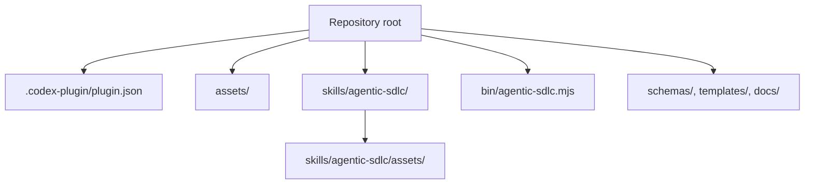

# Portable Codex Install

Agentic SDLC is packaged as a self-contained Codex plugin. The repository root is the plugin root because it contains `.codex-plugin/plugin.json`.

## What Travels With The Plugin



All paths in the plugin manifest and skill agent card are relative to the repository. There are no absolute paths to Antonio's machine, no project-specific contracts, and no target-project `.sdlc/` data inside the plugin package.

## Install On Another Codex

Use the personal marketplace flow when you want this plugin to behave like other local Codex plugins.

```bash
git clone https://github.com/aantenore/agentic-sdlc-codex-plugin.git \
  "$HOME/plugins/agentic-sdlc-codex-plugin"

cd "$HOME/plugins/agentic-sdlc-codex-plugin"
python3 scripts/install-personal-marketplace.py
codex plugin add agentic-sdlc-codex-plugin@personal
codex plugin list | grep agentic-sdlc-codex-plugin
```

Expected result:

```text
agentic-sdlc-codex-plugin@personal  installed, enabled
```

If you already have a working checkout elsewhere and want Codex to install directly from it, expose it through the personal plugin directory:

```bash
mkdir -p "$HOME/plugins"
ln -s "$(pwd)" "$HOME/plugins/agentic-sdlc-codex-plugin"
python3 scripts/install-personal-marketplace.py
codex plugin add agentic-sdlc-codex-plugin@personal
```

Use either a real directory or a symlink, not both. If `~/plugins/agentic-sdlc-codex-plugin` already exists, inspect it before replacing it.

The install script creates or updates this machine-local marketplace entry:

```json
{
  "name": "agentic-sdlc-codex-plugin",
  "source": {
    "source": "local",
    "path": "./plugins/agentic-sdlc-codex-plugin"
  },
  "policy": {
    "installation": "AVAILABLE",
    "authentication": "ON_INSTALL"
  },
  "category": "Productivity"
}
```

The marketplace file lives at `~/.agents/plugins/marketplace.json`. Keep it out of this repository unless you are intentionally maintaining a separate team marketplace repository.

After install or reinstall, start a new Codex thread so the app reloads plugin-provided skills, assets, and MCP/app metadata.

## Update An Existing Local Install

```bash
cd "$HOME/plugins/agentic-sdlc-codex-plugin"
git pull
python3 scripts/install-personal-marketplace.py
codex plugin add agentic-sdlc-codex-plugin@personal
```

If the plugin version did not change and you still need Codex to refresh its cache during local development, add a Codex cachebuster to `.codex-plugin/plugin.json` before reinstalling:

```bash
python3 /path/to/plugin-creator/scripts/update_plugin_cachebuster.py \
  "$HOME/plugins/agentic-sdlc-codex-plugin"
codex plugin add agentic-sdlc-codex-plugin@personal
```

Do not use the cachebuster for tagged releases; bump the plugin version instead.

## Validate Before Sharing

```bash
python /path/to/plugin-creator/scripts/validate_plugin.py .
python /path/to/skill-creator/scripts/quick_validate.py skills/agentic-sdlc
```

## Project Knowledge Is Separate

The plugin is reusable method code. The project knowledge base is created in each target project under `.sdlc/` and should be shared through that project's Git remote. This separation is what lets multiple Codex installations use the same SDLC plugin while collaborating on different products.

## Asset Regeneration

The PNG assets are committed for portability. They can be regenerated deterministically with:

```bash
node scripts/generate-plugin-assets.mjs
```
