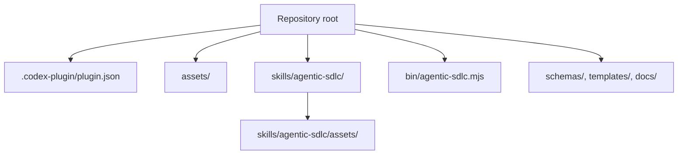

# Portable Codex Install

Agentic SDLC is packaged as a self-contained Codex plugin. The repository root is the plugin root because it contains `.codex-plugin/plugin.json`.

## What Travels With The Plugin



All paths in the plugin manifest and skill agent card are relative to the repository. There are no absolute paths to Antonio's machine, no project-specific contracts, and no target-project `.sdlc/` data inside the plugin package.

## Install On Another Codex

1. Clone or copy this repository to the target machine.
2. Import the repository root as a local Codex plugin.
3. If the target Codex build has no plugin import UI, create a machine-local marketplace entry that points to that repository root.
4. Do not commit that marketplace entry unless it belongs to a separate team marketplace repository.
5. Run the validators before sharing a tagged plugin package.

```bash
python /path/to/plugin-creator/scripts/validate_plugin.py .
python /path/to/skill-creator/scripts/quick_validate.py skills/agentic-sdlc
```

## Project Knowledge Is Separate

The plugin is reusable method code. The project knowledge base is created in each target project under `.sdlc/` and should be shared through that project's Git remote. This separation is what lets multiple Codex installations use the same SDLC plugin while collaborating on different products.

## Asset Regeneration

The PNG assets are committed for portability. They can be regenerated deterministically with:

```bash
node scripts/generate-plugin-assets.mjs
```
