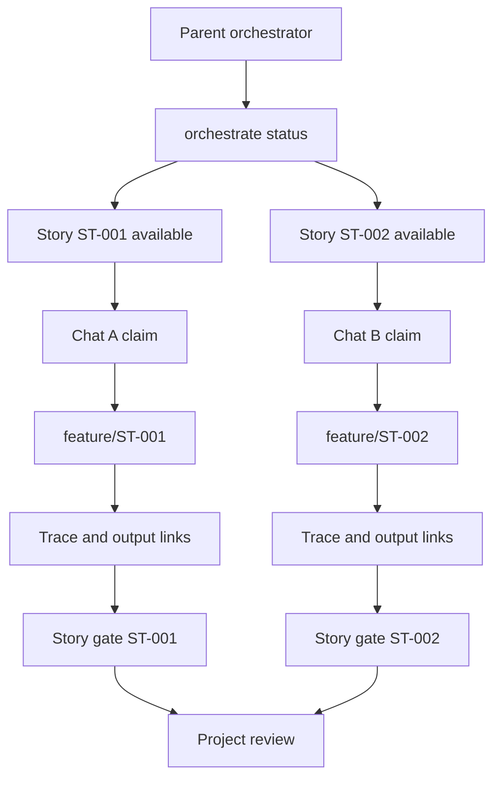

# Parallel Work

Agentic SDLC supports parallel work through story-scoped ownership and append-only traces.

## Rules

- One story should have one active claim at a time.
- Each claim should name the agent, branch, and optional expiry.
- Implementation work should happen on a story branch such as `feature/ST-001`.
- Agents should append trace events instead of rewriting shared history.
- Agents should record actor, run/thread, branch, and head SHA metadata.
- Pushes, merges, handoffs, and claim changes should be recorded as trace events.
- Durable outputs should be resolved and linked through the shared output-contract registry before they are treated as canonical.
- Approved dependency graph entries should be checked before claiming a story; hard blockers stop work lanes, soft dependencies provide context.
- If upstream artifacts change, downstream stories need a `dependency.revalidate` trace before they are no longer stale.
- Output registry writes are serialized locally; still merge `.sdlc/output-contracts/registry.json` carefully across Git branches.
- Cache and indexes can be rebuilt locally by each chat, but derived files must not become handoff evidence.
- Teams should merge `.sdlc/` artifacts with the code changes they explain.

## Multiple Codex Chats

1. Run `orchestrate status --json`.
2. Pick an `available` story lane.
3. Claim it with `story claim --thread-id <codex-thread-id>`.
4. Work only on that story branch and story KB files.
5. Resolve required outputs with `output resolve`; link artifacts with `output link`.
6. Append decision, implementation, test, sync, and handoff traces.
7. Run `gate check --story <id> --strict --out .sdlc/reports/<story-id>-gate-report.json`.
8. Release the claim when done or handed off.

## Parent Orchestrator Chat

A parent chat can coordinate several worker chats without editing their story files directly:

1. Run `orchestrate plan --json`.
2. Assign one story per worker chat.
3. Monitor claims, stale claims, locks, and handoffs with `orchestrate status`.
4. Require each worker to write attributed trace and sync evidence.
5. Resolve conflicts by splitting stories, releasing/reclaiming claims after coordination, or using phase locks.
6. Run project-wide `gate check --scope all --strict --out .sdlc/reports/project-gate-report.json` before release.

## Conflict Handling

If two agents need the same story, split the story or coordinate release and reclaim. Do not use `--force` on a claim unless a human has decided the previous claim is stale or invalid.

Use phase locks only for shared artifacts such as global analysis, release notes, or architecture decisions. Do not lock the whole project for ordinary story-scoped implementation.
