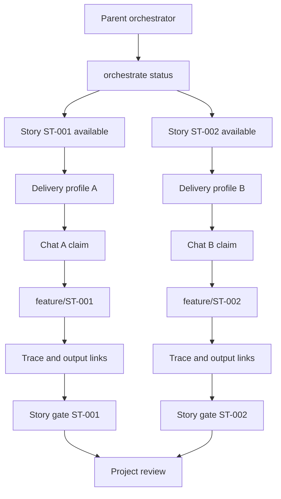

# Parallel Work

Agentic SDLC supports parallel work through story-scoped ownership and append-only traces.

## Rules

- One story should have one active claim at a time.
- Every worker that acts on a delivery must be covered by that delivery's current profile and effective autonomy decision; a profile for another PR, local release, or story is not authority.
- A delivery profile binds exactly one story/approved-contract pair and allows at most one concurrent delivery run. Several agents may perform bounded internal subtasks inside that orchestrated run, but they do not create additional delivery lanes or concurrent story claims from the same profile.
- Independent story lanes require their own delivery profiles and targets. If several changes must ultimately appear in one PR, first agree one aggregation story/contract and track subordinate work as bounded tasks/traces inside that single delivery unit.
- Each claim should name the agent, branch, and optional expiry.
- Implementation work should happen on a story branch such as `feature/ST-001`.
- Agents should append trace events instead of rewriting shared history.
- Agents should record actor, run/thread, branch, and head SHA metadata.
- Pushes, merges, handoffs, and claim changes should be recorded as trace events.
- Completed functional, technical, implementation, validation, or release lanes should be recorded with `story complete-step`.
- Cross-chat or cross-machine continuation should use `story prepare-handoff` so the receiving worker gets a story package with steps, outputs, dependencies, and recent traces.
- Durable outputs should be resolved and linked through the shared output-contract registry before they are treated as canonical.
- Approved dependency graph entries should be checked before claiming a story; hard blockers stop work lanes, soft dependencies provide context.
- If upstream artifacts change, downstream stories need a `dependency.revalidate` trace before they are no longer stale.
- Output registry writes are serialized locally; still merge `.sdlc/output-contracts/registry.json` carefully across Git branches.
- Cache and indexes can be rebuilt locally by each chat, but derived files must not become handoff evidence.
- Teams should merge `.sdlc/` artifacts with the code changes they explain.

## Multiple Codex Chats

1. Confirm the approved requirement ceiling and the explicit profile for this exact pull request or local release and its one story/contract pair.
2. Run `orchestrate status --json`.
3. Pick an `available` story lane whose approved contract reserves its own profile ID and whose current profile binds that contract hash.
4. Claim it with `story claim --thread-id <codex-thread-id>`.
5. Work only on that story branch and story KB files.
6. Resolve required outputs with `output resolve`; link artifacts with `output link`.
7. Append autonomy-decision, implementation, test, sync, and handoff traces.
8. Record completed lanes with `story complete-step`.
9. Prepare cross-lane or cross-machine handoffs with `story prepare-handoff --release-claim`.
10. Run `gate check --story <id> --strict --out .sdlc/reports/<story-id>-gate-report.json`.
11. Release the claim when done or handed off.

## Parent Orchestrator Chat

A parent chat can coordinate several worker chats without editing their story files directly:

1. Run `orchestrate plan --json`.
2. Assign one story per worker chat.
3. Monitor claims, stale claims, locks, and handoffs with `orchestrate status`.
4. Require each worker to write attributed trace and sync evidence.
5. Resolve conflicts by splitting stories, releasing/reclaiming claims after coordination, or using phase locks.
6. Run project-wide `gate check --scope all --strict --out .sdlc/reports/project-gate-report.json` before release.

The parent may distribute story work only across separately governed delivery lanes, or distribute internal subtasks inside one aggregation-story run without inventing extra story authority. It cannot raise a worker above the most restrictive host, project, requirement, delivery, contract, capability, environment, or budget boundary. Protected-branch merge and remote/production deployment remain explicit decisions outside ordinary worker coordination.

## Conflict Handling

If two agents need the same story, split the story or coordinate release and reclaim. Do not use `--force` on a claim unless a human has decided the previous claim is stale or invalid.

Use phase locks only for shared artifacts such as global analysis, release notes, or architecture decisions. Do not lock the whole project for ordinary story-scoped implementation.
