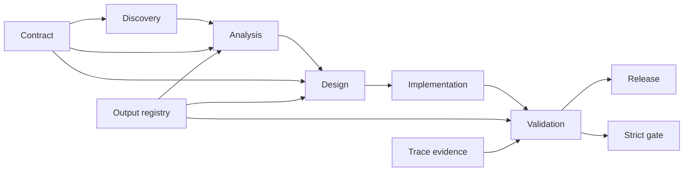
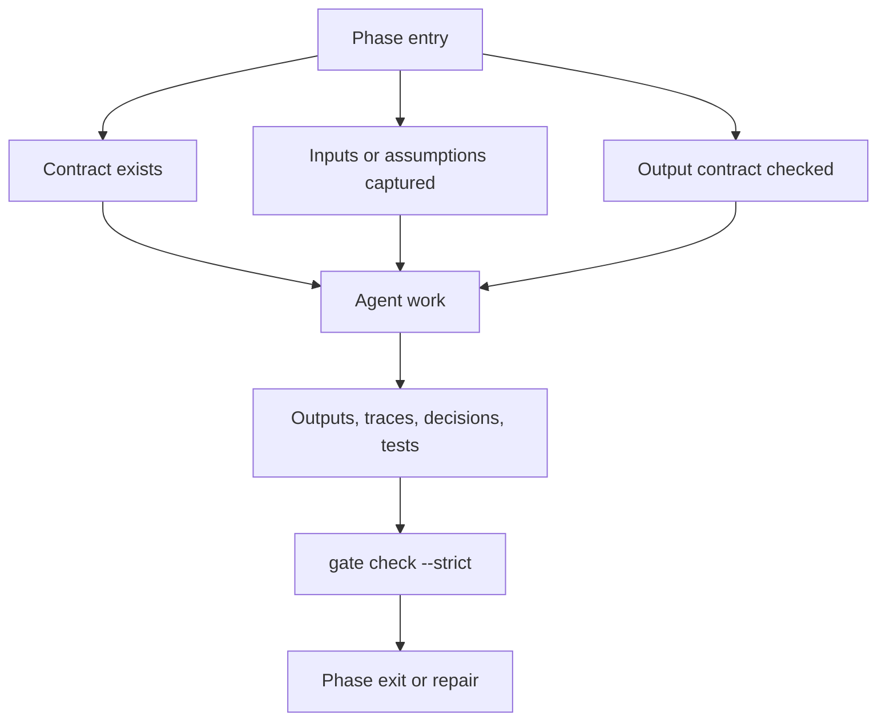

# SDLC Process

Agentic SDLC keeps the classic SDLC sequence, but each phase is governed by an explicit contract and every durable decision, output structure, and handoff is captured in the project knowledge base.

## Phases

1. Discovery
   - Define the problem, target users, constraints, competitors, process gaps, value hypothesis, and success metrics.
2. Analysis
   - Produce functional analysis, technical analysis, integration boundaries, API or mock strategy, edge cases, and risks.
   - When technical choices depend on stack, integrations, skills, MCPs, tools, models, or external targets, produce and approve capability profiles/recommendations before applying them to contracts.
3. Design
   - Convert analysis into stories, task decomposition, acceptance criteria, test strategy, UX notes, and architecture decisions.
4. Implementation
   - Implement story-scoped changes on dedicated branches with an active claim, tests, and trace evidence.
5. Validation
   - Validate against contracts, acceptance criteria, tests, risk mitigation, and release readiness.
6. Release
   - Produce release notes, deployment notes, observability signals, feedback loop, and updated project context.

## Operating Principle

The model proposes and executes bounded work. The harness, CLI, schemas, contracts, and human gates enforce the process. Human owners keep responsibility for objectives, architecture, trade-offs, and approvals.

For existing projects, start with `onboard existing-project` when there is useful code, documentation, or configuration to inspect. The resulting baseline is proposed context, not approved history, until the user explicitly confirms it.

Implementation permission is not formal approval. Any approve command that represents a human decision must include `--approval-source explicit-user` plus a summary or evidence for the specific artifact being approved.

## Phase Entry Checklist

- Current phase contract exists.
- Existing-project baseline is reviewed when the project predates the SDLC KB.
- Required inputs are present or missing inputs are logged as assumptions.
- Human gate expectations are explicit.
- KB writes for the phase are known.
- Output contract registry has been checked for required artifact types.
- Active phase locks are understood and owned.
- Parallel story claims do not conflict.

## Phase Exit Checklist

- Required outputs exist.
- Required outputs are linked to approved output templates.
- Related-story outputs use reuse plus delta unless a duplicate/new structure decision was approved.
- Validation criteria are satisfied or failures are recorded.
- Decisions, assumptions, risks, and evidence are traceable.
- Formal approvals include approval source, summary/evidence, approver attribution, and fresh content hashes.
- Cache/index files are not cited as canonical evidence.
- Handoffs are recorded when another agent or chat takes over.
- Push, merge, and release sync events are recorded.
- Strict gate check has been run for phase exit, review, or merge.

