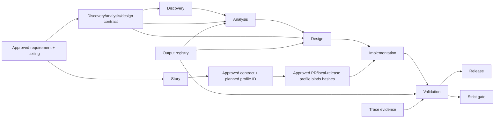
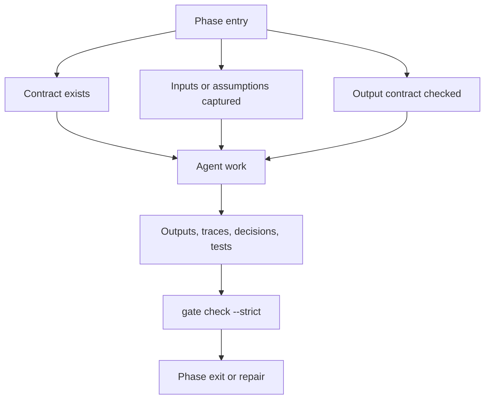

# SDLC Process

Agentic SDLC keeps the classic SDLC sequence, but each phase is governed by an explicit contract and every durable decision, output structure, and handoff is captured in the project knowledge base.

Before the phase sequence becomes executable, agree a revisioned `requirement:v2` and approve its requirement execution profile. The profile defines an autonomy ceiling, not permission to run. Before every pull request or local release, ask for a separate delivery autonomy selection; no selection is inherited from an earlier delivery.

## Phases

1. Discovery
   - Define the problem, target users, constraints, competitors, process gaps, value hypothesis, and success metrics.
2. Analysis
   - Produce functional analysis, technical analysis, integration boundaries, API or mock strategy, edge cases, and risks.
   - When technical choices depend on stack, integrations, skills, MCPs, tools, models, or external targets, produce and approve capability profiles/recommendations before applying them to contracts.
3. Design
   - Convert analysis into stories, task decomposition, acceptance criteria, test strategy, UX notes, and architecture decisions.
4. Implementation
   - Implement story-scoped changes on dedicated branches with an active claim, tests, and trace evidence.
5. Validation
   - Validate against contracts, acceptance criteria, tests, risk mitigation, and release readiness.
6. Release
   - Produce release notes, deployment notes, observability signals, feedback loop, and updated project context.

## Operating Principle

The model proposes and executes bounded work. The harness, CLI, schemas, contracts, and human gates enforce the process. Human owners keep responsibility for objectives, architecture, trade-offs, and approvals.

The available autonomy levels are `supervised`, `checkpointed`, and `bounded-autonomous`. Effective autonomy is the most restrictive of host, project, requirement, delivery, contract, capability, environment, and budget. Downstream policies may narrow but never widen. `audit_only` is capped at `checkpointed`, including for local release; effective `bounded-autonomous` requires an external trusted host/CI Ed25519 receipt for the exact approval subject under `host_verified` policy.

`pull_request` and `local_release` are explicit delivery kinds. Each profile binds exactly one story and its one approved contract. A pull request binds repository, base/head branches, explicit write paths, and canonical actions; a local release binds a target root, allowed writes/actions, shell-free JSON-argv smoke tests, and rollback. A new delivery always requires a new selection. Protected-branch merge and remote or production deployment are explicit exceptions.

Task start is automatic only for phases listed in the effective level's configured `automatic_phases`; `supervised` always confirms. State-changing delivery operations then follow authorize → host/tool execution → complete with immutable evidence. Success completion of `release.local` or `pull_request.merge` writes the terminal close automatically. Push/merge add live remote pre/post observations; preserve durable host/CI/provider evidence because these are not provider-signed offline attestations.

For existing projects, start with `onboard existing-project` when there is useful code, documentation, or configuration to inspect. The resulting baseline is proposed context, not approved history, until the user explicitly confirms it.

Implementation permission is not formal approval. Any approve command that represents a human decision must include `--approval-source explicit-user` plus a summary or evidence for the specific artifact being approved.

## Phase Entry Checklist

- The exact requirement revision is approved, or legacy policy has conservatively assigned a `supervised` ceiling.
- The requirement execution profile is active, fresh, and no broader than host/project policy.
- When the phase advances a pull request or local release, the current delivery unit has an explicitly approved, non-reused delivery execution profile.
- For delivery work, the final approved contract reserves the stable `delivery_execution_profile_id`; the current approved profile has that ID and binds the immutable requirement-profile, story, and contract hashes.
- The delivery profile binds exactly one story and its one approved contract; any multi-story release uses an explicitly agreed aggregation story/contract.
- The effective autonomy decision is valid for this phase and material scope whenever delivery execution is in scope.
- Current phase contract exists.
- Existing-project baseline is reviewed when the project predates the SDLC KB.
- Required inputs are present or missing inputs are logged as assumptions.
- Human gate expectations are explicit.
- KB writes for the phase are known.
- Output contract registry has been checked for required artifact types.
- Active phase locks are understood and owned.
- Parallel story claims do not conflict.

## Phase Exit Checklist

- Requirement, delivery, contract, capability, environment, and budget hashes still match the effective autonomy decision.
- No operation exceeded the effective autonomy level or reused another delivery's authorization.
- A local release has successful structured smoke-test evidence from the exact approved JSON argv set and a usable rollback procedure.
- Every state-changing delivery action has an authorized receipt, a single completion receipt, and immutable evidence; remote actions additionally retain host/CI/provider evidence.
- Pull-request readiness is not reported as protected-branch merge or production deployment.
- Required outputs exist.
- Required outputs are linked to approved output templates.
- Related-story outputs use reuse plus delta unless a duplicate/new structure decision was approved.
- Validation criteria are satisfied or failures are recorded.
- Decisions, assumptions, risks, and evidence are traceable.
- Formal approvals include approval source, summary/evidence, approver attribution, and fresh content hashes.
- Cache/index files are not cited as canonical evidence.
- Handoffs are recorded when another agent or chat takes over.
- Push, merge, and release sync events are recorded.
- Strict gate check has been run for phase exit, review, or merge.

