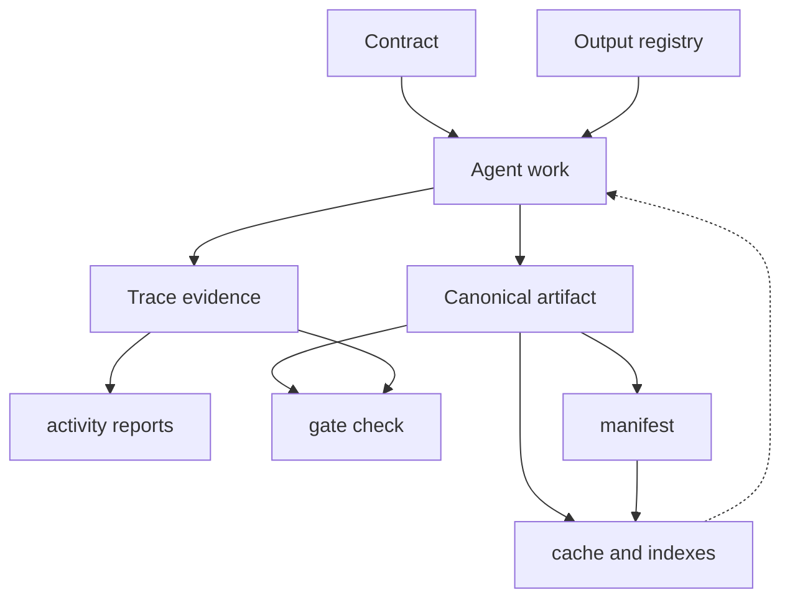

# {{PROJECT_NAME}} SDLC Knowledge Base

This directory is the shared source of truth for the project SDLC.

It is intentionally stored in the project repository so people and agents can collaborate through Git branches, pull requests, and code review.

## Operating Rules

- Keep durable knowledge in `.sdlc/`, not only in chat history.
- Work in story-scoped folders when possible.
- Append trace events instead of rewriting history.
- Record actor, run, thread, branch, and head SHA metadata on claims, traces, handoffs, approvals, locks, and sync events.
- For existing projects, create and review a baseline before treating inferred context as canonical.
- Do not treat permission to implement or push as formal artifact approval.
- Record formal approvals with `--approval-source explicit-user|ci|automation|bootstrap` plus summary or evidence.
- Use `--approval-source automation` only when a human/CI has explicitly delegated a matching approval level or autonomy scope; keep that scope in the summary/evidence.
- Run `agentic-sdlc orchestrate status` before starting work in another chat.
- Run `agentic-sdlc sync record --event push` after pushing a branch.
- Release story claims and phase locks when work is done or handed off.
- Link requirements, stories, decisions, tests, and release evidence.
- Keep epics, tasks, work breakdown agreements, and dependency graphs in `.sdlc/`.
- Approve work breakdown and dependency graph proposals before using them as delivery constraints.
- Record `dependency.revalidate` traces when downstream work is rechecked after upstream artifact changes.
- Resolve story outputs through `.sdlc/output-contracts/registry.json` before generating new durable artifacts.
- Reuse approved artifacts and create only deltas when related stories cover the same requirement.
- Ask for user approval before introducing a new output template or changing an approved output structure.
- Record completed phase lanes with `story complete-step` before handing off work.
- Use `story prepare-handoff --release-claim` to let another chat or machine continue from the KB.
- Use `report activity` for recent-history questions; reports must cite trace source files.
- Use `report query` for natural-language history filters after Codex normalizes them to canonical query JSON.
- Use `manifest rebuild`, `trace compact`, and plan-first `archive closed` as the KB grows.
- Run `agentic-sdlc gate check` before merging implementation work.
- Rebuild cache and indexes when retrieval speed matters; cache and indexes are derived artifacts, not sources of truth.

## Directory Map

```text
contracts/      Phase contracts and story-specific contracts
baseline/       Existing-project current-state baselines and approval records
authorizations/ Explicit action-scoped grants for delegated automation approvals
output-contracts/ Approved output templates, artifact links, and structure decisions
requirements/   Product requirements and constraints
work-items/     Project-local epics and tasks
work-breakdown/ Approved decomposition decisions
dependencies/   Approved dependency graph and proposals
stories/        Story workspaces, claims, plans, and evidence
orchestration/  Parent-chat orchestration snapshots
locks/          Phase and shared-artifact locks
handoffs/       Story handoff records between agents and chats
decisions/      Architecture and product decision records
assumptions/    Explicit assumptions and their review status
risks/          Delivery, technical, product, and operational risks
tests/          Test plans, test evidence, and coverage notes
traces/         Append-only event logs
releases/       Release notes, rollout evidence, feedback loops
manifests/      Shared compact KB manifests
archive/        Archive plans and applied archive records
cache/          Local regenerable lookup cache
indexes/        Regenerable search indexes
reports/        Generated gate and audit reports
```



## Human Governance

Agents may propose, generate, validate, and summarize. Humans keep responsibility for goals, architecture, trade-offs, approvals, and high-risk decisions.
